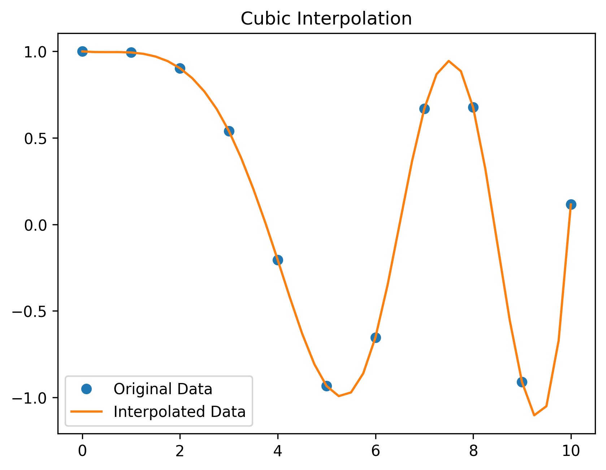
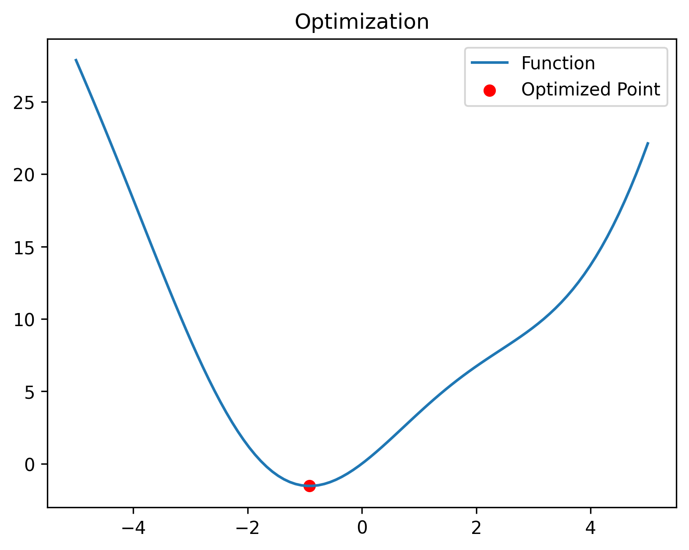
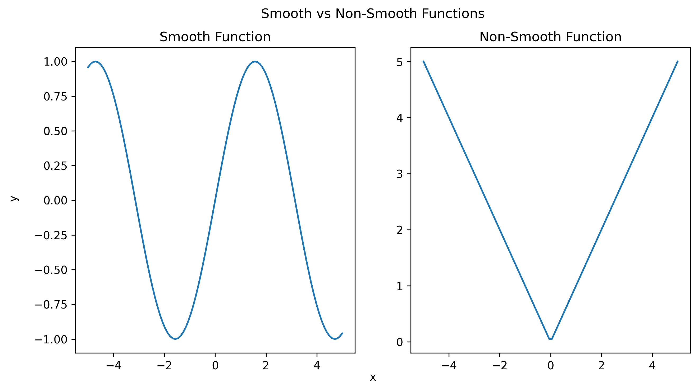
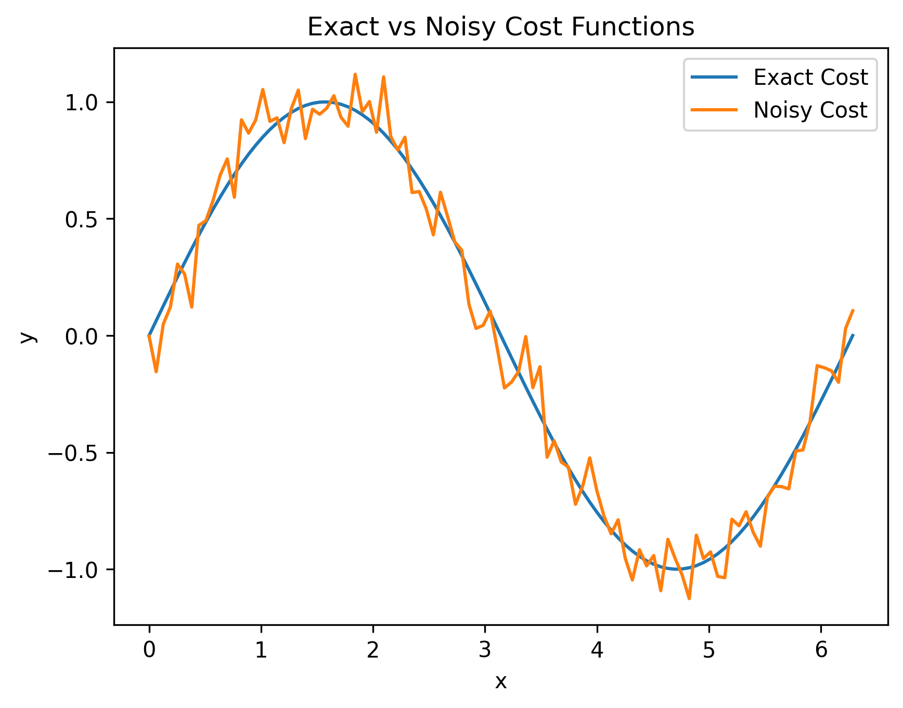
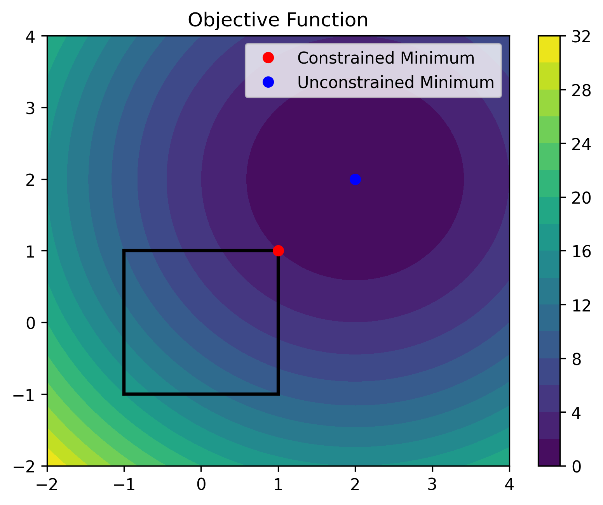

### Interpolation

```python
# Name: Mei Jiaojiao
# Profession: Artificial Intelligence
# Time and date: 4/3/23 19:06

import numpy as np
from scipy.interpolate import interp1d
import matplotlib.pyplot as plt

# Generate some random data
x = np.linspace(0, 10, num=11, endpoint=True)
y = np.cos(-x**2/9.0)

# Create an interpolation function
f = interp1d(x, y, kind='cubic')

# Generate new x values to interpolate at
x_new = np.linspace(0, 10, num=41, endpoint=True)

# Use the interpolation function to generate y values
y_new = f(x_new)

# Plot the original data and interpolated data
plt.plot(x, y, 'o', label='Original Data')
plt.plot(x_new, y_new, label='Interpolated Data')
plt.title('Cubic Interpolation')

plt.legend()
plt.savefig('Interpolation.png', dpi=300, bbox_inches='tight', pad_inches=0.1)
plt.show()
```



### Optimization

```python
# Name: Mei Jiaojiao
# Profession: Artificial Intelligence
# Time and date: 4/3/23 20:01

import numpy as np
import matplotlib.pyplot as plt
from scipy.optimize import minimize


# Define the function to be optimized
def f(x):
    return x ** 2 + 3 * np.sin(x)


# Use the minimize function from scipy.optimize to find the minimum of the function
result = minimize(f, x0=0)

# Generate some data for plotting
x_vals = np.linspace(-5, 5, 100)
y_vals = f(x_vals)

# Plot the function and the optimized point
plt.plot(x_vals, y_vals, label='Function')
plt.scatter(result.x, result.fun, color='red', label='Optimized Point')
plt.title('Optimization')
plt.legend()
plt.savefig('Optimization.png', dpi=300, bbox_inches='tight', pad_inches=0.1)
plt.show()
```



```python
# Name: Mei Jiaojiao
# Profession: Artificial Intelligence
# Time and date: 4/3/23 20:03

import numpy as np
import matplotlib.pyplot as plt
from mpl_toolkits.mplot3d import Axes3D
from scipy.optimize import minimize

# Define the function
def f(x):
    return (4 - 2.1 * x[0] ** 2 + x[0] ** 4 / 3) * x[0] ** 2 + x[0] * x[1] + (4 * x[1] ** 2 - 4) * x[1] ** 2

# Define the bounds
bounds = [(-2, 2), (-1, 1)]

# Find the global minimum
res1 = minimize(f, x0=[1, -1], bounds=bounds)
res2 = minimize(f, x0=[-1, 1], bounds=bounds)
res3 = minimize(f, x0=[0, 0], bounds=bounds)

# Plot the function's 3D surface and contour
x = np.linspace(-2, 2, 100)
y = np.linspace(-1, 1, 100)
X, Y = np.meshgrid(x, y)
Z = f([X, Y])
fig = plt.figure(figsize=(12, 6))
ax1 = fig.add_subplot(1, 2, 1, projection='3d')
ax1.plot_surface(X, Y, Z, cmap='coolwarm', alpha=0.8)
ax1.set_xlabel('x')
ax1.set_ylabel('y')
ax1.set_zlabel('f(x, y)')
ax1.set_title('3D Surface')
# colorbar
m = plt.cm.ScalarMappable(cmap='coolwarm')
fig.colorbar(m, ax=ax1)

ax2 = fig.add_subplot(1, 2, 2)
ax2.contourf(X, Y, Z, 50, cmap='coolwarm')
ax2.set_xlabel('x')
ax2.set_ylabel('y')
ax2.set_title('Contourf for f(x, y)')
# plot global minimum
ax2.scatter(res1.x[0], res1.x[1], color='red', label='Global minimum with initial guess[1, -1]', marker='*', s=200)
ax2.scatter(res2.x[0], res2.x[1], color='orange', label='Global minimum with initial guess[-1, 1]', marker='*', s=200)
ax2.scatter(res3.x[0], res3.x[1], color='cyan', label='Global minimum with initial guess[0, 0]', marker='*', s=200)
ax2.legend()
# move the legend
ax2.legend(bbox_to_anchor=(0, 1), loc='upper left', borderaxespad=0)
# colorbar
fig.colorbar(m, ax=ax2)
plt.savefig('Optimization with constraints.png', dpi=300, bbox_inches='tight', pad_inches=0.1)
plt.show()
```


### Local minima and global minima

```python
# Name: Mei Jiaojiao
# Profession: Artificial Intelligence
# Time and date: 4/3/23 20:27

import numpy as np
import matplotlib.pyplot as plt
from scipy.signal import find_peaks


# Define the function to find the minima of
def my_function(x):
    return np.sin(x) + np.sin(2 * x) + np.sin(4 * x) + np.sqrt(abs(x))


# Generate x values for the function
x = np.linspace(-3, 6 * np.pi, 1000)

# Plot the function
plt.plot(x, my_function(x))

# Find the global minimum of the function
global_min = np.min(my_function(x))

# Plot the global minimum as a red dot
plt.plot(x[np.argmin(my_function(x))], global_min, 'ro', label='Global Minimum',markersize=10)

# Find the local minima of the function
local_mins, _ = find_peaks(-my_function(x))

# Plot the local minima as blue dots
plt.plot(x[local_mins], my_function(x)[local_mins], 'bo', label='Local Minima',markersize=7)

# Add a legend to the plot
plt.legend(['Function', 'Global Minimum', 'Local Minima'])

# Show the plot
plt.savefig('Local Minima.png', dpi=300, bbox_inches='tight', pad_inches=0.1)
plt.show()
```


### Smooth and non-smooth

```python
# Name: Mei Jiaojiao
# Profession: Artificial Intelligence
# Time and date: 4/3/23 21:03

import numpy as np
import matplotlib.pyplot as plt

# Generate some sample data
x = np.linspace(-5, 5, 100)
y_smooth = np.sin(x)
y_non_smooth = np.abs(x)

# Create a plot with two subplots
fig, axs = plt.subplots(1, 2, figsize=(10, 5))

# Plot the smooth function in the first subplot
axs[0].plot(x, y_smooth)
axs[0].set_title("Smooth Function")

# Plot the non-smooth function in the second subplot
axs[1].plot(x, y_non_smooth)
axs[1].set_title("Non-Smooth Function")

# Add labels and a title to the overall figure
fig.suptitle("Smooth vs Non-Smooth Functions")
fig.text(0.5, 0.04, "x", ha="center")
fig.text(0.04, 0.5, "y", va="center", rotation="vertical")

# Show the plot
plt.savefig('smooth_non_smooth.png', dpi=300, bbox_inches='tight', pad_inches=0.1)
plt.show()
```



### Noisy versus exact cost functions

```python
# Name: Mei Jiaojiao
# Profession: Artificial Intelligence
# Time and date: 4/3/23 21:04

import numpy as np
import matplotlib.pyplot as plt

# Define the exact and noisy cost functions
def exact_cost(x):
    return np.sin(x)

def noisy_cost(x):
    return np.sin(x) + np.random.normal(scale=0.1)

# Generate data
x = np.linspace(0, 2*np.pi, 100)
exact_y = exact_cost(x)
noisy_y = np.array([noisy_cost(xi) for xi in x])

# Plot the exact and noisy cost functions
plt.plot(x, exact_y, label='Exact Cost')
plt.plot(x, noisy_y, label='Noisy Cost')
plt.title('Exact vs Noisy Cost Functions')
plt.xlabel('x')
plt.ylabel('y')
plt.legend()
plt.savefig('Exact_vs_Noisy_Cost_Functions.png', dpi=300, bbox_inches='tight', pad_inches=0.1)
plt.show()
```



### Constraints

```python
# Name: Mei Jiaojiao
# Profession: Artificial Intelligence
# Time and date: 4/3/23 21:07

import numpy as np
import matplotlib.pyplot as plt
from scipy.optimize import minimize

# Define the objective function
def objective_function(x):
    return (x[0] - 2) ** 2 + (x[1] - 2) ** 2

# Define the bounds of the search space
bounds = ((-1, 1), (-1, 1))

# Define the constrained optimization problem
def constrained_optimization():
    res = minimize(objective_function, x0=(0, 0), bounds=bounds)
    return res

# Define the unconstrained optimization problem
def unconstrained_optimization():
    res = minimize(objective_function, x0=(0, 0))
    return res

# Plot the objective function and the search space
x = np.linspace(-2, 4, 100)
y = np.linspace(-2, 4, 100)
X, Y = np.meshgrid(x, y)
Z = objective_function((X, Y))

fig, ax = plt.subplots()
cmap = plt.get_cmap('viridis')
cf = ax.contourf(X, Y, Z, cmap=cmap, levels=20)
fig.colorbar(cf, ax=ax)
ax.set_title('Objective Function')

# Plot the search space
ax.plot([-1, 1], [-1, -1], 'k', linewidth=2)
ax.plot([-1, 1], [1, 1], 'k', linewidth=2)
ax.plot([-1, -1], [-1, 1], 'k', linewidth=2)
ax.plot([1, 1], [-1, 1], 'k', linewidth=2)

# Plot the constrained minimum
res_constrained = constrained_optimization()
ax.plot(res_constrained.x[0], res_constrained.x[1], 'ro', label='Constrained Minimum')

# Plot the unconstrained minimum
res_unconstrained = unconstrained_optimization()
ax.plot(res_unconstrained.x[0], res_unconstrained.x[1], 'bo', label='Unconstrained Minimum')

ax.legend()
plt.savefig('Constrained_vs_Unconstrained_Optimization.png', dpi=300, bbox_inches='tight', pad_inches=0.1)
plt.show()
```



### Reference

1. *Scipy Lecture Notes — Scipy lecture notes*. (n.d.). Scipy Lecture Notes — Scipy Lecture Notes. https://scipy-lectures.org/index.html#one-document-to-learn-numerics-science-and-data-with-python


