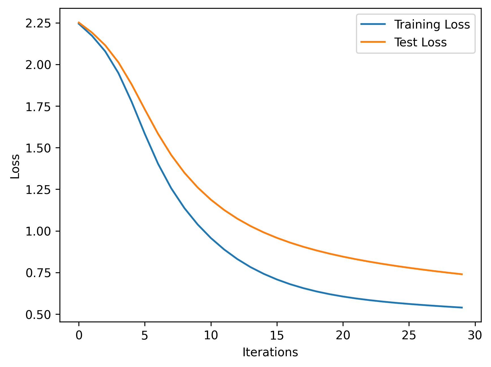
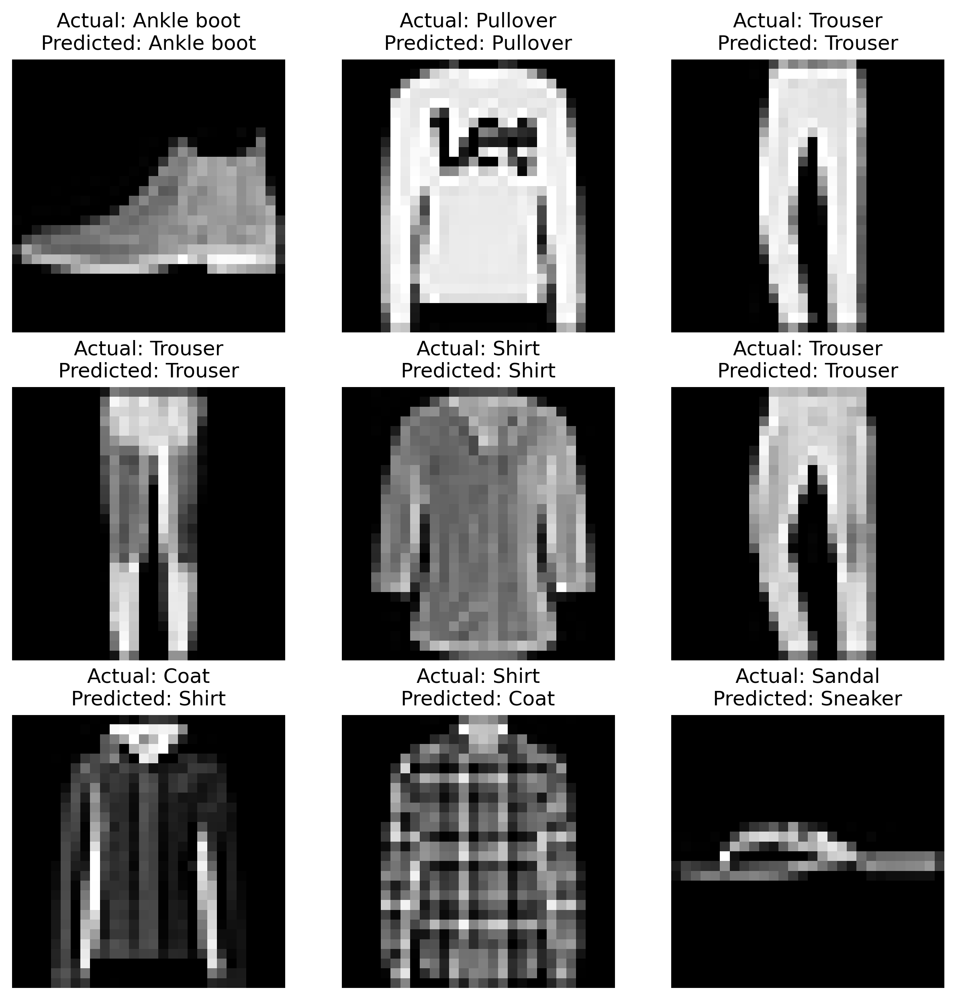

This code trains a neural network model to classify images from the FashionMNIST dataset using PyTorch. The model is trained using stochastic gradient descent (SGD) with cross-entropy loss as the loss function. The code loads the training and test datasets, creates data loaders for batching the data, and defines a neural network model using PyTorch's nn.Module class. The code then trains the model for a specified number of epochs, and records the training and test losses at each epoch. The final model is saved to a file, and example predictions are made on a 3x3 grid of test images, with the actual and predicted labels displayed for each image. The code also generates plots of the training and test loss over time, as well as the example predictions.

```python
# Name: Mei Jiaojiao
# Profession: Artificial Intelligence
# Time and date: 4/1/23 19:57

# Import necessary libraries
import torch
from torch import nn
from torch.utils.data import DataLoader
from torchvision import datasets
from torchvision.transforms import ToTensor
import matplotlib.pyplot as plt
import numpy as np

# Load the FashionMNIST training and test datasets
training_data = datasets.FashionMNIST(root='data', train=True, download=True, transform=ToTensor())
test_data = datasets.FashionMNIST(root='data', train=False, download=True, transform=ToTensor())

# Specify the batch size and create data loaders
batch_size = 16
train_dataloader = DataLoader(training_data, batch_size=batch_size)
test_dataloader = DataLoader(test_data, batch_size=batch_size)

# Get a batch of training data and display its shape
images, labels = next(iter(train_dataloader))
print(images.shape)
print(labels.shape)
print(labels[0])


# Create a neural network model
class Model(nn.Module):
    def __init__(self):
        super().__init__()
        self.flatten = nn.Flatten()
        self.linear_relu_stack = nn.Sequential(
            nn.Linear(28 * 28, 512),
            nn.ReLU(),
            nn.Linear(512, 512),
            nn.ReLU(),
            nn.Linear(512, 10)
        )

    def forward(self, x):
        x = self.flatten(x)
        logits = self.linear_relu_stack(x)
        return logits


# Check if CUDA is available and set the device accordingly
device = 'cuda' if torch.cuda.is_available() else 'cpu'
print(device)

# Create an instance of the model and move it to the device
model = Model().to(device)

# Specify the loss function and optimizer
loss_fn = nn.CrossEntropyLoss()
optimizer = torch.optim.SGD(model.parameters(), lr=1e-4)


# Define a function to train the model
def train(dataloader, model, loss_fn, optimizer):
    size = len(dataloader.dataset)
    model.train()
    train_loss = []  # initialize a list to record the training loss
    for batch, (X, y) in enumerate(dataloader):
        X, y = X.to(device), y.to(device)
        pred = model(X)
        loss = loss_fn(pred, y)
        optimizer.zero_grad()
        loss.backward()
        optimizer.step()

        if batch % 100 == 0:
            loss, current = loss.item(), batch * len(X)
            print(f'loss: {loss:>7f}  [{current: >5d}/ {size:>5d}]')
            train_loss.append(loss)  # record the training loss at this iteration
    return train_loss[-1:]  # return only the last value of the train_loss list


# Define a function to test the model
def test(dataloader, model, loss_fn):
    size = len(dataloader.dataset)
    num_batches = len(dataloader)
    model.eval()
    test_loss, correct = 0, 0
    with torch.no_grad():
        for X, y in dataloader:
            X, y = X.to(device), y.to(device)
            pred = model(X)
            test_loss += loss_fn(pred, y).item()
            correct += (pred.argmax(1) == y).type(torch.float).sum().item()

    test_loss /= num_batches
    correct /= size
    print(f'Test Error: \n Accuracy: {(100 * correct):>0.1f}, Avg Loss: {test_loss:>8f}\n')
    return test_loss


# Train the model for a specified number of epochs
epochs = 30
train_losses = []  # initialize a list to record the training loss at each epoch
test_losses = []  # initialize a list to record the test loss at each epoch
for t in range(epochs):
    print(f'Epoch {t + 1}\n-------------------------------------------')
    train_loss = train(train_dataloader, model, loss_fn, optimizer)
    train_losses += train_loss  # concatenate the list of training losses from this epoch
    test_loss = test(test_dataloader, model, loss_fn)
    test_losses.append(test_loss)  # record the test loss for this epoch
print('Done!')

# Create a plot of the training and test loss over time
plt.plot(train_losses, label='Training Loss')
plt.plot(test_losses, label='Test Loss')
plt.xlabel('Iterations')
plt.ylabel('Loss')
plt.legend()
plt.savefig("train_test_loss.png", dpi=300, bbox_inches='tight', pad_inches=0.1, transparent=True)
plt.show()

# Save the model
torch.save(model.state_dict(), 'model.pth')

# Load the model
model = Model()
model.load_state_dict(torch.load('model.pth'))

# Define the labels for the classes
classes = ['T-shirt/top', 'Trouser', 'Pullover', 'Dress', 'Coat', 'Sandal', 'Shirt', 'Sneaker', 'Bag', 'Ankle boot']

# Load the saved model from the file
model = Model()
model.load_state_dict(torch.load('model.pth'))

# Set the model to evaluation mode
model.eval()

# Create a 3x3 grid of subplots
fig, axes = plt.subplots(3, 3, figsize=(10, 10))

# Loop through the first 9 images in the test dataset
for ax, idx in zip(axes.flatten(), range(9)):
    # Get an example image and label from the test dataset
    x, y = test_data[idx][0], test_data[idx][1]

    # Use the model to predict the label of the image
    with torch.no_grad():
        pred = model(x.unsqueeze(0))
        predicted, actual = classes[pred.argmax(1)], classes[y]

    # Display the image and label
    ax.imshow(x.view(28, 28), cmap='gray')
    ax.set_title(f'Actual: {actual}\nPredicted: {predicted}')
    ax.axis('off')

# Show the plot
plt.savefig("predictions.png", dpi=300, bbox_inches='tight', pad_inches=0.1, transparent=True)
plt.show()
```

<div style="text-align:center"></div> 

<div style="text-align:center">      </div>

The final test accuracy of the model is 73.4% and the average loss is 0.739739.

### Reference

1. Z. (2022, March 21). *GitHub - zalandoresearch/fashion-mnist: A MNIST-like fashion product database. Benchmark*. GitHub. https://github.com/zalandoresearch/fashion-mnist


