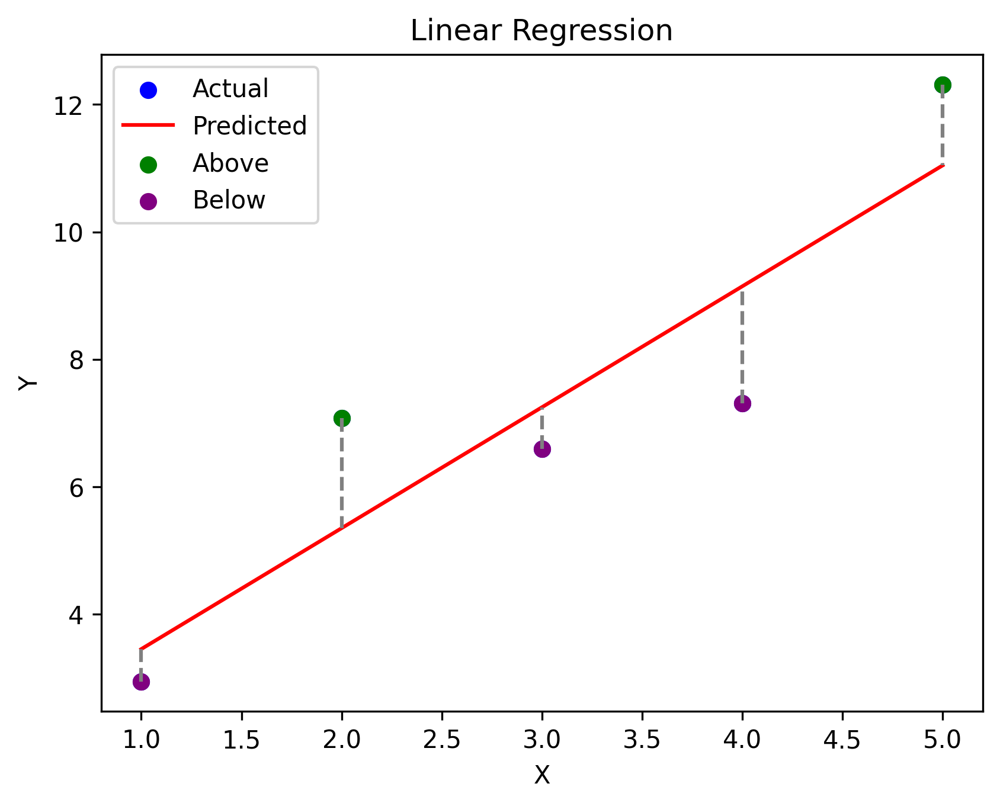
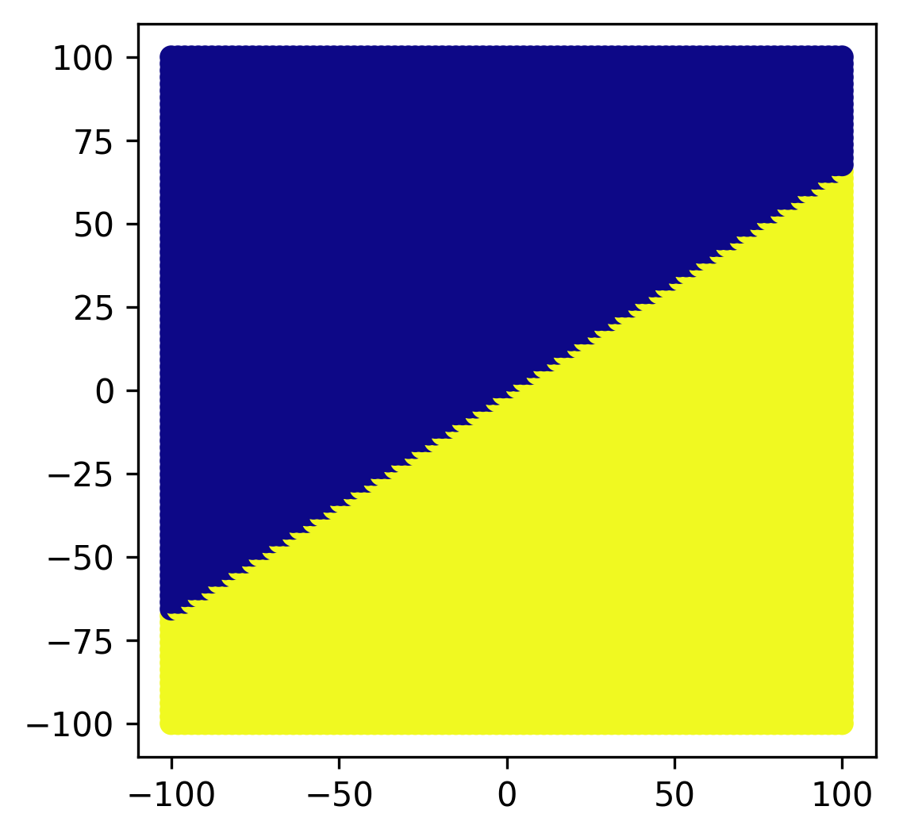
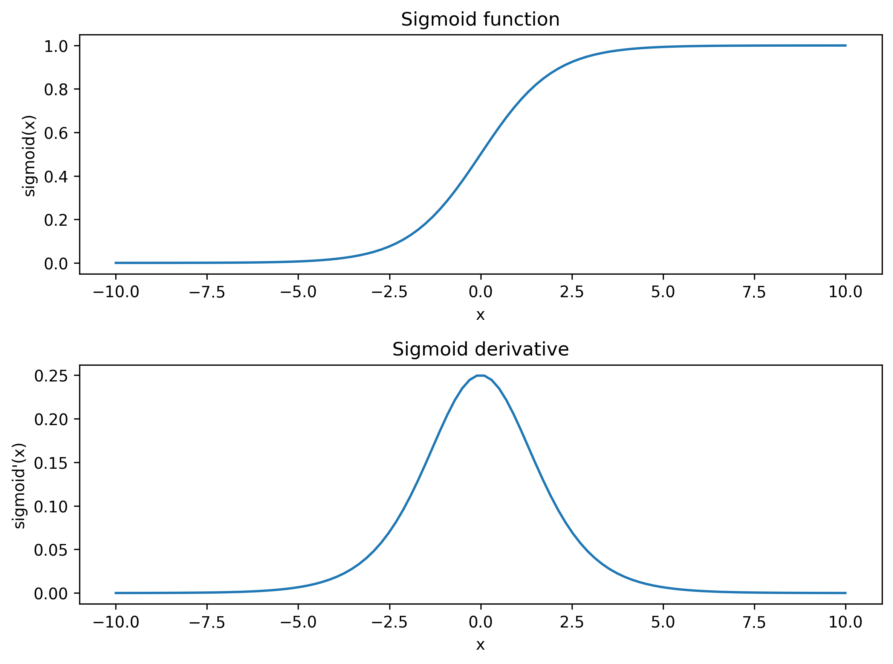
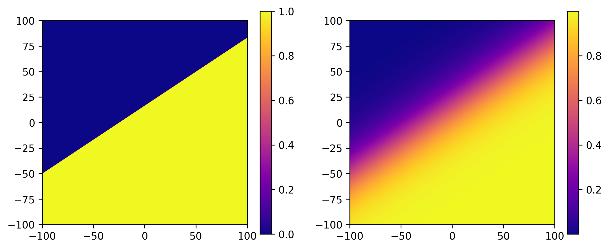

# Regression and classification 

Linear regression involves finding a line that fits a set of data points, while binary classification involves finding a line that separates a set of points into two groups. Specifically, some points will be on one side of the line and others on the other side.

Regression problems and binary classification problems have many similarities. They both take a set of input data points and aim to find a single line. The difference is in the purpose of the line. In regression problems, the line is used to make predictions based on the input data, while in binary classification problems, the line is used to separate the data into two classes.

```python
# Name: Mei Jiaojiao
# Profession: Artificial Intelligence
# Time and date: 3/29/23 14:49

import numpy as np
import matplotlib.pyplot as plt

# Generate some random data for demonstration
x = np.array([1, 2, 3, 4, 5])
y = np.array([2, 4, 6, 8, 10]) + 2 * np.random.randn(5)

# Fit a linear regression model to the data
model = np.polyfit(x, y, 1)
predicted = np.polyval(model, x)

# Plot the data and the regression line
plt.scatter(x, y, color='blue', label='Actual')
plt.plot(x, predicted, color='red', label='Predicted')

# Highlight the difference between actual and predicted values
for i in range(len(x)):
    plt.plot([x[i], x[i]], [y[i], predicted[i]], color='gray', linestyle='--')

# Color-code the actual data points based on whether they are above or below the regression line
above = y > predicted
below = y < predicted
plt.scatter(x[above], y[above], color='green', label='Above')
plt.scatter(x[below], y[below], color='purple', label='Below')

# Add labels and legend to the plot
plt.xlabel('X')
plt.ylabel('Y')
plt.title('Linear Regression')
plt.legend()

# Display the plot
plt.savefig('binaryclass.png', dpi=300, bbox_inches='tight', pad_inches=0.1)
plt.show()
```

<p align="center">  </p>

Now, building on the concept of linear regression, we can view the data points above the regression line as one class, and the points below the line as another class. This transforms the regression problem into a binary classification problem, where the goal is to find a line that best separates the two classes.

# The relationship between a point and a line

Given a line with equation $Ax + By + C = 0$ and a point with coordinates $(x_0, y_0)$, we can determine the relationship between the point and the line using the vector inner product.

We first define a vector $\vec{n} = \begin{pmatrix} A \ B \end{pmatrix}$ as the normal vector to the line. Then, we define a vector $\vec{p} = \begin{pmatrix} x_0 \ y_0 \end{pmatrix}$ as the vector representing the point. The relationship between the point and the line can then be determined by taking the dot product of these two vectors:
$$
\begin{equation}
\vec{n} \cdot \vec{p}=\left(\begin{array}{l}
A \\
B
\end{array}\right) \cdot\left(\begin{array}{l}
x_0 \\
y_0
\end{array}\right)=A x_0+B y_0
\end{equation}
$$
If $\vec{n} \cdot \vec{p} + C = 0$, then the point lies on the line. If $\vec{n} \cdot \vec{p} + C > 0$, then the point lies on one side of the line, and if $\vec{n} \cdot \vec{p} + C < 0$, then the point lies on the other side of the line.

it feels like this:

```python
import matplotlib.pyplot as plt
import numpy as np

# Define the line equation
A = 2
B = -3
C = 1

# Generate some random points to plot
x = np.linspace(-100, 100, 100)
y = np.linspace(-100, 100, 100)
X, Y = np.meshgrid(x, y)
Z = A*X + B*Y + C

# plot the line
plt.figure(figsize=(4, 4))
plt.subplot(1, 1, 1)
labels = Z > 0
# Plot the points with different colors based on their labels
plt.scatter(X, Y, c=labels, cmap='plasma')
plt.savefig('binaryclass1.png', dpi=300, bbox_inches='tight', pad_inches=0.1)
plt.show()
```

<p align="center">  </p>

**Now we have a problem, the classification approach we just described is that it does not take into account the distance between each point and the line. Some points may be far away from the line, while others may be closer. This is similar to the problem of classifying people as male or female based on certain characteristics. While there may be some defining characteristics for each gender, most people have a combination of both male and female traits, and it's a gradient rather than a clear-cut binary classification.**

we need sigmoid function to solve this problem.

# Sigmoid

```python
# Name: Mei Jiaojiao
# Profession: Artificial Intelligence
# Time and date: 3/29/23 15:54

import numpy as np
import matplotlib.pyplot as plt


def sigmoid(x):
    return 1 / (1 + np.exp(-x))


def sigmoid_derivative(x):
    return sigmoid(x) * (1 - sigmoid(x))


x = np.linspace(-10, 10, 100)
y = sigmoid(x)
dy = sigmoid_derivative(x)

fig, ax = plt.subplots(nrows=2, ncols=1, figsize=(8, 6))

ax[0].plot(x, y)
ax[0].set_title('Sigmoid function')
ax[0].set_xlabel('x')
ax[0].set_ylabel('sigmoid(x)')

ax[1].plot(x, dy)
ax[1].set_title('Sigmoid derivative')
ax[1].set_xlabel('x')
ax[1].set_ylabel('sigmoid\'(x)')

plt.tight_layout()
plt.savefig('sigmoid.png', dpi=300, bbox_inches='tight', pad_inches=0.1)
plt.show()
```



The sigmoid function is defined as:
$$
\begin{equation}
\sigma(\mathrm{x})=\frac{1}{1+e^{-\mathrm{x}}}
\end{equation}
$$
where $z$ is the input to the function. It maps any input value to a value between 0 and 1, which makes it suitable for modeling probabilities.

Sigmoid derivative:
$$
\begin{equation}
\begin{aligned}
\frac{\mathrm{d}}{\mathrm{dx}} \sigma(\mathrm{x}) & =\frac{\mathrm{d}}{\mathrm{dx}}\left[\frac{1}{1+\mathrm{e}^{-\mathrm{x}}}\right]=\frac{\mathrm{d}}{\mathrm{dx}}\left(1+\mathrm{e}^{-\mathrm{x}}\right)^{-1} \\
& =-1 *\left(1+\mathrm{e}^{-\mathrm{x}}\right)^{-2}\left(-\mathrm{e}^{-\mathrm{x}}\right) \\
& =\frac{-\mathrm{e}^{-\mathrm{x}}}{-\left(1+\mathrm{e}^{-\mathrm{x}}\right)^2} \\
& =\frac{\mathrm{e}^{-\mathrm{x}}}{\left(1+\mathrm{e}^{-\mathrm{x}}\right)^2} \\
& =\frac{1}{1+\mathrm{e}^{-\mathrm{x}}} \frac{\mathrm{e}^{-\mathrm{x}}}{1+\mathrm{e}^{-\mathrm{x}}} \\
& =\frac{1}{1+\mathrm{e}^{-\mathrm{x}}} \frac{\mathrm{e}^{-\mathrm{x}}+(1-1)}{1+\mathrm{e}^{-\mathrm{x}}} \\
& =\frac{1}{1+\mathrm{e}^{-\mathrm{x}}} \frac{\left(1+\mathrm{e}^{-\mathrm{x}}\right)-1}{1+\mathrm{e}^{-\mathrm{x}}} \\
& =\frac{1}{1+\mathrm{e}^{-\mathrm{x}}}\left[\frac{\left(1+\mathrm{e}^{-\mathrm{x}}\right)}{1+\mathrm{e}^{-\mathrm{x}}}-\frac{1}{1+\mathrm{e}^{-\mathrm{x}}}\right] \\
& =\frac{1}{1+\mathrm{e}^{-\mathrm{x}}}\left[1-\frac{1}{1+\mathrm{e}^{-\mathrm{x}}}\right] \\
& =\sigma(\mathrm{x})(1-\sigma(\mathrm{x}))
\end{aligned}
\end{equation}
$$

# Mapping though sigmoid

```python
import matplotlib.pyplot as plt
import numpy as np

# Define the line equation
A = 2
B = -3
C = 1

# Generate some random points to plot
x = np.linspace(-2, 2, 2000)
y = np.linspace(-2, 2, 2000)
X, Y = np.meshgrid(x, y)
Z1 = A * X + B * Y + C

# plot the line
plt.figure(figsize=(10, 4))
plt.subplot(1, 2, 1)
# if z > 0, then assign 1 to the point
# if z < 0, then assign 0 to the point
Z1[Z1 > 0] = 1
Z1[Z1 < 0] = 0
# Plot the points with different colors based on their labels
plt.imshow(Z1, extent=[-100, 100, -100, 100], cmap='plasma', origin='lower')
plt.colorbar()


plt.subplot(1, 2, 2)
# map the Z values through the sigmoid function
Z2 = A * X + B * Y + C
Z2 = 1 / (1 + np.exp(-Z2))
# now Z is between 0 and 1
# if we plot Z, then Z should show a gradually changing color
plt.imshow(Z2, extent=[-100, 100, -100, 100], cmap='plasma', origin='lower')
plt.colorbar()
plt.savefig('binaryclass2.png', dpi=300, bbox_inches='tight', pad_inches=0.1)
plt.show()
```

<p align="center">  </p>

**Previously, the points were separated into two classes on either side of a straight line. Now, the results are passed through a sigmoid function to map the values to the range of 0-1. This way, the distance from the points to the line can be more easily observed.**

# Decision boundary

Generally, the decision boundary is set at 0.5, since the points on the decision boundary will be mapped to 0.5 after passing through the sigmoid function. Therefore, any point with a sigmoid value above 0.5 is classified as one class, while any point with a sigmoid value below 0.5 is classified as the other class.

However, in certain cases, it may be more appropriate to set the decision boundary at a different value. For example, in the case of spam email classification, a decision boundary of 0.8 or 0.9 may be more appropriate to reduce the number of false positives and ensure that fewer emails are mistakenly identified as spam. Ultimately, the choice of decision boundary depends on the specific application and the trade-offs between different types of classification errors.

# Reference 

1. Wright, R. E. (1995). Logistic regression.
2. King, J. E. (2008). Binary logistic regression. *Best practices in quantitative methods*, 358-384.
3. Wikipedia contributors. (2023, March 28). Logistic regression. In Wikipedia, The Free Encyclopedia. Retrieved 21:05, March 28, 2023, from https://en.wikipedia.org/wiki/Logistic_regression
4. Weisstein, Eric W. "Sigmoid Function." From MathWorld--A Wolfram Web Resource. https://mathworld.wolfram.com/SigmoidFunction.html


