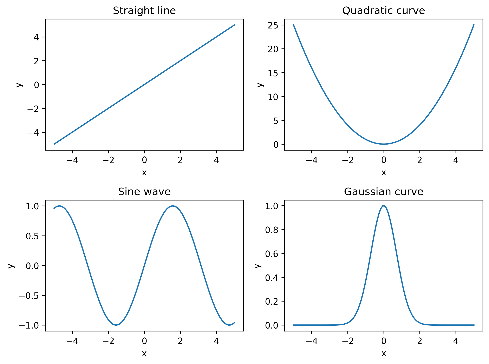
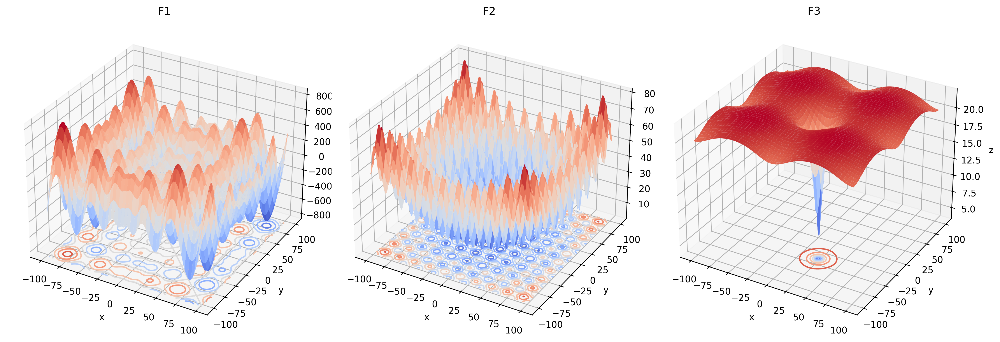

# Line and curves

```python
# Name: Mei Jiaojiao
# Profession: Artificial Intelligence
# Time and date: 3/28/23 10:19

import numpy as np
import matplotlib.pyplot as plt

# Define the x-values for the functions
x = np.linspace(-5, 5, 100)

# Define the functions
y1 = x                   # Straight line
y2 = x**2                # Quadratic curve
y3 = np.sin(x)           # Sine wave
y4 = np.exp(-x**2)       # Gaussian curve

# Create a new figure and set its size
plt.figure(figsize=(8, 6))

# Plot the functions in separate subplots
plt.subplot(2, 2, 1)     # Create a subplot for the straight line
plt.plot(x, y1)
plt.title('Straight line')

plt.subplot(2, 2, 2)     # Create a subplot for the quadratic curve
plt.plot(x, y2)
plt.title('Quadratic curve')

plt.subplot(2, 2, 3)     # Create a subplot for the sine wave
plt.plot(x, y3)
plt.title('Sine wave')

plt.subplot(2, 2, 4)     # Create a subplot for the Gaussian curve
plt.plot(x, y4)
plt.title('Gaussian curve')

# Add x- and y-labels for all subplots
for ax in plt.gcf().axes:
    ax.set_xlabel('x')
    ax.set_ylabel('y')

# Adjust the spacing between subplots to avoid overlap
plt.tight_layout()
plt.savefig("2d_functions.png", dpi=300, bbox_inches='tight', pad_inches=0.1)
# Show the figure
plt.show()
```



# 3D view of 2D functions

$F_1(x) = -\sum\limits_{i=1}^n x_i \sin(\sqrt{|x_i|})$

$F_2(x) = \sum\limits_{i=1}^n \left(x_i^2 - 10 \cos(2\pi x_i) + 10\right)$

$F_3(x) = \left(-20 \exp\left(-0.2 \sqrt{\frac{1}{n} \sum\limits_{i=1}^n x_i^2}\right) - \exp\left(\frac{1}{n} \sum\limits_{i=1}^n \cos(2\pi x_i)\right) + 20 + e\right)$

Note that in these formulas, $x$ represents a vector of length $n$.

```python
import numpy as np
import matplotlib.pyplot as plt
from mpl_toolkits.mplot3d import Axes3D


def F1(x):
    result = []
    for i in x:
        k = (-1) * i * np.sin(np.sqrt(np.abs(i)))
        result.append(k)
    return sum(result)


def F2(x):
    result = [np.power(i, 2) - (10 * np.cos(2 * np.pi * i)) + 10 for i in x]
    return sum(result)


def F3(x):
    dim = len(x)
    part1 = sum([np.power(i, 2) for i in x])
    part2 = sum([np.cos(2 * np.pi * i) for i in x])
    result = (-20) * np.exp(-0.2 * np.sqrt((1 / dim) * part1)) + (-np.exp((1 / dim) * part2) + 20 + np.e)
    return result


# Create a meshgrid of x and y values
x = np.linspace(-500, 500, 100)
y = np.linspace(-500, 500, 100)
X, Y = np.meshgrid(x, y)
Z1 = F1([X, Y])


x = np.linspace(-5, 5, 100)
y = np.linspace(-5, 5, 100)
X, Y = np.meshgrid(x, y)
Z2 = F2([X, Y])

x = np.linspace(-100, 100, 100)
y = np.linspace(-100, 100, 100)
X, Y = np.meshgrid(x, y)
Z3 = F3([X, Y])

# Create a new figure and set its size
fig = plt.figure(figsize=(15, 6))
# white background
fig.patch.set_facecolor('white')

# Plot the functions in 3D subplots
ax1 = fig.add_subplot(131, projection='3d')
ax1.plot_surface(X, Y, Z1, cmap="coolwarm")
# plot projection on xy plane
ax1.contour(X, Y, Z1, zdir='z', offset=-900, cmap="coolwarm")
ax1.set_title('F1')

ax2 = fig.add_subplot(132, projection='3d')
ax2.plot_surface(X, Y, Z2, cmap="coolwarm")
# plot projection on xy plane
ax2.contour(X, Y, Z2, zdir='z', offset=0, cmap="coolwarm")
ax2.set_title('F2')

ax3 = fig.add_subplot(133, projection='3d')
ax3.plot_surface(X, Y, Z3, cmap="coolwarm")
# plot projection on xy plane
ax3.contour(X, Y, Z3, zdir='z', offset=0, cmap="coolwarm")
ax3.set_title('F3')

# Add x-, y-, and z-labels to all subplots, grid off, axis off
for ax in fig.axes:
    ax.set_xlabel('x')
    ax.set_ylabel('y')
    ax.set_zlabel('z')

# Adjust the spacing between subplots to avoid overlap
plt.tight_layout()

plt.savefig("3d_functions.png", dpi=300, bbox_inches='tight', pad_inches=0.1)
# Show the figure
plt.show()
```




