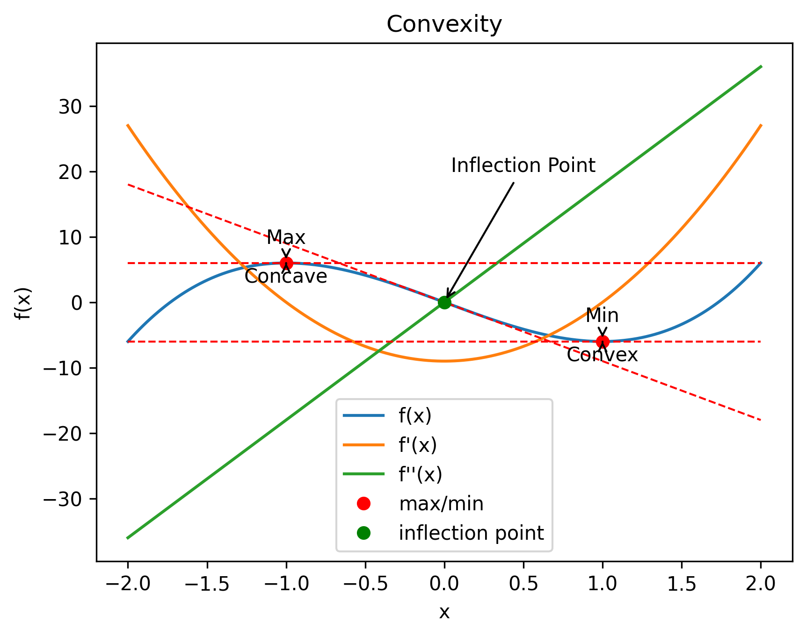
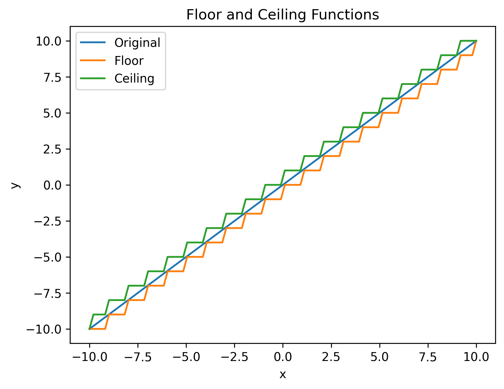

# One to one functions

```python
# Name: Mei Jiaojiao
# Profession: Artificial Intelligence
# Time and date: 4/3/23 17:46

import matplotlib.pyplot as plt

# define a one-to-one function
def one_to_one(x):
    return x

# define a not one-to-one function
def not_one_to_one(x):
    return x ** 2


# create input values
x_values = list(range(-5, 6))

# apply functions to input values
y_values_one_to_one = [one_to_one(x) for x in x_values]
y_values_not_one_to_one = [not_one_to_one(x) for x in x_values]

# create subplots
fig, axs = plt.subplots(nrows=1, ncols=2)

# plot one-to-one function
axs[0].plot(x_values, y_values_one_to_one)
axs[0].set_title('One-to-one Function')
axs[0].set_xlabel('x')
axs[0].set_ylabel('y')

# plot not one-to-one function
axs[1].plot(x_values, y_values_not_one_to_one)
axs[1].set_title('Not One-to-one Function')
axs[1].set_xlabel('x')
axs[1].set_ylabel('y')

# adjust layout
plt.tight_layout()

# show plots
plt.show()
```

<div style="text-align:center">
    
</div>

# Increasing and decreasing

```python
# Name: Mei Jiaojiao
# Profession: Artificial Intelligence
# Time and date: 4/3/23 17:51

import matplotlib.pyplot as plt
import numpy as np

# define the function f(x) = x^2
def f(x):
    return x ** 2

# define the derivative of f(x) = x^2
def df(x):
    return 2 * x

# create input values
x_values = np.linspace(-5, 5, 1000)

# apply function to input values
y_values = f(x_values)

# create subplots
fig, axs = plt.subplots(nrows=2, ncols=1)

# plot function
axs[0].plot(x_values, y_values)
axs[0].set_title('Function f(x) = x^2')
axs[0].set_xlabel('x')
axs[0].set_ylabel('y')
axs[0].fill_between(x_values, y_values, where=x_values>=0, color='green', alpha=0.2)
axs[0].fill_between(x_values, y_values, where=x_values<=0, color='red', alpha=0.2)

# plot derivative
y_values_derivative = df(x_values)
axs[1].plot(x_values, y_values_derivative)
axs[1].set_title('Derivative of f(x) = x^2')
axs[1].set_xlabel('x')
axs[1].set_ylabel('dy/dx')

# plot horizontal line at y=0
axs[1].axhline(y=0, color='gray', linestyle='--')

# shade the increasing and decreasing regions
axs[1].fill_between(x_values, y_values_derivative, where=y_values_derivative>=0, color='green', alpha=0.2)
axs[1].fill_between(x_values, y_values_derivative, where=y_values_derivative<=0, color='red', alpha=0.2)
# derivative is positive : increasing, color = 'green'
# derivative is negative : decreasing ,color = 'red'
axs[1].text(0, 0, 'Increasing', color='green', fontsize=12,horizontalalignment='left', verticalalignment='top')
axs[1].text(0, 0, 'Decreasing', color='red', fontsize=12,horizontalalignment='right', verticalalignment='bottom')

# adjust layout
plt.tight_layout()

plt.savefig('Function f(x) = x^2.png', dpi=300, bbox_inches='tight', pad_inches=0.1)
# show plots
plt.show()
```

<div style="text-align:center">   </div>

# Old and Even functions

```python
# Name: Mei Jiaojiao
# Profession: Artificial Intelligence
# Time and date: 4/3/23 18:04

import numpy as np
import matplotlib.pyplot as plt

# define an even function
def even(x):
    return x ** 2

# define an odd function
def odd(x):
    return x ** 3

# create input values
x_values = np.linspace(-5, 5, 100)

# apply functions to input values
y_values_even = [even(x) for x in x_values]
y_values_odd = [odd(x) for x in x_values]

# create subplots
fig, axs = plt.subplots(nrows=1, ncols=2)

# plot even function
axs[0].plot(x_values, y_values_even)
axs[0].set_title('Even Function')
axs[0].set_xlabel('x')
axs[0].set_ylabel('y')

# plot odd function
axs[1].plot(x_values, y_values_odd)
axs[1].set_title('Odd Function')
axs[1].set_xlabel('x')
axs[1].set_ylabel('y')

# adjust layout
plt.tight_layout()

# show plots
plt.show()
```

<div style="text-align:center">   </div>

# Convex and concave

```python
# Name: Mei Jiaojiao
# Profession: Artificial Intelligence
# Time and date: 4/3/23 18:13

import numpy as np
import matplotlib.pyplot as plt


# define function
def f(x):
    return 3 * x ** 3 - 9 * x


# define derivative function
def df(x):
    return 9 * x ** 2 - 9


# define second derivative function
def ddf(x):
    return 18 * x


# create x values
x_values = np.linspace(-2, 2, 1000)

# plot function
plt.plot(x_values, f(x_values), label='f(x)')
plt.plot(x_values, df(x_values), label='f\'(x)')
plt.plot(x_values, ddf(x_values), label='f\'\'(x)')

# plot tangent lines
for x0 in [-1, 0, 1]:
    m = df(x0)
    y0 = f(x0)
    y1 = y0 + m * (x_values - x0)
    plt.plot(x_values, y1, 'r--', linewidth=1)

# plot max and min points
plt.plot([-1, 1], [f(-1), f(1)], 'ro', label='max/min')

# plot inflection point
plt.plot([0], [0], 'go', label='inflection point')

# annotate points
plt.annotate('Max', xy=(-1, f(-1)), xytext=(-1, f(-1) + 3), ha='center',
             arrowprops=dict(facecolor='black', arrowstyle="->"))
plt.annotate('Min', xy=(1, f(1)), xytext=(1, f(1) + 3), ha='center',
             arrowprops=dict(facecolor='black', arrowstyle="->"))
plt.annotate('Inflection Point', xy=(0, 0), xytext=(0.5, 20), ha='center',
             arrowprops=dict(facecolor='black', arrowstyle="->"))
# concave, point to max
plt.annotate('Concave', xy=(-1, f(-1)), xytext=(-1, f(-1) - 3), ha='center',
                arrowprops=dict(facecolor='black', arrowstyle="->"))
# convex, point to min
plt.annotate('Convex', xy=(1, f(1)), xytext=(1, f(1) - 3), ha='center',
                arrowprops=dict(facecolor='black', arrowstyle="->"))

# add legend
plt.legend()

# set axis labels
plt.xlabel('x')
plt.ylabel('f(x)')

# show plot
plt.savefig('convexity.png', dpi=300, bbox_inches='tight', pad_inches=0.1)
plt.show()
```

<div style="text-align:center">   </div>

# Exponential and logarithmic

```python
# Name: Mei Jiaojiao
# Profession: Artificial Intelligence
# Time and date: 4/3/23 18:42

import numpy as np
import matplotlib.pyplot as plt


# define an exponential function
def exponential_function(x, a=1, b=1):
    return a * np.exp(b * x)


# define a logarithmic function
def logarithmic_function(x, a=1, b=1):
    return a * np.log(b * x)


# create input values
x_values = np.linspace(0.1, 100, 100)

# apply functions to input values
y_values_exponential = exponential_function(x_values, a=1, b=1)
y_values_logarithmic = logarithmic_function(x_values, a=1, b=2)

# create subplots
fig, axs = plt.subplots(nrows=1, ncols=2)

# plot exponential function
axs[0].plot(x_values, y_values_exponential)
axs[0].set_title('Exponential Function')
axs[0].set_xlabel('x')
axs[0].set_ylabel('y')

# plot logarithmic function
axs[1].plot(x_values, y_values_logarithmic)
axs[1].set_title('Logarithmic Function')
axs[1].set_xlabel('x')
axs[1].set_ylabel('y')

# adjust layout
plt.tight_layout()
plt.savefig('exponential_logarithmic.png', dpi=300, bbox_inches='tight', pad_inches=0.1)
# show plots
plt.show()
```

<div style="text-align:center">  </div>

# Floor function and ceiling function

```python
# Name: Mei Jiaojiao
# Profession: Artificial Intelligence
# Time and date: 4/3/23 18:47

import numpy as np
import matplotlib.pyplot as plt


# define floor function
def floor(x):
    return np.floor(x)


# define ceiling function
def ceiling(x):
    return np.ceil(x)


# create input values
x_values = np.linspace(-10, 10, 100)

# apply functions to input values
y_values_floor = floor(x_values)
y_values_ceiling = ceiling(x_values)

# create subplots
fig, axs = plt.subplots(nrows=1, ncols=1)

# plot original values
axs.plot(x_values, x_values, label='Original')

# plot floor function
axs.plot(x_values, y_values_floor, label='Floor')

# plot ceiling function
axs.plot(x_values, y_values_ceiling, label='Ceiling')

# set title, labels, and legend
axs.set_title('Floor and Ceiling Functions')
axs.set_xlabel('x')
axs.set_ylabel('y')
axs.legend()

# show plot
plt.savefig('floor_ceiling.png', dpi=300, bbox_inches='tight', pad_inches=0.1)
plt.show()
```

<div style="text-align:center"></div>

# Reference

1. Blitzstein, J. K., & Hwang, J. (2019). Introduction to Probability (2nd ed.). CRC Press.


