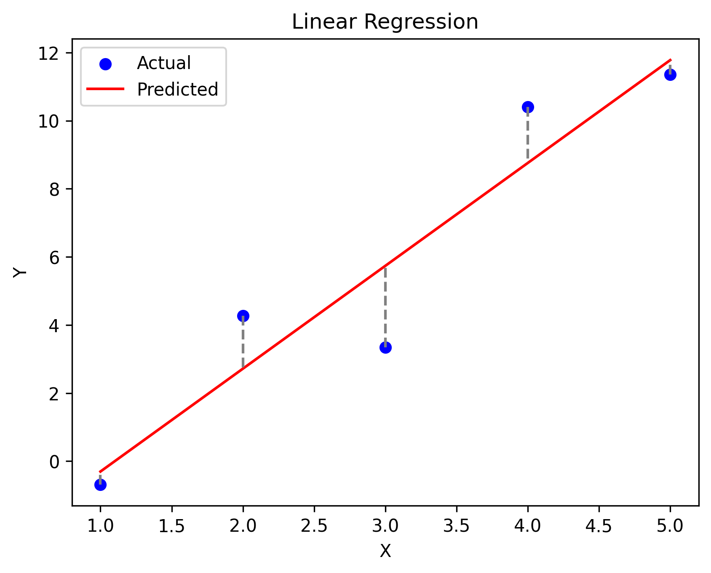
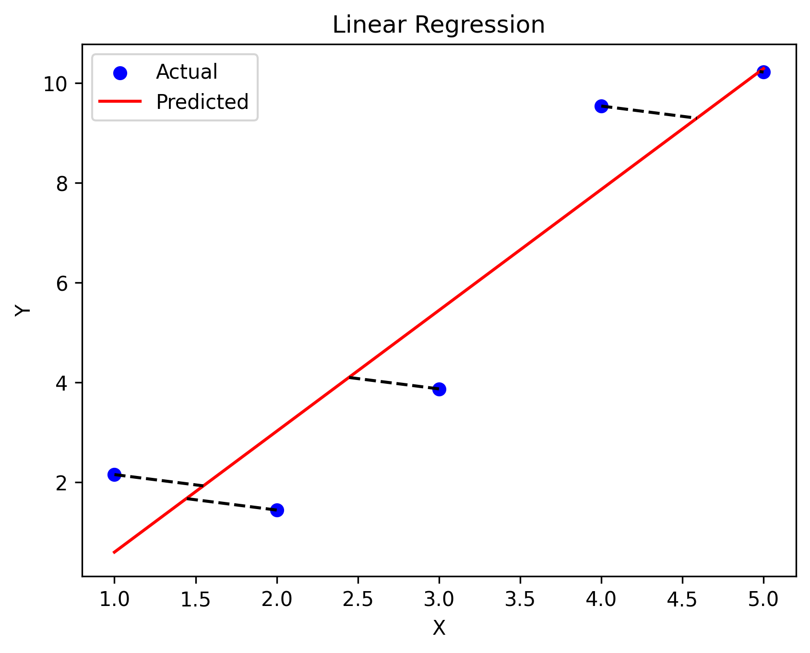
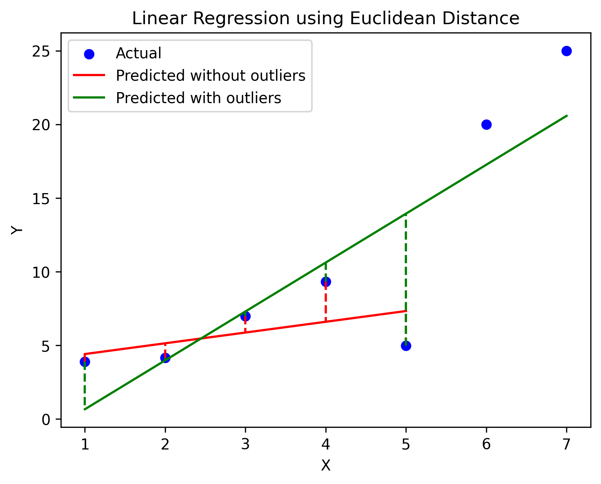
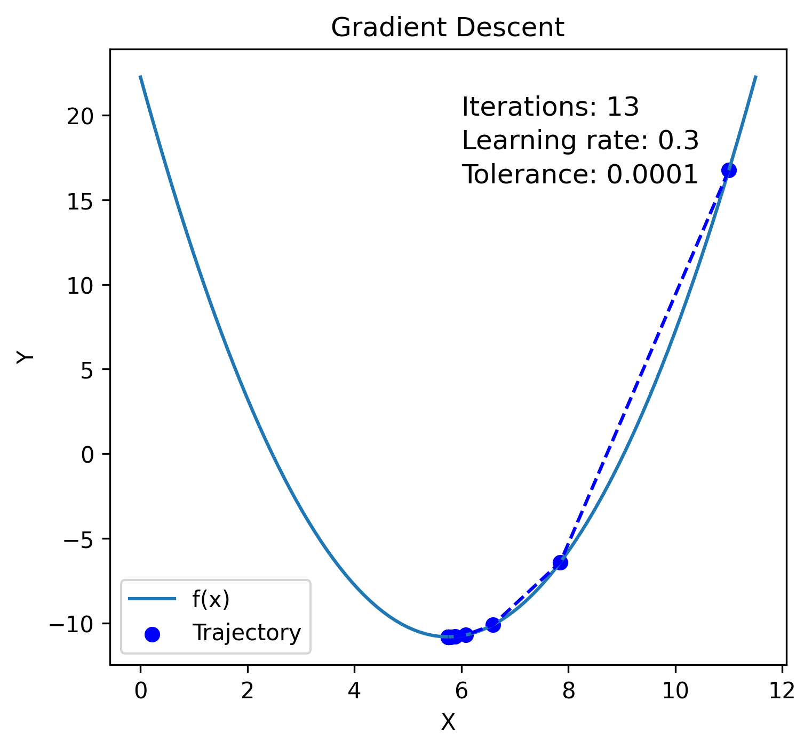
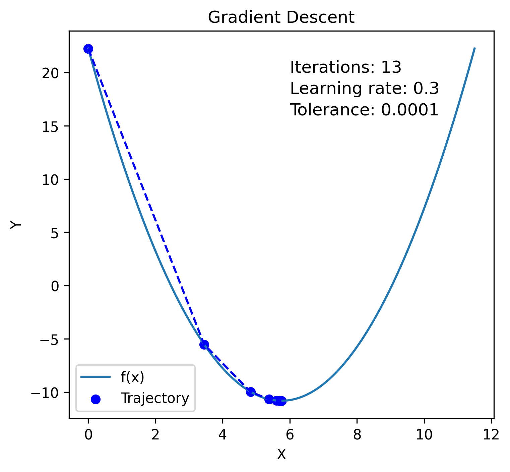
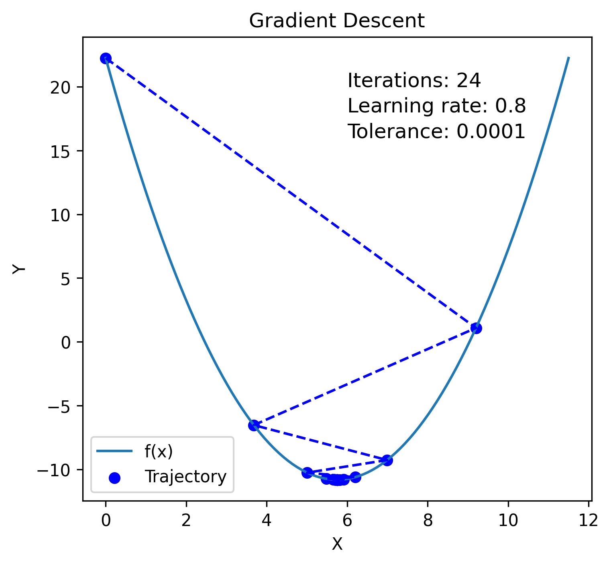

# The importance of a loss function

The importance of a loss function in machine learning cannot be overstated. Whenever we try to solve a problem, there is always some expected outcome, and the actual outcome will inevitably have some degree of error. The goal of optimization is to minimize this error as much as possible.

In linear regression, we try to find a line that best fits a set of data points. However, no matter how many data points we have, there will always be some degree of error in the fit. 

**When we only have a single point in the space, there are countless lines that can pass through that point, making it impossible to determine the best fit line. When we have two points, there is only one line that can pass through both points, meaning that the best fit line is well-defined. However, when we have three or more points, and those points lie on a straight line, there will always be some degree of error in the fit, no matter how we attempt to fit the line to the points.**

This is because, in this case, any line we draw will either overestimate or underestimate the data points, leading to some degree of inaccuracy in the fit. Thus, the role of the loss function is to measure this uncertainty and provide feedback to the optimization algorithm to improve the fit of the model.

# Loss function

A loss function is a function used to measure the difference between an expected value and a predicted value, which is also known as the loss. In simple terms, the loss function quantifies the difference between the expected value and the actual (or predicted) value.

The role of the loss function is to measure the quality of the model's output by calculating the difference between the predicted output and the actual output. The goal of training a machine learning model is to minimize the loss function, which means finding the model parameters that result in the smallest possible loss.

```python
# Name: Mei Jiaojiao
# Profession: Artificial Intelligence
# Time and date: 3/28/23 22:19

import numpy as np
import matplotlib.pyplot as plt

# Generate some random data for demonstration
x = np.array([1, 2, 3, 4, 5])
y = np.array([2, 4, 6, 8, 10]) + 2* np.random.randn(5)

# Fit a linear regression model to the data
model = np.polyfit(x, y, 1)
predicted = np.polyval(model, x)

# Plot the data and the regression line
plt.scatter(x, y, color='blue', label='Actual')
plt.plot(x, predicted, color='red', label='Predicted')

# Highlight the difference between actual and predicted values
for i in range(len(x)):
    plt.plot([x[i], x[i]], [y[i], predicted[i]], color='gray', linestyle='--')

# Add labels and legend to the plot
plt.xlabel('X')
plt.ylabel('Y')
plt.title('Linear Regression')
plt.legend()

# Display the plot
plt.savefig('gradient.png', dpi=300, bbox_inches='tight', pad_inches=0.1)
plt.show()
```

<p align="center">
  
</p>

```python
# Name: Mei Jiaojiao
# Profession: Artificial Intelligence
# Time and date: 3/28/23 22:25

import numpy as np
import matplotlib.pyplot as plt

# Generate some random data for demonstration
x = np.array([1, 2, 3, 4, 5])
y = np.array([2, 4, 6, 8, 10]) + 1.5 * np.random.randn(5)

# Fit a linear regression model to the data
model = np.polyfit(x, y, 1)
predicted = np.polyval(model, x)

# Calculate the residuals
residuals = y - predicted

# Plot the data and the regression line
plt.scatter(x, y, color='blue', label='Actual')
plt.plot(x, predicted, color='red', label='Predicted')

# Plot the orthogonal lines
for i in range(len(x)):
    slope = -1 / model[0]
    intercept = y[i] - slope * x[i]
    intersection_x = (intercept - model[1]) / (model[0] - slope)
    intersection_y = slope * intersection_x + intercept
    plt.plot([x[i], intersection_x], [y[i], intersection_y], color='black', linestyle='--')

# Add labels and legend to the plot
plt.xlabel('X')
plt.ylabel('Y')
plt.title('Linear Regression')
plt.legend()

# Display the plot
plt.savefig('gradient1.png', dpi=300, bbox_inches='tight', pad_inches=0.1)
plt.show()
```

<p align="center">
  
</p>

# Tug-of-war

I had a question before about why the loss function in linear regression is represented as a vertical line instead of the distance between the point and the line. **I think of linear regression as a tug-of-war game, where the points on either side of the line are pulling the line in opposite directions.**

I think about it. The vertical line is better because (1) Using a vertical line to represent the loss in linear regression is more intuitive and accurate because the goal of linear regression is to minimize the vertical distance between the predicted values and the actual values. (2) The distance between two points in a triangle is always greater than or equal to the difference between the lengths of the two sides that form the angle between them. This is known as the triangle inequality. Therefore, the use of a vertical line to represent the loss function in linear regression can be seen as a way to magnify the difference between the predicted values and the actual values, which can make it easier to see and understand the performance of the model.

The use of a vertical line to represent the residual or error in linear regression is a way to magnify the difference between the predicted values and the actual values, which makes it easier to measure the error or loss of the model. In the case of mean squared error (MSE), the use of the Euclidean distance (i.e., the distance between the points in a straight line) instead of the Manhattan distance (i.e., the sum of the absolute differences between the coordinates) is also a way to magnify the errors and make them more apparent. This is because the Euclidean distance gives more weight to larger errors, which can help to identify and prioritize the points with the greatest impact on the overall error.

Overall, the use of these techniques to magnify the errors and make them more apparent is an important step in understanding and improving the performance of the model.

# Euclidean Distance vs Manhattan distance

```python
import numpy as np
import matplotlib.pyplot as plt

# Generate some random data for demonstration
x = np.array([1, 2, 3, 4, 5])
y = np.array([2, 4, 6, 8, 10]) + 2 * np.random.randn(5)
# generate two outliers
x = np.append(x, [6, 7])
y = np.append(y, [20, 25])

# Fit a linear regression model to the data
# model1 without outliers
model1 = np.polyfit(x[:-2], y[:-2], 1)
predicted1 = np.polyval(model1, x[:-2])
# model2 with outliers
model2 = np.polyfit(x, y, 1)
predicted2 = np.polyval(model2, x)

# Plot the data and the regression line
plt.scatter(x, y, color='blue', label='Actual')
plt.plot(x[:-2], predicted1, color='red', label='Predicted without outliers')
plt.plot(x, predicted2, color='green', label='Predicted with outliers')

# Highlight the difference between actual and two predicted values
for i in range(len(x)-2):
    plt.plot([x[i], x[i]], [y[i], predicted1[i]], color='red', linestyle='--')
    plt.plot([x[i], x[i]], [y[i], predicted2[i]], color='green', linestyle='--')

# Add labels and legend to the plot
plt.xlabel('X')
plt.ylabel('Y')
plt.title('Linear Regression using Euclidean Distance')
plt.legend()

# Display the plot
plt.savefig('gradient2.png', dpi=300, bbox_inches='tight', pad_inches=0.1)
plt.show()
```

<p align="center">
  
</p>

I added two outliers to the original data, and it is clear that these outliers have a significant impact on the regression model, causing the line to shift noticeably. This is similar to a tug-of-war game where the two outliers are pulling the line strongly towards their side. With the use of the Euclidean distance, the impact of the outliers is amplified, as the larger errors have more weight in the calculation of the loss. As the line moves to adjust to the outliers, the distance between the line and the original five points increases, leading to a larger loss. The goal is to find a balance that minimizes the overall loss.

If we were to use the Manhattan distance instead, the impact of the outliers may be even greater than the impact of the original five points. This is because the Manhattan distance measures the vertical distance between the line and each point, without amplifying the error through squaring.

In practice, the choice of distance metric depends on the number and nature of the outliers. There is no one-size-fits-all solution, and it is important to carefully consider the specific characteristics of the data and the problem at hand when choosing a distance metric for regression.

In general, it is a good practice to remove or handle outliers before fitting a linear regression model. 

# Mean squared error

Mean squared error (MSE) is a common measure of the average squared difference between the predicted values and the actual values in regression analysis. It is calculated as the average of the squared differences between the predicted and actual values for each data point. The formula for MSE is:
$$
\begin{equation}
\text { MSE }=1 / n * \sum(y_i-\hat{y} _i)^2
\end{equation}
$$
where:

- n is the number of data points
- $y_i$ is the actual value for the $i$-th data point
- $\hat{y} _i$ is the predicted value for the $i$-th data point

The $1/n$ term in the MSE formula is used to normalize the sum of squared errors and ensure that the MSE is relative to the number of data points in the sample. 

For example, if we compare the MSE values for two datasets with 100 and 1000 data points, respectively, the MSE value for the larger dataset would be 10 times larger than the MSE value for the smaller dataset, even if the models have the same level of accuracy. By dividing the sum of squared errors by the number of data points, we can obtain an average error value that is more representative of the model's performance across different sample sizes.

In some cases, the MSE is defined with an additional factor of 1/2 to simplify the derivative calculation, as the derivative of the squared term will cancel out the 2 in the denominator. 
$$
\begin{equation}
M S E=1 / 2 n * \Sigma(y_i-\hat{y}_i)^2
\end{equation}
$$
While the additional factor of 1/2 does not change the minimum value of the MSE, it can make the derivative calculation simpler and more efficient. 

# Gradient descend

The derivative is a scalar value that represents the rate of change of a function in one dimension, while the gradient is a vector that represents the rate of change of a function in multiple dimensions.

Gradient descent is an optimization algorithm used to minimize a differentiable function by iteratively adjusting its parameters in the direction of steepest descent of the function. The basic idea of gradient descent is to update the parameters in a way that minimizes the loss function.

```python
import numpy as np
import matplotlib.pyplot as plt

# Define the function to minimize
f = lambda x: (x - 3.5) ** 2 - 4.5 * x + 10

# Define the gradient function
g = lambda x: 2 * (x - 3.5) - 4.5

# Generate x values for plotting
x = np.linspace(0, 11.5, 100)

# Compute y values for plotting
y = f(x)

# Plot the function
plt.plot(x, y, label='f(x)')

# Set the initial guess for the minimum
x_min = 5.75

# Set the learning rate
eta = 0.3

# Perform gradient descent
x_current = np.random.randint(0, 12, size=1)[0]

x_history = [x_current]
tolerance = 0.0001
iteration = 0
while True:
    x_previous = x_current
    x_current = x_previous - eta * g(x_previous)
    x_history.append(x_current)
    iteration += 1
    if np.abs(x_current - x_previous) < tolerance:
        break

plt.figure(figsize=(12, 5))
plt.subplot(1, 2, 1)
# Plot the function
plt.plot(x, y, label='f(x)')
# Plot the trajectory of gradient descent
plt.scatter(x_history, f(np.array(x_history)), color='blue', label='Trajectory')
plt.plot(x_history, f(np.array(x_history)), color='blue', linestyle='--')
# Add labels and legend to the plot
plt.xlabel('X')
plt.ylabel('Y')
plt.title('Gradient Descent')
# iterations, learning rate, and tolerance on the right upper corner
plt.text(6, 20, 'Iterations: {}'.format(iteration), fontsize=12)
plt.text(6, 18, 'Learning rate: {}'.format(eta), fontsize=12)
plt.text(6, 16, 'Tolerance: {}'.format(tolerance), fontsize=12)
plt.legend()
plt.savefig('gradient3.png', dpi=300, bbox_inches='tight', pad_inches=0.1)
plt.show()

```

<p align="center">
  
</p>

<p align="center">
  
</p>

<p align="center">
  
</p>

Learning rate is a hyperparameter that controls the step size taken during each iteration of the gradient descent optimization algorithm. Specifically, it determines how much the model parameters are updated in the direction of the negative gradient of the loss function. A high learning rate results in larger parameter updates and faster convergence, but can also cause the algorithm to overshoot the minimum and oscillate around it, or even diverge. Conversely, a low learning rate results in smaller parameter updates and slower convergence, but can also help the algorithm converge more stably and avoid overshooting.

# Reference

1. Ng, A. (2017). Gradient Descent. In Machine Learning (Week 2). Stanford University. Coursera. https://www.coursera.org/learn/machine-learning
2. Wikipedia contributors. (2023, March 17). Mean squared error. In Wikipedia, The Free Encyclopedia. Retrieved 14:37, March 28, 2023, from https://en.wikipedia.org/wiki/Mean_squared_error


