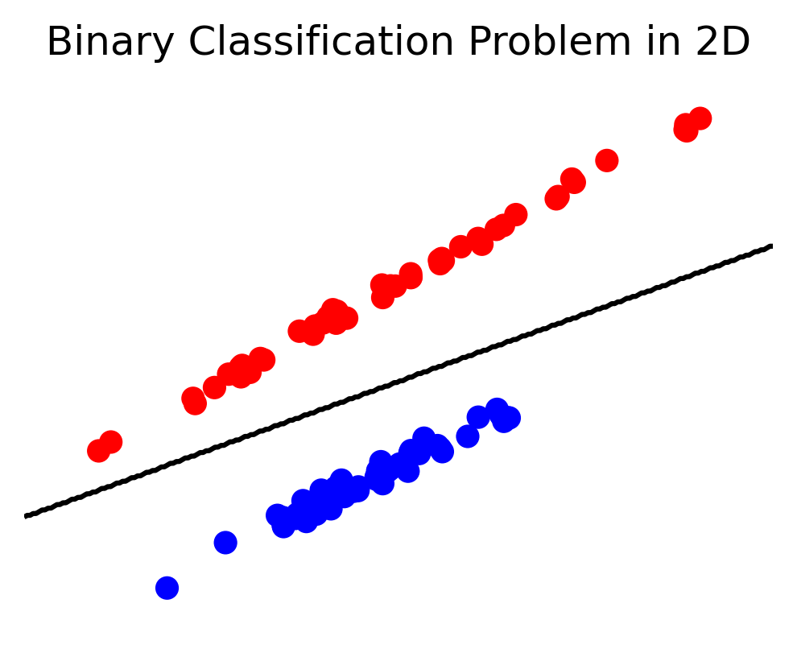
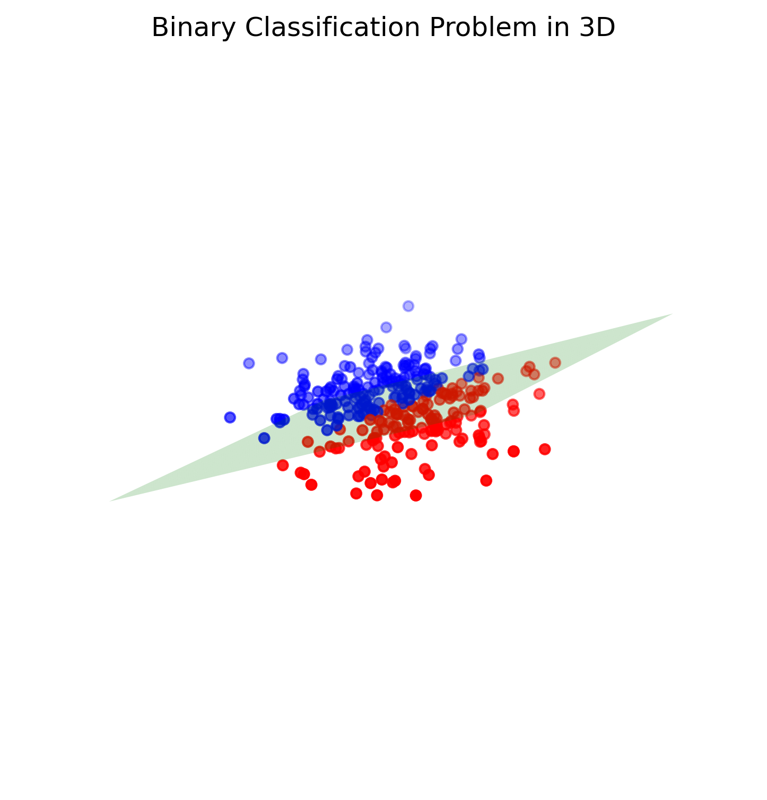

In mathematics, a hyperplane is a subspace of one dimension less than its ambient space. This means that in an n-dimensional space, a hyperplane is an (n-1)-dimensional subspace.

For example, in two-dimensional space (a plane), a hyperplane is a one-dimensional subspace (a line). In three-dimensional space, a hyperplane is a two-dimensional subspace (a plane).

The equation of a hyperplane in $n+1$-dimensional space can be written as:
$$
\begin{equation}
a_1 x_1+a_2 x_2+\cdots+a_n x_n=b
\end{equation}
$$
where $a_1, a_2, \ldots, a_n$ are constants, $x_1, x_2, \ldots, x_n$ are variables representing the coordinates of a point in n-dimensional space, and $b$ is a constant.

### Binary classification problem

The task of binary classification is to classify input data points into one of two classes or categories. This is a supervised learning task where the machine learning algorithm is trained on a labeled dataset where each data point is labeled as belonging to one of the two classes.

In a 2D environment, the task of binary classification is to find a line (also called a decision boundary) that can separate the two classes in the feature space. The line should be chosen in such a way that the data points belonging to one class lie on one side of the line, and the data points belonging to the other class lie on the other side of the line. 

```python
import numpy as np
import matplotlib.pyplot as plt
from sklearn.datasets import make_classification
from sklearn.linear_model import LogisticRegression

# Generate a random 2D binary classification problem
X, y = make_classification(n_samples=100, n_features=2, n_informative=2, n_redundant=0, n_clusters_per_class=1, random_state=42)

# Train a logistic regression model on the data
clf = LogisticRegression(random_state=42)
clf.fit(X, y)

# Plot the data points and the decision boundary
fig = plt.figure(figsize=(4, 3))
ax = plt.scatter(X[:, 0], X[:, 1], c=y, cmap='bwr')
x_min, x_max = X[:, 0].min() - 0.5, X[:, 0].max() + 0.5
y_min, y_max = X[:, 1].min() - 0.5, X[:, 1].max() + 0.5
xx, yy = np.meshgrid(np.arange(x_min, x_max, 0.02), np.arange(y_min, y_max, 0.02))
Z = clf.predict(np.c_[xx.ravel(), yy.ravel()])
Z = Z.reshape(xx.shape)
plt.contour(xx, yy, Z, colors='black', levels=[0.5])
plt.title('Binary Classification Problem in 2D')
plt.axis('off')
plt.grid(False)
plt.savefig('binary_classification_problem_in_2d.png', dpi=300, bbox_inches='tight', pad_inches=0.1)
plt.show()
```

<p align="center">    </p>


In a 3D environment, the task of binary classification is similar, but the decision boundary is now a plane that separates the two classes. Similarly, in higher-dimensional spaces, the decision boundary is a hyperplane that separates the two classes.

```python
import numpy as np
import matplotlib.pyplot as plt
from mpl_toolkits.mplot3d import Axes3D

# Generate random 3D points
np.random.seed(42)
n_samples = 300
X = np.random.randn(n_samples, 3)
y = (X[:, 0] + 2 * X[:, 1] - 0.5 * X[:, 2] > 0).astype(int)

# Find a hyperplane to separate the points
from sklearn.svm import SVC

clf = SVC(kernel='linear', C=10)
clf.fit(X, y)

# Plot the 3D points and the hyperplane
fig = plt.figure(figsize=(8, 6))
ax = fig.add_subplot(111, projection='3d')
ax.scatter(X[:, 0], X[:, 1], X[:, 2], c=y, cmap='bwr')
x_min, x_max = X[:, 0].min() - 0.5, X[:, 0].max() + 0.5
y_min, y_max = X[:, 1].min() - 0.5, X[:, 1].max() + 0.5
z_min, z_max = X[:, 2].min() - 0.5, X[:, 2].max() + 0.5
xx, yy = np.meshgrid(np.arange(x_min, x_max, 0.02), np.arange(y_min, y_max, 0.02))
zz = (-clf.intercept_[0] - clf.coef_[0][0] * xx - clf.coef_[0][1] * yy) / clf.coef_[0][2]
ax.plot_surface(xx, yy, zz, alpha=0.2, color="green")
ax.set_title('Binary Classification Problem in 3D')
ax.axis('off')
ax.grid(False)
ax.view_init(30, 30)
plt.savefig('binary_classification_problem_in_3d.png', dpi=300, bbox_inches='tight', pad_inches=0.1)
plt.show()
```

<p align="center">     </p>

