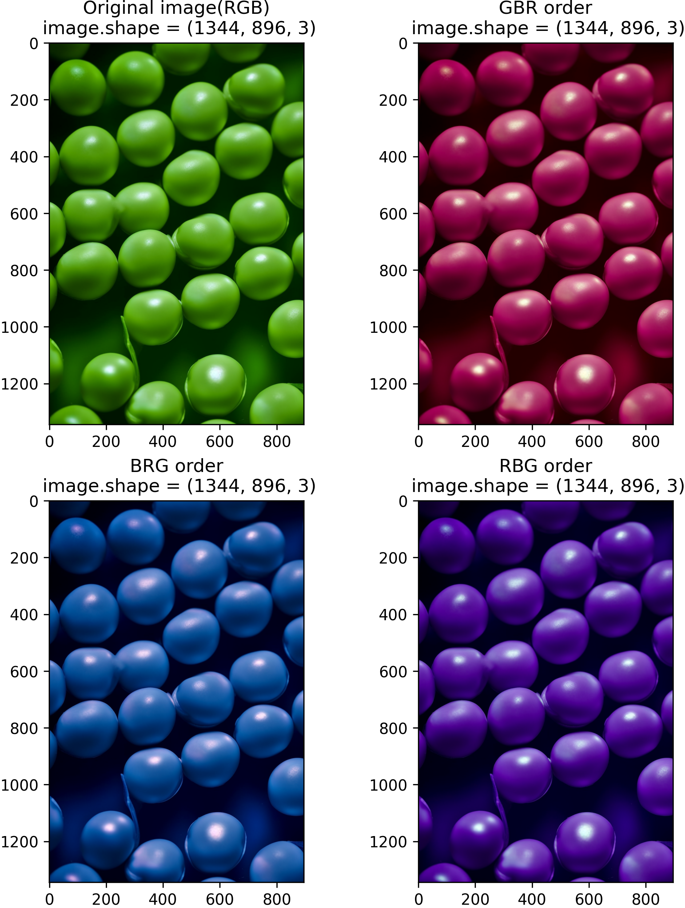
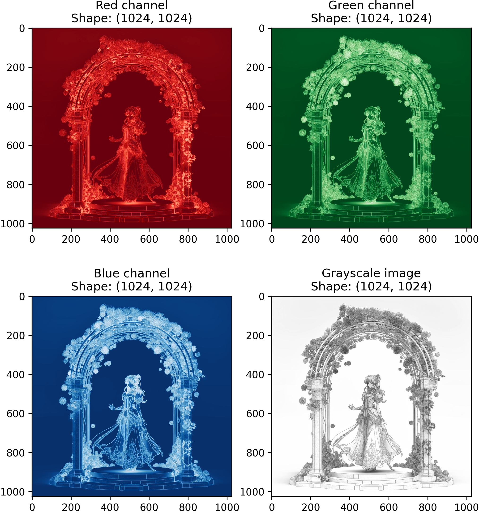

# Change the oder of RGB

```python
# Name: Mei Jiaojiao
# Profession: Artificial Intelligence
# Time and date: 3/28/23 10:06

import numpy as np
import matplotlib.pyplot as plt

# Read image and convert it to a 3D array
img = plt.imread('bean.png')

plt.figure(figsize=(8, 10))  # Create a figure with size 10x10

# Show the original image
plt.subplot(2, 2, 1)  # Create a subplot for the original image
plt.imshow(img)       # Show the original image
plt.title('Original image(RGB)\n image.shape = {}'.format(img.shape))

# Rearrange the RGB channels to GBR order
img_gbr = img[:,:,[1,2,0]]
plt.subplot(2, 2, 2)  # Create a subplot for the GBR image
plt.imshow(img_gbr)   # Show the GBR image
plt.title('GBR order\n image.shape = {}'.format(img_gbr.shape))

# Rearrange the RGB channels to BRG order
img_brg = img[:,:,[2,0,1]]
plt.subplot(2, 2, 3)  # Create a subplot for the BRG image
plt.imshow(img_brg)   # Show the BRG image
plt.title('BRG order\n image.shape = {}'.format(img_brg.shape))


# Rearrange the RGB channels to RBG order
img_rbg = img[:,:,[0,2,1]]
plt.subplot(2, 2, 4)  # Create a subplot for the RBG image
plt.title('RBG order\n image.shape = {}'.format(img_rbg.shape))
plt.imshow(img_rbg)   # Show the RBG image

plt.savefig("rose_chanel_order.png", dpi=300, bbox_inches='tight', pad_inches=0)
plt.show()            # Show the figure with all the subplots
```



# Single channel 

```python
# Name: Mei Jiaojiao
# Profession: Artificial Intelligence
# Time and date: 3/28/23 10:06

import numpy as np
import matplotlib.pyplot as plt

# Read image and convert it to a 3D array
img = plt.imread('rose.png')
print("Image shape: ", img.shape)

plt.figure(figsize=(8, 9))

# Convert the color image to grayscale
gray_img = np.dot(img[..., :3], [0.2989, 0.5870, 0.1140])

# Show the red, green, and blue channels separately
plt.subplot(2, 2, 1)            # Create a subplot for the red channel
plt.imshow(img[:, :, 0], cmap='Reds')   # Show the red channel by indexing the first dimension
plt.title('Red channel\nShape: {}'.format(img[:, :, 0].shape))  # Add a title for the subplot with the shape of the channel

plt.subplot(2, 2, 2)            # Create a subplot for the green channel
plt.imshow(img[:, :, 1], cmap='Greens')  # Show the green channel by indexing the second dimension
plt.title('Green channel\nShape: {}'.format(img[:, :, 1].shape)) # Add a title for the subplot with the shape of the channel

plt.subplot(2, 2, 3)            # Create a subplot for the blue channel
plt.imshow(img[:, :, 2], cmap='Blues')   # Show the blue channel by indexing the third dimension
plt.title('Blue channel\nShape: {}'.format(img[:, :, 2].shape))  # Add a title for the subplot with the shape of the channel

# Show the grayscale image
plt.subplot(2, 2, 4)  # Create a subplot for the grayscale image
plt.imshow(gray_img, cmap='gray')  # Show the grayscale image using the 'gray' colormap
plt.title('Grayscale image\nShape: {}'.format(gray_img.shape))  # Add a title for the subplot with the shape of the image

plt.savefig('rose_channels.png', dpi=300, bbox_inches='tight', pad_inches=0.0)  # Save the figure

plt.show()  # Show the figure with all the subplots
```


