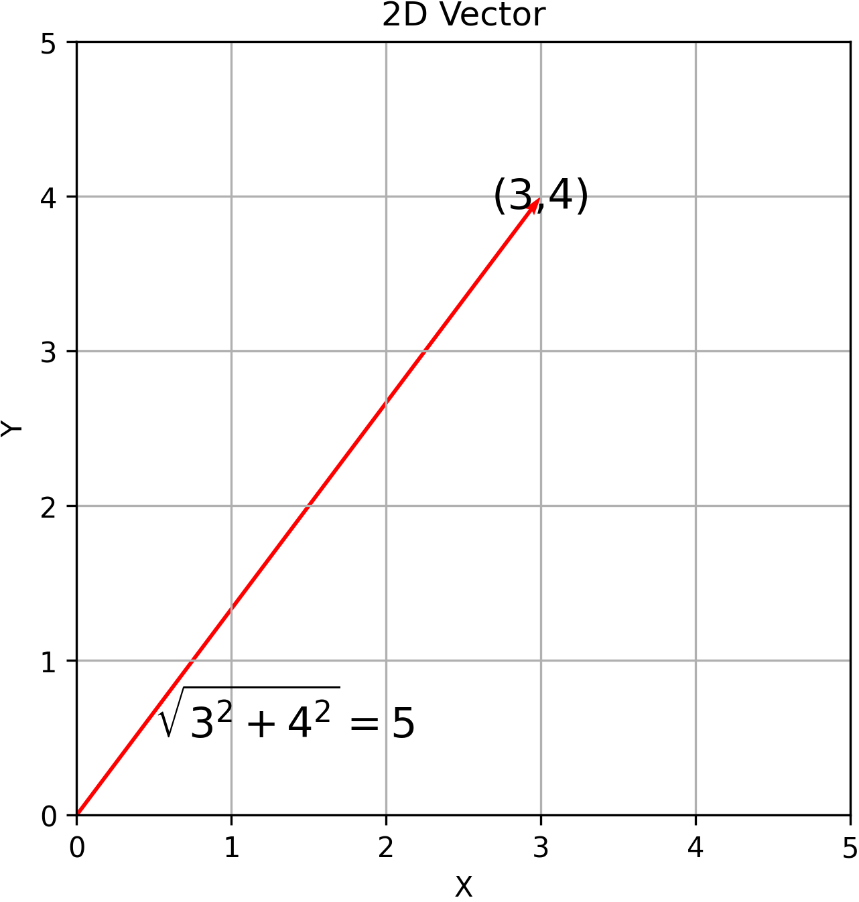

Scalars: A scalar is a quantity that has only magnitude and no direction. It is a single value that can be represented by a number. 

Vectors: A vector is a mathematical object that has both magnitude and direction. It can be represented by an ordered list of numbers, or coordinates, that describe the vector's components in a particular coordinate system.
$$
\begin{equation}
\text { Column vector } v \quad v=\left[\begin{array}{l}
v_1 \\
v_2
\end{array}\right] \quad \begin{aligned}
& v_1=\text { first component of } \boldsymbol{v} \\
& v_2=\text { second component of } \boldsymbol{v}
\end{aligned}
\end{equation}
$$
```python
# Name: Mei Jiaojiao
# Profession: Artificial Intelligence
# Time and date: 3/27/23 20:27

import numpy as np
import matplotlib.pyplot as plt

# Define the 2D vector
v = np.array([3, 4])

# Define the starting point of the vector
start = np.array([0, 0])

# Plot the vector
fig, ax = plt.subplots(figsize=(5, 5))
ax.quiver(*start, *v, scale=1, scale_units='xy', angles='xy', color='r', width=0.005)
ax.set_xlim(0, 5)
ax.set_ylim(0, 5)
ax.set_xlabel('X')
ax.set_ylabel('Y')
ax.set_aspect('equal')
plt.grid()
# annotate the vector
ax.annotate('(3,4)', v, ha='center', va='center', fontsize=15)
# title
plt.title('2D Vector')
# save the figure
plt.savefig('2d_vector.png', dpi=300, bbox_inches='tight', pad_inches=0)
plt.show()
```

<p align="center">

</p>

The formula to calculate the length of a $2 D$ vector with components $(x, y)$ is:
$$
|\boldsymbol{v}|=\sqrt{x^2+y^2}
$$
Matrices: A matrix is a rectangular array of numbers, arranged in rows and columns. It can be used to represent data, systems of linear equations, and transformations in linear algebra.
$$

\begin{equation}
A=\left[\begin{array}{ll}
1 & 4 \\
2 & 5 \\
3 & 6
\end{array}\right] \text { is a } 3 \text { by } 2 \text { matrix : } m=3 \text { rows and } n=2 \text { columns. }
\end{equation}
$$
Tensors: A tensor is a generalization of vectors and matrices, and is used to represent higher-order data or multidimensional arrays. Tensors can have any number of dimensions, and can be used to represent complex systems, such as those found in physics, engineering, and machine learning.

```python
# Name: Mei Jiaojiao
# Profession: Artificial Intelligence
# Time and date: 3/27/23 20:27

import numpy as np

# Scalars
scalar = 5
print("Scalar:", scalar)
# Scalars have no dimensions, so they do not have a shape.

# Vectors
vector = np.array([1, 2, 3])
print("Vector:", vector)
print("Vector shape:", vector.shape)
# 1-dimensional vector with 3 elements

# Matrices
matrix = np.array([[1, 2, 3], [4, 5, 6], [7, 8, 9]])
print("Matrix:\n", matrix)
print("Matrix shape:", matrix.shape)
# 2-dimensional matrix with 3 rows and 3 columns

# Tensors
tensor = np.array([[[1, 2], [3, 4]], [[5, 6], [7, 8]]])
print("Tensor:\n", tensor)
print("Tensor shape:", tensor.shape)
# 3-dimensional tensor with 2 matrices, each with 2 rows and 2 columns
```

