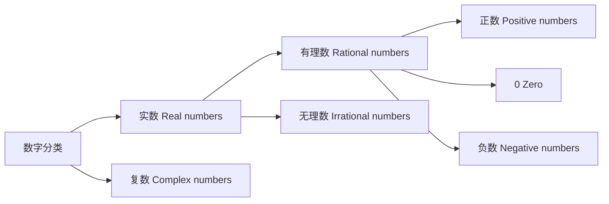
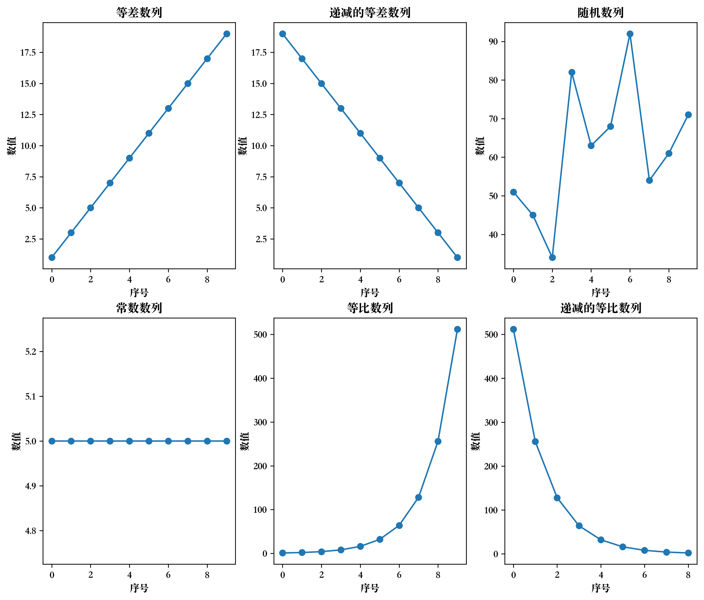
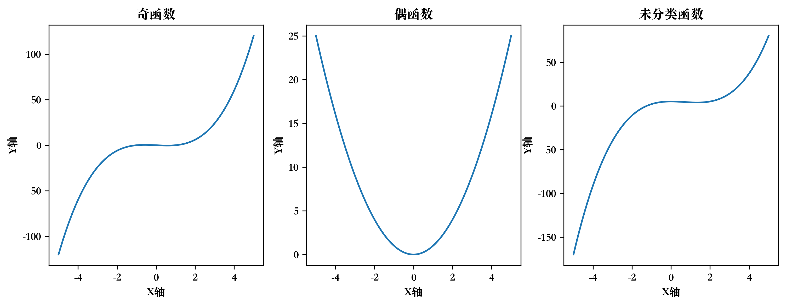
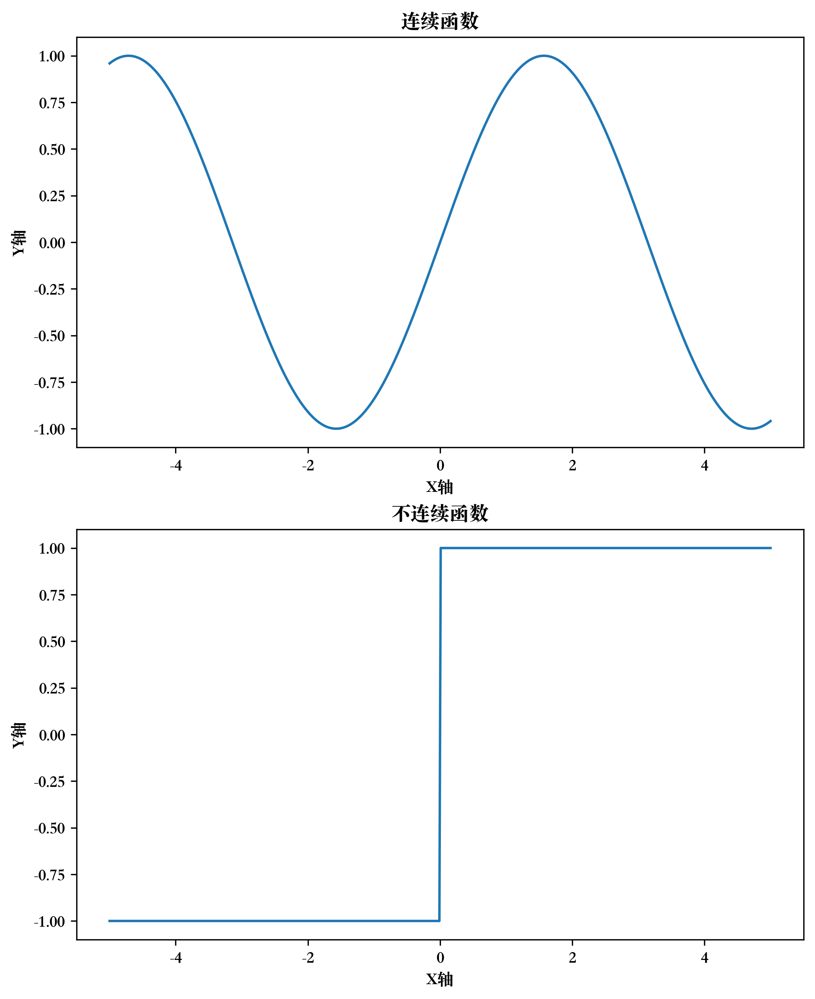
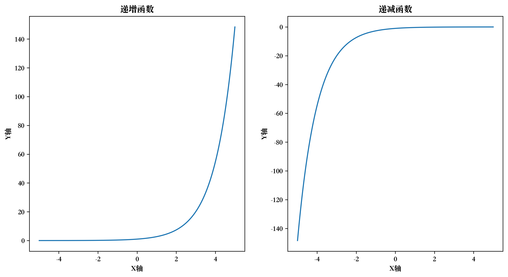
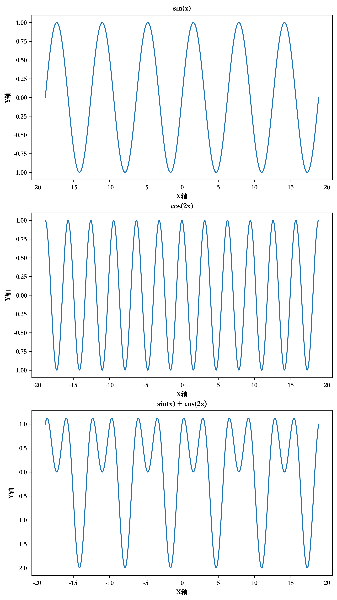
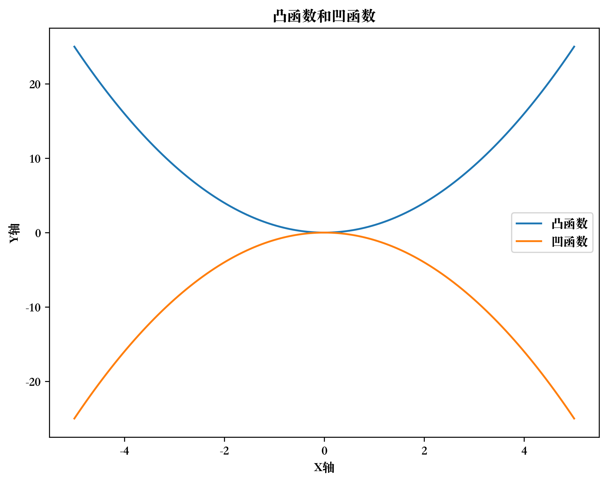

# 数字



## 判断正负

```python
num = -10

if num > 0:
    print("这个数是正数")
elif num == 0:
    print("这个数是零")
else:
    print("这个数是负数")
```

## 判断奇偶

```python
num = 7

if num % 2 == 0:
    print("这个数是偶数")
else:
    print("这个数是奇数")
```

## 判断整数和小数

```python
num = 3.5

if num // 1 == num:
    print("这个数是整数")
else:
    print("这个数是小数")
```

## 判断有理数和无理数

```python
import math

num = math.sqrt(2)

if num.is_integer():
    print("这个数是有理数")
else:
    print("这个数是无理数")
```

## 判断质数

```python
import math

num = 17
is_prime = True

if num > 1:
    for i in range(2, int(math.sqrt(num)) + 1):
        if num % i == 0:
            is_prime = False
            break
else:
    is_prime = False

if is_prime:
    print("这个数是质数")
else:
    print("这个数不是质数")
```

## 常见的数学符号和对应的概念

- 实数集：$\mathbb {R}$ (所有实数的集合)
-  整数集：$\mathbb {Z}$ (所有整数的集合)
-  有理数集：$\mathbb {Q}$ (所有有理数的集合)
-  自然数集：$\mathbb {N}$ (所有正整数的集合)
-  复数集：$\mathbb {C}$ (所有复数的集合)
-  空集：$\varnothing$ (不包含任何元素的集合)
-  子集：$\subseteq$ (表示一个集合包含于另一个集合)
-  并集：$\cup$ (表示两个集合中所有元素的集合)
-  交集：$\cap$ (表示两个集合中共同元素的集合)
-  属于：$\in$ (表示一个元素属于某个集合)
-  不属于：$\notin$ (表示一个元素不属于某个集合)
-  等于：$=$ (表示两个数或两个集合相等)
-  不等于：$\neq$ (表示两个数或两个集合不相等)
-  大于：$>$ (表示一个数大于另一个数)
-  小于：$<$ (表示一个数小于另一个数)
- 大于等于：$\geq$ (表示一个数大于或等于另一个数)
- 小于等于：$\leq$ (表示一个数小于或等于另一个数)
- 加号：$+$ (表示两个数相加或集合的并集)
- 减号：$-$ (表示两个数相减或集合的差集)
- 乘号：$\times$ 或 $\cdot$ (表示两个数相乘或集合的笛卡尔积)
- 除号：$\div$ (表示两个数相除)
- 开方：$\sqrt {}$ (表示一个数的平方根)
- 绝对值：$|\ \ |$ (表示一个数的绝对值)
- 阶乘：$!$ (表示一个自然数的阶乘)

## 比较特殊的 $\pi$ and $e$

```python
import math
print ('pi = ', math.pi)
print ('e = ', math.e)

# pi =  3.141592653589793
# e =  2.718281828459045
```

# 数列

数列是按照一定的规律排列起来的一组数字，通常用 $a_1,a_2,\dots,a_n,\dots$ 表示。其中，$a_n$ 表示数列的第 $n$ 项，$n$ 表示项数。

数列可以有无限多个项，也可以只有有限个项。数列可以按照不同的规律排列，例如，等差数列、等比数列、斐波那契数列等。

- 等差数列（Arithmetic Sequence）：相邻项之间的差值是相等的。这个相等的差值称为公差（$d$），公差可以是正数、负数或零。以 $a_1$ 表示等差数列的第一个项，则等差数列的一般项公式为 $a_n=a_1+(n-1) d$。
- 等比数列（Geometric Sequence）：相邻项之间的比值是相等的。这个相等的比值称为公比（$r$），公比可以是正数、负数或零。以 $a_1$ 表示等比数列的第一个项，则等比数列的一般项公式为 $a_n=a_1*r^{n-1}$。
- 常数数列是一种特殊的数列，其中每个项都相等。因此，常数数列的一般形式为 $a_1, a_1, a_1, \ldots$，其中 $a_1$ 是任意给定的常数。
- 斐波那契数列是指这样一个数列：$0,1,1,2,3,5,8,13,21,34,55,\ldots$。即第一项为 $0$，第二项为 $1$，后面每一项都是其前面两项的和。斐波那契数列可以用递归公式来表示：$F_1=0,F_2=1,F_n=F_{n-1}+F_{n-2}(n>2)$。

```python
# Name: Mei Jiaojiao
# Profession: Artificial Intelligence
# Time and date: 4/15/23 10:12

import matplotlib.pyplot as plt
import random
# font
plt.rcParams['font.sans-serif'] = ['Songti SC']
plt.rcParams['axes.unicode_minus'] = False


# 生成等差数列
a1 = 1
d1 = 2
arithmetic_seq = [a1 + (i-1)*d1 for i in range(1, 11)]

# 生成等比数列
a2 = 1
r2 = 2
geometric_seq = [a2*(r2**(i-1)) for i in range(1, 11)]

# 生成随机数列
random_seq = [random.randint(1, 100) for i in range(1, 11)]

# 生成常数数列
constant_seq = [5 for i in range(1, 11)]

# 绘制子图
fig, axs = plt.subplots(2, 3, figsize=(12, 10))

axs[0, 0].plot(arithmetic_seq, 'o-')
axs[0, 0].set_title('等差数列')
axs[0, 0].set_xlabel('序号')
axs[0, 0].set_ylabel('数值')

axs[0, 1].plot(arithmetic_seq[::-1], 'o-')
axs[0, 1].set_title('递减的等差数列')
axs[0, 1].set_xlabel('序号')
axs[0, 1].set_ylabel('数值')

axs[0, 2].plot(random_seq, 'o-')
axs[0, 2].set_title('随机数列')
axs[0, 2].set_xlabel('序号')
axs[0, 2].set_ylabel('数值')

axs[1, 0].plot(constant_seq, 'o-')
axs[1, 0].set_title('常数数列')
axs[1, 0].set_xlabel('序号')
axs[1, 0].set_ylabel('数值')

axs[1, 1].plot(geometric_seq, 'o-')
axs[1, 1].set_title('等比数列')
axs[1, 1].set_xlabel('序号')
axs[1, 1].set_ylabel('数值')

axs[1, 2].plot(geometric_seq[:0:-1], 'o-')
axs[1, 2].set_title('递减的等比数列')
axs[1, 2].set_xlabel('序号')
axs[1, 2].set_ylabel('数值')

plt.show()
```



# 矩阵


# 函数

函数是一种映射关系, 将一个集合中的每个元素都映射到另一个集合中的唯一元素上。在数学中, 函数通常用符号 $f(x)$ 表示, 其中 $x$ 是函数的自变量, $f(x)$ 是函数的因变量, 表示自变量$x$对应的函数值。
具体来说, 函数 $f(x)$ 可以定义为：对于定义域 $X$ 中的任意一个元素$x$, 都有唯一的一个值 $y$ 与之对应, 这个值 $y$ 就是函数 $f(x)$ 在 $x$ 处的函数值。即：
$$
\begin{aligned}
& f: X \rightarrow Y \\
& x \mapsto f(x)
\end{aligned}
$$
其中, $X$ 是函数的定义域, $Y$ 是函数的值域。函数 $f(x)$ 的图像是表示所有可能的输入值和它们对应的输出值的集合。

## 奇偶性

在数学中，对于一个函数 $f (x)$，若对于任意 $x$，都有 $f (-x) = f (x)$，则称该函数为偶函数；若对于任意 $x$，都有 $f (-x) = -f (x)$，则称该函数为奇函数。

```python
# Name: Mei Jiaojiao
# Profession: Artificial Intelligence
# Time and date: 4/15/23 11:06

import matplotlib.pyplot as plt
import numpy as np

plt.rcParams['font.sans-serif'] = ['Songti SC']
plt.rcParams['axes.unicode_minus'] = False

# 定义x轴的范围和步长
x = np.linspace(-5, 5, 500)


# 定义奇函数
def odd_function(x):
    return x ** 3 - x


# 定义偶函数
def even_function(x):
    return x ** 2


# 定义未分类函数
def other_function(x):
    return x ** 3 - 2 * x ** 2 + 5


# 创建一个3x1的子图
fig, axs = plt.subplots(1, 3, figsize=(12, 4))

# 在第一个子图中绘制奇函数的图像
axs[0].plot(x, odd_function(x))
axs[0].set_title('奇函数')
axs[0].set_xlabel('X轴')
axs[0].set_ylabel('Y轴')

# 在第二个子图中绘制偶函数的图像
axs[1].plot(x, even_function(x))
axs[1].set_title('偶函数')
axs[1].set_xlabel('X轴')
axs[1].set_ylabel('Y轴')

# 在第三个子图中绘制未分类函数的图像
axs[2].plot(x, other_function(x))
axs[2].set_title('未分类函数')
axs[2].set_xlabel('X轴')
axs[2].set_ylabel('Y轴')


# 显示图像
plt.savefig('04.png', dpi=300, bbox_inches='tight', pad_inches=0.1)
plt.show()
```



## 连续性

在数学中，一个函数在某一点连续，指的是在该点函数的极限存在且等于函数在该点的取值。具体来说，设 $f (x)$ 是定义在区间 $I$ 上的函数，$x_0 \in I$，若以下三个条件同时成立，则称 $f (x)$ 在 $x_0$ 处连续：

1. 函数 $f (x)$ 在 $x_0$ 处有定义；
2. 函数 $f (x)$ 在 $x_0$ 的左右两侧的极限都存在，即 $\lim\limits_{x \to x_0^-} f (x)$ 和 $\lim\limits_{x \to x_0^+} f (x)$ 都存在；
3. 函数 $f (x)$ 在 $x_0$ 处的取值等于其左右极限的值，即 $f (x_0) = \lim\limits_{x \to x_0^-} f (x) = \lim\limits_{x \to x_0^+} f (x)$。

若函数 $f (x)$ 在区间 $I$ 的每一点都连续，则称 $f (x)$ 在 $I$ 上连续。

```python
# Name: Mei Jiaojiao
# Profession: Artificial Intelligence
# Time and date: 4/15/23 11:09

import matplotlib.pyplot as plt
import numpy as np

plt.rcParams['font.sans-serif'] = ['Songti SC']
plt.rcParams['axes.unicode_minus'] = False

# 定义x轴的范围和步长
x = np.linspace(-5, 5, 500)


# 定义一个连续函数
def continuous_function(x):
    return np.sin(x)


# 定义一个不连续函数
def discontinuous_function(x):
    y = np.zeros(len(x))
    for i, x_val in enumerate(x):
        if x_val < 0:
            y[i] = -1
        else:
            y[i] = 1
    return y


# 创建一个2x1的子图
fig, axs = plt.subplots(2, 1, figsize=(8, 10))

# 在第一个子图中绘制连续函数的图像
axs[0].plot(x, continuous_function(x))
axs[0].set_title('连续函数')
axs[0].set_xlabel('X轴')
axs[0].set_ylabel('Y轴')

# 在第二个子图中绘制不连续函数的图像
axs[1].plot(x, discontinuous_function(x))
axs[1].set_title('不连续函数')
axs[1].set_xlabel('X轴')
axs[1].set_ylabel('Y轴')

# 显示图像
plt.savefig('05.png', dpi=300, bbox_inches='tight', pad_inches=0.1)
plt.show()
```



## 单调性

单调性指函数在其定义域内的变化趋势，若对于函数 $f (x)$ 中定义域内的任意两个实数 $x_1$ 和 $x_2$，当 $x_1 < x_2$ 时，有 $f (x_1) < f (x_2)$，则称 $f (x)$ 在该定义域内为严格单调递增函数；若对于函数 $f (x)$ 中定义域内的任意两个实数 $x_1$ 和 $x_2$，当 $x_1 < x_2$ 时，有 $f (x_1) \leq f (x_2)$，则称 $f (x)$ 在该定义域内为单调递增函数。

同理，若对于函数 $f (x)$ 中定义域内的任意两个实数 $x_1$ 和 $x_2$，当 $x_1 < x_2$ 时，有 $f (x_1) > f (x_2)$，则称 $f (x)$ 在该定义域内为严格单调递减函数；若对于函数 $f (x)$ 中定义域内的任意两个实数 $x_1$ 和 $x_2$，当 $x_1 < x_2$ 时，有 $f (x_1) \geq f (x_2)$，则称 $f (x)$ 在该定义域内为单调递减函数。

符号上可以表示为：

- 严格单调递增函数：$x_1 <x_2 \Rightarrow f (x_1) < f (x_2)$；
- 单调递增函数：$x_1 <x_2 \Rightarrow f (x_1) \leq f (x_2)$；
- 严格单调递减函数：$x_1 <x_2 \Rightarrow f (x_1) > f (x_2)$；
- 单调递减函数：$x_1 <x_2 \Rightarrow f (x_1) \geq f (x_2)$。

其中，"$\Rightarrow$" 表示蕴含关系，即当左侧的条件成立时，右侧的结论一定成立。

```python
# Name: Mei Jiaojiao
# Profession: Artificial Intelligence
# Time and date: 4/15/23 11:15

import matplotlib.pyplot as plt
import numpy as np

plt.rcParams['font.sans-serif'] = ['Songti SC']
plt.rcParams['axes.unicode_minus'] = False

# 定义x轴的范围和步长
x = np.linspace(-5, 5, 500)

# 定义一个递增函数
def increasing_function(x):
    return np.exp(x)

# 定义一个递减函数
def decreasing_function(x):
    return -np.exp(-x)

# 创建一个1x2的子图
fig, axs = plt.subplots(1, 2, figsize=(12, 6))

# 在第一个子图中绘制递增函数的图像
axs[0].plot(x, increasing_function(x))
axs[0].set_title('递增函数')
axs[0].set_xlabel('X轴')
axs[0].set_ylabel('Y轴')

# 在第二个子图中绘制递减函数的图像
axs[1].plot(x, decreasing_function(x))
axs[1].set_title('递减函数')
axs[1].set_xlabel('X轴')
axs[1].set_ylabel('Y轴')

# 显示图像
plt.savefig('06.png', dpi=300, bbox_inches='tight', pad_inches=0.1)
plt.show()
```



## 周期性

一个函数 $f (x)$ 是周期函数，如果存在正数 $T$ 使得对于任意的 $x$ 都有 $f (x+T)=f (x)$ 成立。 $T$ 称为函数的一个周期。

```python
# Name: Mei Jiaojiao
# Profession: Artificial Intelligence
# Time and date: 4/15/23 11:19

import matplotlib.pyplot as plt
import numpy as np

plt.rcParams['font.sans-serif'] = ['Songti SC']
plt.rcParams['axes.unicode_minus'] = False

# 定义x轴的范围和步长
x = np.linspace(-6 * np.pi, 6 * np.pi, 500)


# 定义第一个周期性函数
def periodic_function1(x):
    return np.sin(x)


# 定义第二个周期性函数
def periodic_function2(x):
    return np.cos(2 * x)


# 定义第三个周期性函数
def periodic_function3(x):
    return np.sin(x) + np.cos(2 * x)


# 创建一个3x1的子图
fig, axs = plt.subplots(3, 1, figsize=(8, 15))

# 在第一个子图中绘制第一个周期性函数的图像
axs[0].plot(x, periodic_function1(x))
axs[0].set_title('sin(x)')
axs[0].set_xlabel('X轴')
axs[0].set_ylabel('Y轴')

# 在第二个子图中绘制第二个周期性函数的图像
axs[1].plot(x, periodic_function2(x))
axs[1].set_title('cos(2x)')
axs[1].set_xlabel('X轴')
axs[1].set_ylabel('Y轴')

# 在第三个子图中绘制第三个周期性函数的图像
axs[2].plot(x, periodic_function3(x))
axs[2].set_title('sin(x) + cos(2x)')
axs[2].set_xlabel('X轴')
axs[2].set_ylabel('Y轴')

# 显示图像
plt.savefig('07.png', dpi=300, bbox_inches='tight', pad_inches=0.1)
plt.show()
```



## 凹凸性

```python
# Name: Mei Jiaojiao
# Profession: Artificial Intelligence
# Time and date: 4/15/23 11:22

import matplotlib.pyplot as plt
import numpy as np

plt.rcParams['font.sans-serif'] = ['Songti SC']
plt.rcParams['axes.unicode_minus'] = False

# 定义x轴的范围和步长
x = np.linspace(-5, 5, 500)


# 定义一个凸函数
def convex_function(x):
    return x ** 2


# 定义一个凹函数
def concave_function(x):
    return -x ** 2


# 创建一个1x1的子图
fig, axs = plt.subplots(1, 1, figsize=(8, 6))

# 在子图中绘制凸函数和凹函数的图像
axs.plot(x, convex_function(x), label='凸函数')
axs.plot(x, concave_function(x), label='凹函数')
axs.set_title('凸函数和凹函数')
axs.set_xlabel('X轴')
axs.set_ylabel('Y轴')
axs.legend()

# 显示图像
plt.savefig('08.png', dpi=300, bbox_inches='tight', pad_inches=0.1)
plt.show()
```



