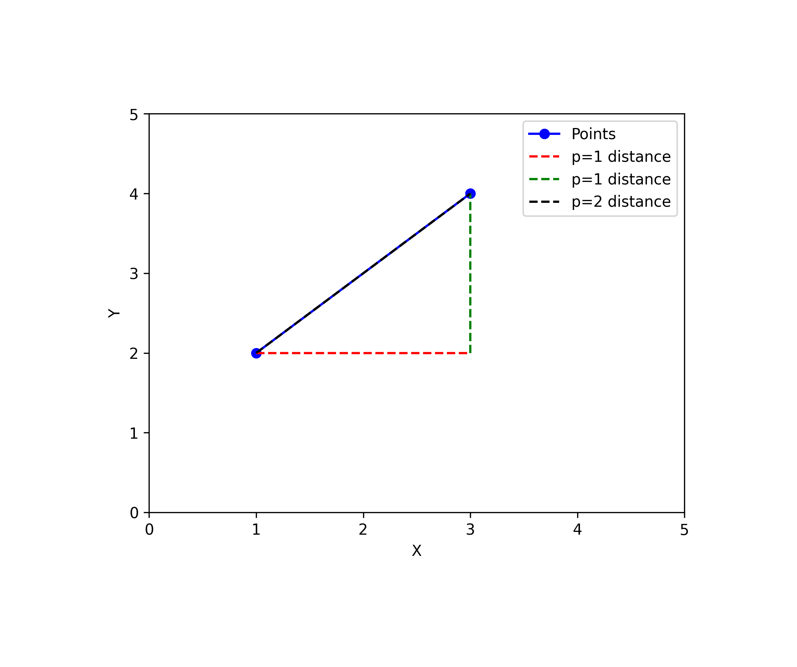

### Norm for a vector

In linear algebra, the p-norm of a vector $\mathrm{x}$ is a way of measuring the size or magnitude of the vector. The p-norm is defined as:
$$
\begin{equation}
\|\mathrm {x}\|_p=\left(\sum_{i=1}^n\left|x_i\right|^p\right)^{1 / p}
\end{equation}
$$
where $\mathrm{x} = [x_1, x_2, \ldots, x_n]$ is an n-dimensional vector, and $p$ is a positive real number. When $p=2$, the p-norm is known as the Euclidean norm, and when $p=1$, it is known as the Manhattan or taxicab norm.

The Euclidean norm of a vector $\mathrm{x}$ is defined as:
$$
\begin{equation}
\|\mathrm{x}\|_2=\sqrt{\sum_{i=1}^n x_i^2}
\end{equation}
$$
The Manhattan norm of a vector $\mathrm{x}$ is defined as:
$$
\begin{equation}
\|\mathrm{x}\|_1=\sum_{i=1}^n\left|x_i\right|
\end{equation}
$$

```python
# Name: Mei Jiaojiao
# Profession: Artificial Intelligence
# Time and date: 3/27/23 22:34

import numpy as np
import matplotlib.pyplot as plt

# Define the two points
x1 = np.array([1, 2])
x2 = np.array([3, 4])

# Calculate the absolute and Euclidean distance
d1 = np.sum(np.abs(x1 - x2))
d2 = np.sqrt(np.sum((x1 - x2)**2))

# Print the distances
print("Absolute distance:", d1)
print("Euclidean distance:", d2)

# Plot the two points and the distances
fig, ax = plt.subplots()
ax.plot([x1[0], x2[0]], [x1[1], x2[1]], 'bo-', label='Points')
ax.plot([x1[0], x2[0]], [x1[1], x1[1]], 'r--', label='p=1 distance')
ax.plot([x2[0], x2[0]], [x1[1], x2[1]], 'g--', label='p=1 distance')
ax.plot([x1[0], x2[0]], [x1[1], x2[1]], 'k--', label='p=2 distance')
ax.legend()
ax.set_xlim(0, 5)
ax.set_ylim(0, 5)
ax.set_xlabel('X')
ax.set_ylabel('Y')
plt.savefig('norm.png', dpi=300, bbox_inches='tight', pad_inches=1)
plt.show()
```

```markdown
Absolute distance: 4
Euclidean distance: 2.8284271247461903
```



The red and green dashed lines represent the $p=1$ distance, which is the sum of the absolute differences between the coordinates of the two points in each dimension. The black dashed line represents the $p=2$ distance, which is the Euclidean distance between the two points.

### Norm for a matrix

#### Frobenius norm

The Frobenius norm of a matrix $\mathrm{A}$ is a way of measuring the "size" or "magnitude" of the matrix. It is defined as the square root of the sum of the squares of all the elements in the matrix:
$$
\begin{equation}
\|\mathrm{A}\|_F \equiv \sqrt{\sum_{i=1}^m \sum_{j=1}^n\left|a_{i j}\right|^2}
\end{equation}
$$
where $a_{ij}$ is the $(i,j)$-th entry of $\mathrm{A}$ and $m$ and $n$ are the number of rows and columns of $\mathrm{A}$, respectively.

The Frobenius norm is similar to the Euclidean norm for vectors, and it measures the overall "size" of the matrix. It is always non-negative and satisfies the following properties:

- $|\mathrm{A}|_F \geq 0$ for any matrix $\mathrm{A}$.
- $|\mathrm{A}|_F = 0$ if and only if $\mathrm{A} = \mathrm{0}$ (the matrix of all zeros).
- $|\alpha\mathrm{A}|_F = |\alpha||\mathrm{A}|_F$ for any scalar $\alpha$.
- $|\mathrm{A} + \mathrm{B}|_F \leq |\mathrm{A}|_F + |\mathrm{B}|_F$ (the triangle inequality).

```python
import numpy as np

# Define a matrix
A = np.array([[1, 2], [3, 4], [5, 6]])

# Calculate the Frobenius norm
f_norm = np.linalg.norm(A, 'fro')
print("Frobenius norm:", f_norm)
```

```markdown
Frobenius norm: 9.539392014169456
```

#### Spectral norm

The Spectral norm of a matrix $\mathrm{A}$ is defined as the maximum singular value of $\mathrm{A}$, denoted as:
$$
\begin{equation}
\|\mathrm{A}\|_2=\sqrt{\lambda_{\max }\left(\mathrm{A}^{\mathrm{H}} \mathrm{A}\right)}=\sigma_{\max }(\mathrm{A})
\end{equation}
$$
where, $\mathrm{A}^\mathrm{H}$ represents the conjugate transpose of $\mathrm{A}$, $\lambda_{\max}\left(\mathrm{A}^\mathrm{H}\mathrm{~A}\right)$ is the largest eigenvalue of $\mathrm{A}^\mathrm{H} \mathrm{~A}$, and $\sigma_{\max }(\mathrm{A})$ is the maximum singular value of $\mathrm{A}$.

```python
import numpy as np

# Define a matrix
A = np.array([[1, 2], [3, 4], [5, 6]])

# Calculate the spectral norm
s_norm = np.linalg.norm(A, 2)
print("Spectral norm:", s_norm)

# Calculate the singular values of A
U, s, V = np.linalg.svd(A)

# Calculate the spectral norm
s_norm = s[0]
print("Spectral norm:", s_norm)
```

```markdown
Spectral norm: 9.525518091565107
```

#### Other norms

$$
\begin{equation}
\|A\|_1=\max _{1 \leq j \leq n} \sum_{i=1}^m\left|a_{i j}\right|_{,} \quad \text { "max column sum"}
\end{equation}
$$

$$
\begin{equation}
\|A\|_{\infty}=\max _{1 \leq i \leq m} \sum_{j=1}^n\left|a_{i j}\right|, \quad \text { "max row sum" }
\end{equation}
$$

For example, for
$$
A=\left[\begin{array}{ccc}
-3 & 5 & 7 \\
2 & 6 & 4 \\
0 & 2 & 8
\end{array}\right],
$$
we have that
$$
\begin{aligned}
& \|A\|_1=\max (|-3|+2+0 ; 5+6+2 ; 7+4+8)=\max (5,13,19)=19, \\
& \|A\|_{\infty}=\max (|-3|+5+7 ; 2+6+4 ; 0+2+8)=\max (15,12,10)=15 .
\end{aligned}
$$

### Reference

1. Wikipedia contributors. (2022, March 27). Matrix norm. In Wikipedia. Retrieved March 27, 2022, from https://en.wikipedia.org/wiki/Matrix_norm
2. Goodfellow, I., Bengio, Y., & Courville, A. (2016). Deep Learning. MIT Press.


