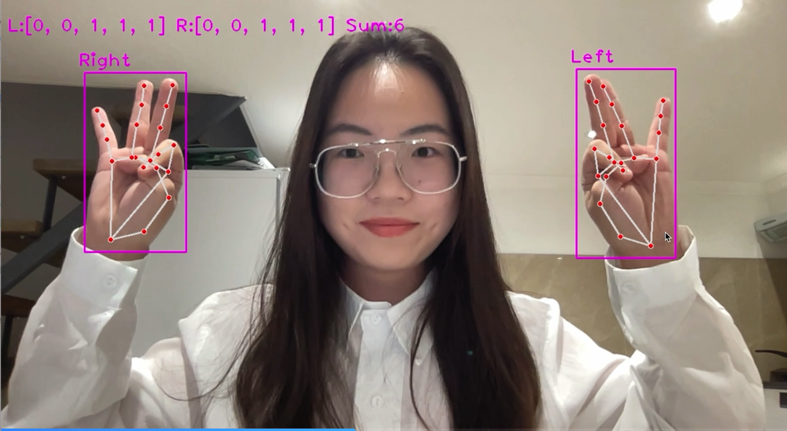

This program uses OpenCV and the Hand Tracking Module to detect and count the number of fingers visible in a camera feed. It can detect up to two hands simultaneously and displays the number of fingers for each hand as well as the total number of fingers on the screen.

Steps:

1. The program initializes the HandDetector object with the specified detection confidence and maximum number of hands to detect.
2. The camera is opened and its resolution is set.
3. The program enters a loop where it continuously reads the camera feed, detects and draws the hands on the image, and displays the finger count for each hand.
4. If there is only one hand visible, the program calculates the finger count for that hand and sets the finger count for the other hand to 0.
5. If two hands are visible, the program calculates the finger count for each hand and adds them together to get the total finger count.
6. The finger counts are displayed on the screen using OpenCV's putText function.
7. The loop stops when the user presses the 'q' key, and the camera is released and all windows are closed.

```python
import cv2
from cvzone.HandTrackingModule import HandDetector

# initialize hand detector
detector = HandDetector(detectionCon=0.8, maxHands=2)

# open camera
cap = cv2.VideoCapture(0)

# set camera resolution
cap.set(3, 1280) # width
cap.set(4, 720)  # height

# initialize left and right hand variables
leftHand = None
rightHand = None

while True:
    # read camera feed
    success, img = cap.read()
    if not success:
        print("Unable to read camera feed")
        break
    if img is None:
        continue
    img = cv2.flip(img, 1)

    # detect and draw the hands
    hands, img = detector.findHands(img)

    if hands:
        if len(hands) == 1:
            # if only one hand is detected, get the number of fingers up
            if hands[0]['type'] == 'Left':
                leftHand = hands[0]
                leftFingers = detector.fingersUp(leftHand)
                rightFingers = [0] * 5
            elif hands[0]['type'] == 'Right':
                rightHand = hands[0]
                rightFingers = detector.fingersUp(rightHand)
                leftFingers = [0] * 5
        elif len(hands) == 2:
            # if two hands are detected, get the number of fingers up for each hand
            leftHand = hands[0] if hands[0]['type'] == 'Left' else hands[1]
            rightHand = hands[0] if hands[0]['type'] == 'Right' else hands[1]
            leftFingers = detector.fingersUp(leftHand)
            rightFingers = detector.fingersUp(rightHand)

        fingerSum = sum(leftFingers) + sum(rightFingers)

        # draw the number of fingers up on the screen
        cv2.putText(img, f"L:{leftFingers} R:{rightFingers} Sum:{fingerSum}", (10, 70), cv2.FONT_HERSHEY_PLAIN,
                    2, (255, 0, 255), 2)

    # show the camera feed
    cv2.imshow("Image", img)

    # if the 'q' key is pressed, stop the loop
    if cv2.waitKey(1) == ord('q'):
        break

# release the camera and close all windows
cap.release()
cv2.destroyAllWindows()
```

<p align="center">
  
</p>

A video demonstration of the final program can be found at the following link: https://drive.google.com/file/d/1WAxcclJO9HlfqIIzZvn3XCFV8l6c7-xB/view?usp=sharing

### Reference

1. *Virtual Calculator Based On OpenCV And Cvzone Using Python With A Full Source Code*. (2021, December 13). YouTube. https://www.youtube.com/watch?v=vOaurBYMovQ
