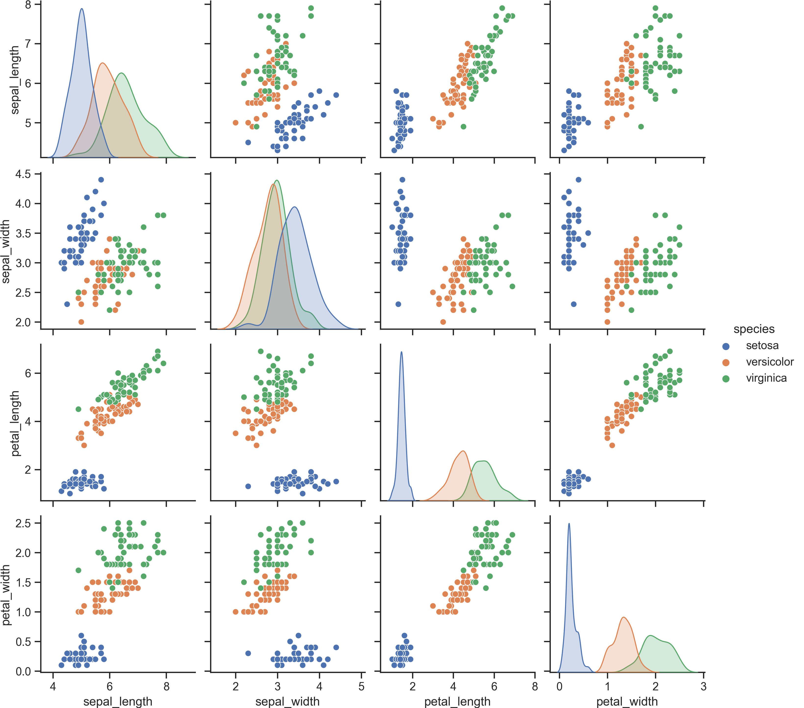

The iris dataset is a well-known multivariate dataset that contains 150 observations of iris flowers. Each observation includes four features: sepal length, sepal width, petal length, and petal width. The dataset also includes the species of the flower, which serves as the response variable. There are three species of iris in the dataset: setosa, versicolor, and virginica. Overall, the iris dataset is commonly used for classification and machine learning tasks, as well as for data visualization and exploratory analysis.

# Basic Operations of Pandas on Iris Dataset

```python
import pandas as pd
import numpy as np
import matplotlib.pyplot as plt
import seaborn as sns
import warnings
warnings.filterwarnings('ignore')

# load iris dataset from seaborn
data = sns.load_dataset('iris')

# covert data to dataframe
df = pd.DataFrame(data)

# Display the first 10 rows of the dataframe
print(df.head(10))

# Display the last 5 rows of the dataframe
print(df.tail())

# Display the shape of the dataframe
print(df.shape)

# Display the data types of the columns
print(df.dtypes)

# Display the row index of the dataframe
print(df.index)

# Display the column index of the dataframe
print(df.columns)

# Display the values of the dataframe as a 2D ndarray array
print(df.values)

# Display summary statistics for the numeric columns of the dataframe
print(df.describe())

# Display information about the dataframe including column index, data types, non-null counts and memory usage
print(df.info())

# Plot the distribution of each column in the dataframe
sns.set(style="ticks")
sns.pairplot(df, hue="species")
plt.savefig('iris.png', dpi=300, bbox_inches='tight', pad_inches=0.0)
plt.show()
```



```python
# Use loc to select specific rows and columns by label
print(df.loc[0:4, ['sepal_length', 'species']])

# Select the first row
print(df.iloc[0])

# Select the second row
print(df.iloc[1])

# Select the last row
print(df.iloc[-1])

# Select the last column
print(df.iloc[:,-1])

# Select the value in the third row and second column
print(df.iloc[2,1])

# Use iloc to select specific rows and columns by integer position
print(df.iloc[0:5, [0, 4]])

# Select rows where sepal_width > 3.0
print(df[df['sepal_width'] > 3.0])

# Select rows where petal_length is null
print(df[df['petal_length'].isnull()])

# Select rows where species is not virginica
print(df[df['species'] != 'virginica'])

# Select rows where sepal_width > 3.0 and petal_width < 1.0
print(df[(df['sepal_width'] > 3.0) & (df['petal_width'] < 1.0)])

# Check if there are any missing values in the dataframe
print(df.isnull().values.any())
```

# Reference

1. Seaborn. (n.d.). Scatterplot matrix. Retrieved March 28, 2023, from https://seaborn.pydata.org/examples/scatterplot_matrix.html
2. pandas. (2023). Pandas documentation (Version 1.5.3). Retrieved from https://pandas.pydata.org/docs/


