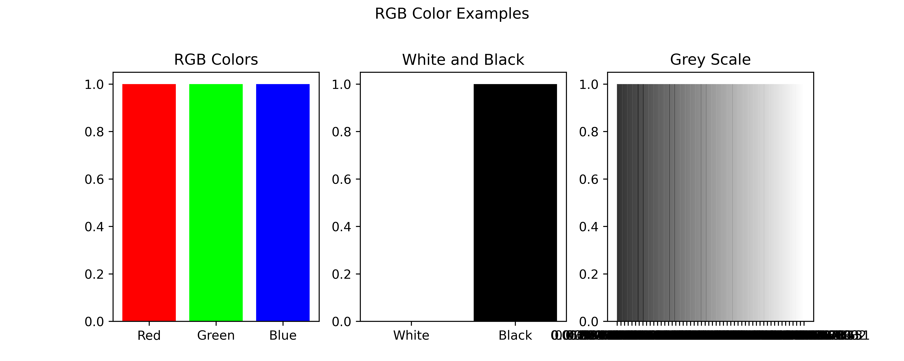
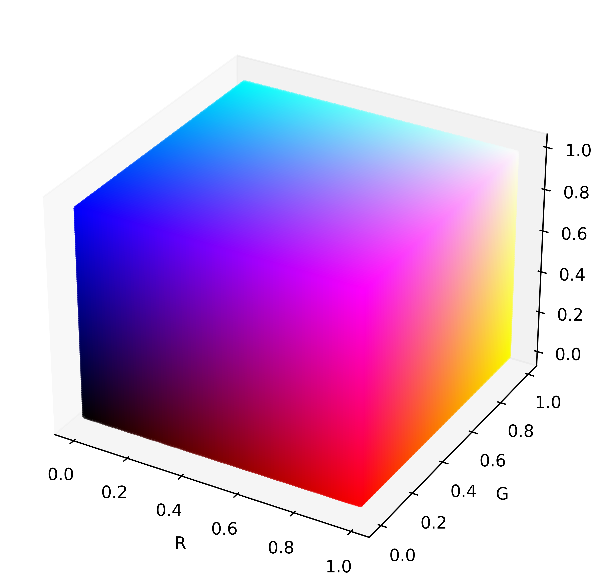

# RGB Basics

RGB stands for Red, Green, and Blue, which are the three primary colors of light. The RGB color model works by combining these three primary colors in different ways to create a wide range of colors.

In the RGB color model, each color is represented by a combination of three numbers between 0 and 255, representing the intensity of the red, green, and blue components respectively. For example, pure red is represented as (255, 0, 0), pure green as (0, 255, 0), and pure blue as (0, 0, 255).

In Matplotlib, the RGB color values are defined on a scale of 0 to 1 instead of 0 to 255. This means that the red, green, and blue components of a color are represented as a decimal value between 0 and 1 instead of an integer value between 0 and 255.For example, pure red in Matplotlib is represented as (1, 0, 0), pure green as (0, 1, 0), and pure blue as (0, 0, 1). 

```python
# Name: Mei Jiaojiao
# Profession: Artificial Intelligence
# Time and date: 3/3/23 21:35

import matplotlib.pyplot as plt
import numpy as np

# Define the RGB colors
red = [1, 0, 0]
green = [0, 1, 0]
blue = [0, 0, 1]

# Create a figure with three subplots
fig, axs = plt.subplots(1, 3, figsize=(10, 4))

# Plot the RGB colors in the first subplot
axs[0].bar(np.arange(3), [1, 1, 1], color=[red, green, blue])
axs[0].set_title('RGB Colors')
axs[0].set_xticks(np.arange(3))
axs[0].set_xticklabels(['Red', 'Green', 'Blue'])

# Create the white and black colors by combining RGB colors
white = [1, 1, 1]
black = [0, 0, 0]
grey = np.linspace(0, 1, 256)
grey_color = np.transpose([grey, grey, grey])

# Plot the white and black colors in the second subplot
axs[1].bar(np.arange(2), [1, 1], color=[white, black])
axs[1].set_title('White and Black')
axs[1].set_xticks(np.arange(2))
axs[1].set_xticklabels(['White', 'Black'])

# Plot the grey colors in the third subplot
axs[2].bar(np.arange(len(grey)), [1]*len(grey), color=grey_color)
axs[2].set_title('Grey Scale')
axs[2].set_xticks(np.arange(0, len(grey), 5))
axs[2].set_xticklabels([str(g) for g in grey[::5]])

# Add a title and save the figure
fig.suptitle('RGB Color Examples')
# add a blank space between the title and the subplots
fig.subplots_adjust(top=0.8)
plt.savefig('rgb_colors.png')

# Display the figure
plt.show()

```



# 3D RGB color space

```python
# Name: Mei Jiaojiao
# Profession: Artificial Intelligence
# Time and date: 3/3/23 23:44

import matplotlib.pyplot as plt
import numpy as np
from mpl_toolkits.mplot3d import Axes3D

fig = plt.figure(figsize=(6, 6))
ax = fig.add_subplot(111, projection='3d')

# Generate tight RGB values
r = np.arange(0, 1, 0.01)
g = np.arange(0, 1, 0.01)
b = np.arange(0, 1, 0.01)

# Create meshgrid of RGB values
R, G, B = np.meshgrid(r, g, b)

# Flatten RGB values and convert to 1D arrays
r = R.flatten()
g = G.flatten()
b = B.flatten()

# Plot the RGB values
ax.scatter(r, g, b, color=np.column_stack((r,g,b)), s=10)

# Set axis labels
ax.set_xlabel('R')
ax.set_ylabel('G')
ax.set_zlabel('B')

# remove grid lines
ax.grid(False)

# save figure
plt.savefig('rgb_cubic.png', dpi=600, bbox_inches='tight')
plt.show()
```

<p align="center">
   
</p>


