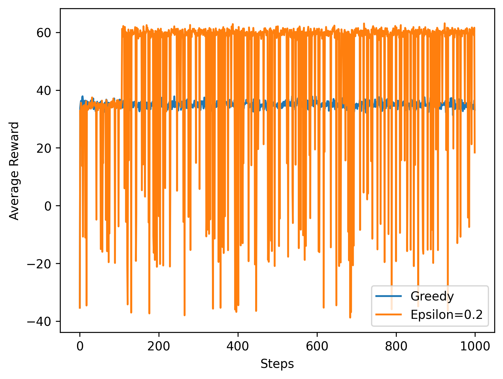
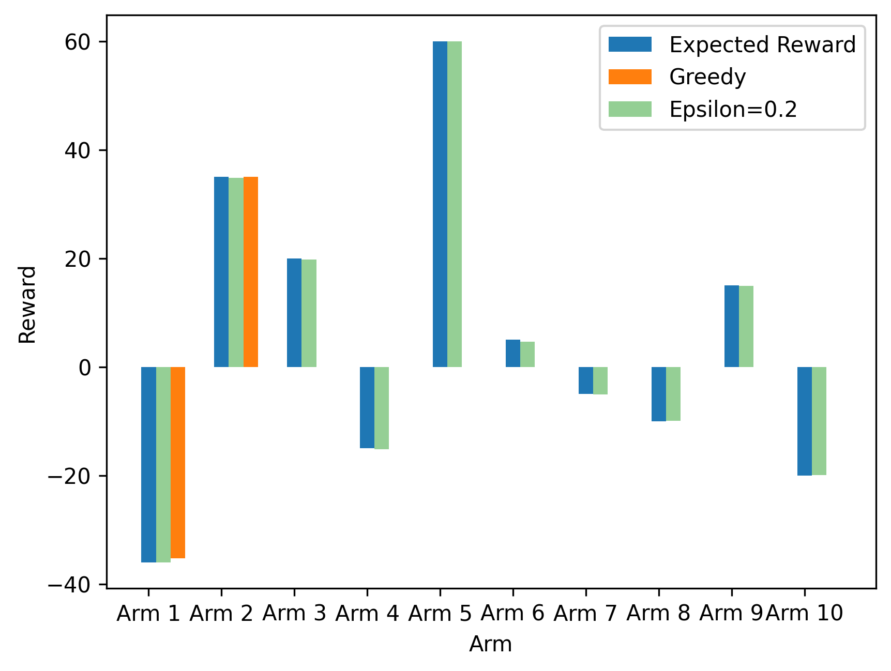
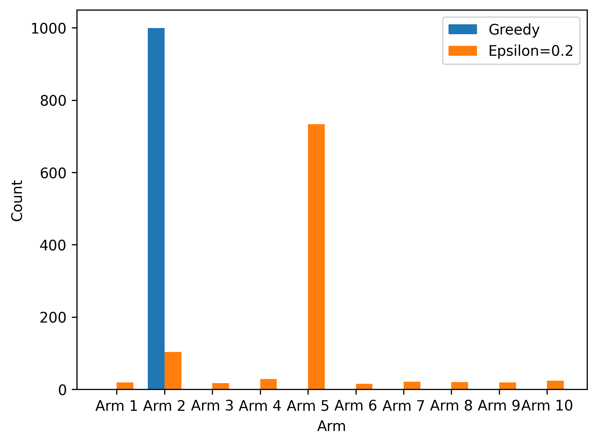

# Basic concepts

## Overview

Reinforcement learning is widely used to solve the problem of **sequential decision making** in robotics. By providing a framework for an agent to learn from its interactions with an environment, reinforcement learning enables robots to learn how to navigate and complete tasks autonomously. For example, a robot tasked with delivering packages in a warehouse could use reinforcement learning to learn how to efficiently navigate the environment, avoid obstacles, and prioritize deliveries based on customer demand.

Reinforcement learning is inspired by the concept of trial-and-error learning, **which is similar to how animals and humans learn from positive and negative feedback to maximize rewards and avoid punishments**.

## Elements

- Policy: Defines the agent's way of behaving based on the perceived states of the environment.
- Reward Signal: The feedback signal that indicates how well the agent performed the task or achieved the goal.
- Value Function: Estimates the total expected reward an agent is likely to accumulate in the future, starting from a given state.
- Model of Environment (Optionally): Mimics the behavior of the true environment to allow predictions of how the environment will behave. It is used for planning future actions.

# k-armed bandit problem

## Definition and description

In the k-armed bandit problem, an agent is faced with a set of k options or "arms," each of which has an unknown associated reward. The agent can select an arm at each time step, and receives a reward signal based on the arm chosen. The goal is to maximize the total reward obtained over a fixed number of time steps.

- $k$: The number of possible actions or arms in the $k$-armed bandit problem.
- Value: The expected or mean reward for selecting a given action $a$, denoted $q_*(a)$.
- Action: Denoted as $A_t$, the action selected at time step $t$ in the $k$-armed bandit problem.
- Reward: Denoted as $R_t$, the corresponding reward obtained when action $A_t$ is selected.
- Estimated Value: Denoted as $Q_t(a)$, the estimated value of action $a$ at time step $t$ in the $k$-armed bandit problem.

$$
\begin{equation}
q_*(a) \doteq \mathbb{E}\left[R_t \mid A_t=a\right]
\end{equation}
$$

$\doteq$ equality relationship that is true by definition.

Objective: To choose actions that maximize the total reward obtained over a fixed number of time steps, even in the presence of uncertainty regarding the true values of the actions.

## Greedy and Non-greedy actions

- Greedy Action: An action whose estimated value is currently the greatest among all available actions. Selecting a greedy action is considered exploitation because it maximizes the expected immediate reward based on current knowledge of the values of the actions.
- Nongreedy Action: An action whose estimated value is currently not the greatest among all available actions. Selecting a nongreedy action is considered exploration because it allows the agent to gather new information and improve its estimate of the nongreedy action's value. Exploration may produce greater total reward in the long run, but it sacrifices immediate reward in favor of learning.

## Action-value Methods: sample-average

$$
\begin{equation}
Q_t(a) \doteq \frac{\text { sum of rewards when } a \text { taken prior to } t}{\text { number of times } a \text { taken prior to } t}=\frac{\sum_{i=1}^{t-1} R_i \cdot \mathbb{1}_{A_i=a}}{\sum_{i=1}^{t-1} \mathbb{1}_{A_i=a}}
\end{equation}
$$

The notation $\mathbb{1}_{A_i=a}$ is a binary variable that takes on the value of 1 if $A_i=a$ (i.e., action $a$ was taken at time step $i$) and 0 otherwise. If the denominator is 0 (i.e., the action has not been taken prior to time step $t$), then we can set $Q_t(a)$ to some default value, such as 0.

Suppose there are a total of $t=5$ actions, among which action $a$ is selected twice. The rewards obtained for selecting action $a$ are $3$ at time step $t=2$ and $6$ at time step $t=4$. Then, we can calculate the estimated value of action $a$, denoted as $Q_t(a)$, as follows:
$$
\begin{equation} Q_t(a) \doteq \frac{\sum_{i=1}^{t-1} R_i \cdot \mathbb{1}*{A_i=a}}{\sum_{i=1}^{t-1} \mathbb{1}*{A_i=a}} = \frac{3 \cdot \mathbb{1}*{A_2=a} + 6 \cdot \mathbb{1}*{A_4=a}}{\mathbb{1}*{A_2=a} + \mathbb{1}*{A_4=a}} = \frac{3 + 6}{2} = 4.5 \end{equation}
$$
Therefore, the estimated value of action $a$ at time step $t=5$ is $Q_5(a) = 4.5$.

The greedy action selection method can be defined as:
$$
A_t=\underset{a}{\operatorname{argmax}} Q_t(a)
$$
An alternative to greedy action selection called $\epsilon$-greedy method.
$$
\begin{equation}
A_t= \begin{cases}\underset{a}{\operatorname{argmax}} Q_t(a), & \text { with probability } 1-\epsilon \\ \text { a random action, } & \text { with probability } \epsilon\end{cases}
\end{equation}
$$
With a small probability $\epsilon$, the agent selects an action randomly from all possible actions, regardless of their estimated values. This allows the agent to explore non-greedy actions and improve its estimate of their values. This method is often used in reinforcement learning when the agent needs to balance between exploration and exploitation.

## Code implementation

```python
# Name: Mei Jiaojiao
# Profession: Artificial Intelligence
# Time and date: 4/9/23 11:19

import numpy as np
import matplotlib.pyplot as plt
from tqdm import tqdm

# Define the 5-armed bandit problem
num_arms = 10
q_star = [-36,35,20,-15,60,5,-5,-10,15,-20]


# Define the epsilon-greedy policy
def epsilon_greedy(Q, epsilon):
    # With probability epsilon, choose a random action
    if np.random.rand() < epsilon:
        return np.random.randint(num_arms)
    # Otherwise, choose the action with the highest estimated value
    else:
        return np.argmax(Q)


# Define the sample average method for updating action-value estimates
def sample_average(Q, N, action, reward):
    N[action] += 1
    Q[action] += (reward - Q[action]) / N[action]
    return Q, N


# Define the function to run the bandit problem with a given policy
def run_bandit(policy, epsilon, num_steps):
    Q = np.zeros(num_arms)
    N = np.zeros(num_arms)
    rewards = np.zeros(num_steps)
    actions = np.zeros(num_steps)
    for i in range(num_steps):
        action = policy(Q, epsilon)
        reward = np.random.normal(q_star[action], 1)
        Q, N = sample_average(Q, N, action, reward)
        rewards[i] = reward
        actions[i] = action
    return rewards, actions


# Define the function to plot the average reward over time
def plot_reward(rewards_greedy, rewards_e02):
    fig, ax = plt.subplots()
    ax.plot(np.arange(len(rewards_greedy)), rewards_greedy, label='Greedy')
    ax.plot(np.arange(len(rewards_e02)), rewards_e02, label='Epsilon=0.2')
    ax.set_xlabel('Steps')
    ax.set_ylabel('Average Reward')
    ax.legend()
    plt.savefig('steps_reward.png', dpi=300, bbox_inches='tight', pad_inches=0.1, transparent=True)
    plt.show()


# Define the function to plot the expected reward and final estimated value
def plot_estimate(rewards_greedy, rewards_e02, q_star):
    fig, ax = plt.subplots()
    labels = ['Arm {}'.format(i + 1) for i in range(num_arms)]
    x = np.arange(num_arms)
    width = 0.2
    ax.bar(x, q_star, width, label='Expected Reward')
    ax.bar(x + 0.4, [np.mean(rewards_greedy[actions_greedy == i]) if np.sum(actions_greedy == i) > 0 else 0 for i in range(num_arms)], width,
           label='Greedy')
    ax.bar(x + 0.2, [np.mean(rewards_e02[actions_e02 == i]) if np.sum(actions_e02 == i) > 0 else 0 for i in range(num_arms)], width, alpha=0.5,
           label='Epsilon=0.2')
    ax.set_xticks(x)
    ax.set_xticklabels(labels)
    ax.set_xlabel('Arm')
    ax.set_ylabel('Reward')
    ax.legend()
    plt.savefig('reward_estimate.png', dpi=300, bbox_inches='tight', pad_inches=0.1, transparent=True)
    plt.show()


# Define the function to plot the count of each arm selected
def plot_count(actions_greedy, actions_e02):
    print('Greedy: {}'.format(actions_greedy))
    fig, ax = plt.subplots()
    labels = ['Arm {}'.format(i + 1) for i in range(num_arms)]
    x = np.arange(num_arms)
    width = 0.35
    ax.bar(x - width / 2, [np.sum(actions_greedy == i) for i in range(num_arms)], width, label='Greedy')
    ax.bar(x + width / 2, [np.sum(actions_e02 == i) for i in range(num_arms)], width, label='Epsilon=0.2')
    ax.set_xticks(x)
    ax.set_xticklabels(labels)
    ax.set_xlabel('Arm')
    ax.set_ylabel('Count')
    ax.legend()
    plt.savefig('count.png', dpi=300, bbox_inches='tight', pad_inches=0.1, transparent=True)
    plt.show()


# Run the bandit problem with epsilon-greedy policy
num_steps = 1000
epsilon = 0.2

# Run the bandit problem with the greedy policy
policy_greedy = lambda Q, epsilon: epsilon_greedy(Q, 0)
rewards_greedy, actions_greedy = run_bandit(policy_greedy, epsilon, num_steps)

# Run the bandit problem with the epsilon-greedy policy
policy_e02 = lambda Q, epsilon: epsilon_greedy(Q, epsilon)
rewards_e02, actions_e02 = run_bandit(policy_e02, epsilon, num_steps)

# Plot the average reward over time
plot_reward(rewards_greedy, rewards_e02)

# Plot the expected reward and final estimated value
plot_estimate(rewards_greedy, rewards_e02, q_star)

# Plot the count of each arm selected
plot_count(actions_greedy, actions_e02)
```







```
Greedy: [0. 1. 1. 1. 1. 1. 1. 1. 1. 1. 1. 1. 1. 1. 1. 1. 1. 1. 1. 1. 1. 1. 1. 1.
 1. 1. 1. 1. 1. 1. 1. 1. 1. 1. 1. 1. 1. 1. 1. 1. 1. 1. 1. 1. 1. 1. 1. 1.
 1. 1. 1. 1. 1. 1. 1. 1. 1. 1. 1. 1. 1. 1. 1. 1. 1. 1. 1. 1. 1. 1. 1. 1.
 1. 1. 1. 1. 1. 1. 1. 1. 1. 1. 1. 1. 1. 1. 1. 1. 1. 1. 1. 1. 1. 1. 1. 1.
 1. 1. 1. 1. 1. 1. 1. 1. 1. 1. 1. 1. 1. 1. 1. 1. 1. 1. 1. 1. 1. 1. 1. 1.
 1. 1. 1. 1. 1. 1. 1. 1. 1. 1. 1. 1. 1. 1. 1. 1. 1. 1. 1. 1. 1. 1. 1. 1.
 1. 1. 1. 1. 1. 1. 1. 1. 1. 1. 1. 1. 1. 1. 1. 1. 1. 1. 1. 1. 1. 1. 1. 1.
 1. 1. 1. 1. 1. 1. 1. 1. 1. 1. 1. 1. 1. 1. 1. 1. 1. 1. 1. 1. 1. 1. 1. 1.
 1. 1. 1. 1. 1. 1. 1. 1. 1. 1. 1. 1. 1. 1. 1. 1. 1. 1. 1. 1. 1. 1. 1. 1.
 1. 1. 1. 1. 1. 1. 1. 1. 1. 1. 1. 1. 1. 1. 1. 1. 1. 1. 1. 1. 1. 1. 1. 1.
 1. 1. 1. 1. 1. 1. 1. 1. 1. 1. 1. 1. 1. 1. 1. 1. 1. 1. 1. 1. 1. 1. 1. 1.
 1. 1. 1. 1. 1. 1. 1. 1. 1. 1. 1. 1. 1. 1. 1. 1. 1. 1. 1. 1. 1. 1. 1. 1.
 1. 1. 1. 1. 1. 1. 1. 1. 1. 1. 1. 1. 1. 1. 1. 1. 1. 1. 1. 1. 1. 1. 1. 1.
 1. 1. 1. 1. 1. 1. 1. 1. 1. 1. 1. 1. 1. 1. 1. 1. 1. 1. 1. 1. 1. 1. 1. 1.
 1. 1. 1. 1. 1. 1. 1. 1. 1. 1. 1. 1. 1. 1. 1. 1. 1. 1. 1. 1. 1. 1. 1. 1.
 1. 1. 1. 1. 1. 1. 1. 1. 1. 1. 1. 1. 1. 1. 1. 1. 1. 1. 1. 1. 1. 1. 1. 1.
 1. 1. 1. 1. 1. 1. 1. 1. 1. 1. 1. 1. 1. 1. 1. 1. 1. 1. 1. 1. 1. 1. 1. 1.
 1. 1. 1. 1. 1. 1. 1. 1. 1. 1. 1. 1. 1. 1. 1. 1. 1. 1. 1. 1. 1. 1. 1. 1.
 1. 1. 1. 1. 1. 1. 1. 1. 1. 1. 1. 1. 1. 1. 1. 1. 1. 1. 1. 1. 1. 1. 1. 1.
 1. 1. 1. 1. 1. 1. 1. 1. 1. 1. 1. 1. 1. 1. 1. 1. 1. 1. 1. 1. 1. 1. 1. 1.
 1. 1. 1. 1. 1. 1. 1. 1. 1. 1. 1. 1. 1. 1. 1. 1. 1. 1. 1. 1. 1. 1. 1. 1.
 1. 1. 1. 1. 1. 1. 1. 1. 1. 1. 1. 1. 1. 1. 1. 1. 1. 1. 1. 1. 1. 1. 1. 1.
 1. 1. 1. 1. 1. 1. 1. 1. 1. 1. 1. 1. 1. 1. 1. 1. 1. 1. 1. 1. 1. 1. 1. 1.
 1. 1. 1. 1. 1. 1. 1. 1. 1. 1. 1. 1. 1. 1. 1. 1. 1. 1. 1. 1. 1. 1. 1. 1.
 1. 1. 1. 1. 1. 1. 1. 1. 1. 1. 1. 1. 1. 1. 1. 1. 1. 1. 1. 1. 1. 1. 1. 1.
 1. 1. 1. 1. 1. 1. 1. 1. 1. 1. 1. 1. 1. 1. 1. 1. 1. 1. 1. 1. 1. 1. 1. 1.
 1. 1. 1. 1. 1. 1. 1. 1. 1. 1. 1. 1. 1. 1. 1. 1. 1. 1. 1. 1. 1. 1. 1. 1.
 1. 1. 1. 1. 1. 1. 1. 1. 1. 1. 1. 1. 1. 1. 1. 1. 1. 1. 1. 1. 1. 1. 1. 1.
 1. 1. 1. 1. 1. 1. 1. 1. 1. 1. 1. 1. 1. 1. 1. 1. 1. 1. 1. 1. 1. 1. 1. 1.
 1. 1. 1. 1. 1. 1. 1. 1. 1. 1. 1. 1. 1. 1. 1. 1. 1. 1. 1. 1. 1. 1. 1. 1.
 1. 1. 1. 1. 1. 1. 1. 1. 1. 1. 1. 1. 1. 1. 1. 1. 1. 1. 1. 1. 1. 1. 1. 1.
 1. 1. 1. 1. 1. 1. 1. 1. 1. 1. 1. 1. 1. 1. 1. 1. 1. 1. 1. 1. 1. 1. 1. 1.
 1. 1. 1. 1. 1. 1. 1. 1. 1. 1. 1. 1. 1. 1. 1. 1. 1. 1. 1. 1. 1. 1. 1. 1.
 1. 1. 1. 1. 1. 1. 1. 1. 1. 1. 1. 1. 1. 1. 1. 1. 1. 1. 1. 1. 1. 1. 1. 1.
 1. 1. 1. 1. 1. 1. 1. 1. 1. 1. 1. 1. 1. 1. 1. 1. 1. 1. 1. 1. 1. 1. 1. 1.
 1. 1. 1. 1. 1. 1. 1. 1. 1. 1. 1. 1. 1. 1. 1. 1. 1. 1. 1. 1. 1. 1. 1. 1.
 1. 1. 1. 1. 1. 1. 1. 1. 1. 1. 1. 1. 1. 1. 1. 1. 1. 1. 1. 1. 1. 1. 1. 1.
 1. 1. 1. 1. 1. 1. 1. 1. 1. 1. 1. 1. 1. 1. 1. 1. 1. 1. 1. 1. 1. 1. 1. 1.
 1. 1. 1. 1. 1. 1. 1. 1. 1. 1. 1. 1. 1. 1. 1. 1. 1. 1. 1. 1. 1. 1. 1. 1.
 1. 1. 1. 1. 1. 1. 1. 1. 1. 1. 1. 1. 1. 1. 1. 1. 1. 1. 1. 1. 1. 1. 1. 1.
 1. 1. 1. 1. 1. 1. 1. 1. 1. 1. 1. 1. 1. 1. 1. 1. 1. 1. 1. 1. 1. 1. 1. 1.
 1. 1. 1. 1. 1. 1. 1. 1. 1. 1. 1. 1. 1. 1. 1. 1.]
```

# Reference

1. Sutton, R. S., & Barto, A. G. (2018). Reinforcement Learning: An Introduction (2nd ed.). MIT Press. http://incompleteideas.net/book/RLbook2020.pdf

