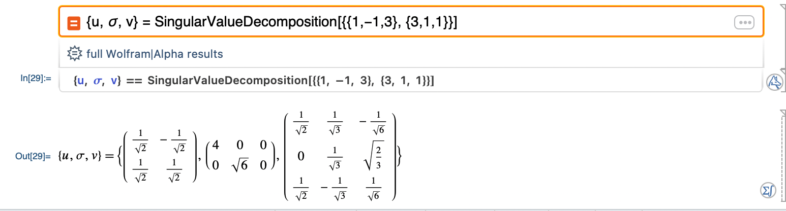
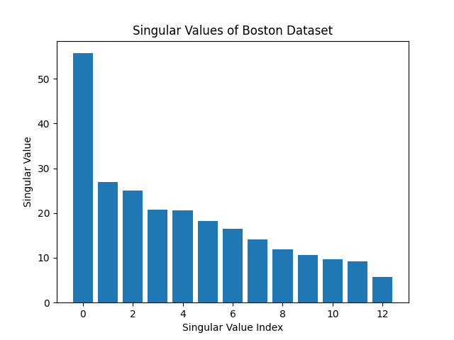

# SingularValueDecomposition

Let A be an $m \times n$ matrix. Then $A=U \Sigma V^T$ is the single value decomposition of A.
- $U$ is an $m \times n$ orthogonal matrix with columns equal to the unit eigenvectors of $A A^T$.
- $V$ is an $n \times n$ orthogonal matrix whose columns are unit eigenvectors of $A^T A$.
- $\Sigma$ is an $m \times n$ matrix with the singular values of $\mathrm{A}$ on the main diagonal and all other entries of zero.

现在有矩阵$A=\left[\begin{array}{ccc}
1 & -1 & 3 \\
3 & 1 & 1
\end{array}\right]$，需要对这个矩阵进行SVD分解，即找到$A=U \Sigma V^T$这三个矩阵。



错了，不是这样子的。要一步一步算😂。

## $V^T$

首先计算$A^T \cdot A$
$$
A^T A=\left[\begin{array}{cc}
1 & 3 \\
-1 & 1 \\
3 & 1
\end{array}\right]\left[\begin{array}{ccc}
1 & -1 & 3 \\
3 & 1 & 1
\end{array}\right]=\left[\begin{array}{ccc}
10 & 2 & 6 \\
2 & 2 & -2 \\
6 & -2 & 10
\end{array}\right]
$$
然后计算determinant
$$
\begin{gathered}
\operatorname{det}\left(\left[\begin{array}{ccc}
10 & 2 & 6 \\
2 & 2 & -2 \\
6 & -2 & 10
\end{array}\right]-\lambda\left[\begin{array}{ccc}
1 & 0 & 0 \\
0 & 1 & 0 \\
0 & 0 & 1
\end{array}\right]\right)=0 \\
\operatorname{det}\left(\left[\begin{array}{ccc}
10-\lambda & 2 & 6 \\
2 & 2-\lambda & -2 \\
6 & -2 & 10-\lambda
\end{array}\right]\right)=0\\
\lambda(\lambda-16)(\lambda-6)=0 \\
\lambda_1=\mathbf{1 6}, \lambda_2=\mathbf{6}, \lambda_3=\mathbf{0}\\
\end{gathered}
$$
$\lambda$ 从大到小排列。

求$\lambda = 16$ 的时候的eigenvector
$$
\begin{gathered}
\boldsymbol{\lambda}_{\mathbf{1}}=\mathbf{1 6} \\
(\boldsymbol{A}-\lambda \boldsymbol{I}) \overrightarrow{\boldsymbol{x}}=\overrightarrow{0}\\
\left(\left[\begin{array}{ccc}
10 & 2 & 6 \\
2 & 2 & -2 \\
6 & -2 & 10
\end{array}\right]-16\left[\begin{array}{lll}
1 & 0 & 0 \\
0 & 1 & 0 \\
0 & 0 & 1
\end{array}\right]\right) \overrightarrow{\boldsymbol{x}}=\overrightarrow{0} \\
{\left[\begin{array}{ccc}
-6 & 2 & 6 \\
2 & -14 & -2 \\
6 & -2 & -6
\end{array}\right]\left[\begin{array}{l}
x_1 \\
x_2 \\
x_3
\end{array}\right]=\left[\begin{array}{l}
0 \\
0 \\
0
\end{array}\right]} \\
{\left[\begin{array}{cccc}
-6 & 2 & 6 & 0 \\
2 & -14 & -2 & 0 \\
6 & -2 & -6 & 0
\end{array}\right]}
\end{gathered}
$$
化简
$$
\left[\begin{array}{cccc}
-6 & 2 & 6 & 0 \\
2 & -14 & -2 & 0 \\
6 & -2 & -6 & 0
\end{array}\right] \longrightarrow\left[\begin{array}{cccc}
1 & 0 & -1 & 0 \\
0 & 1 & 0 & 0 \\
0 & 0 & 0 & 0
\end{array}\right]
$$

$$
\begin{gathered}
\begin{array}{cc}
x_1-x_3=0 & x_1=t \\
x_2=0 & x_2=0 \\
x_3=x_3 & x_3=t
\end{array} \quad \vec{x}=\left[\begin{array}{l}
t \\
0 \\
t
\end{array}\right]=t\left[\begin{array}{l}
1 \\
0 \\
1
\end{array}\right] \\
\boldsymbol{t} \neq \mathbf{0} \\
\overrightarrow{\boldsymbol{v}}_{\mathbf{1}}=\mathbf{1} / \sqrt{\mathbf{2}}\left[\begin{array}{l}
\mathbf{1} \\
\mathbf{0} \\
\mathbf{1}
\end{array}\right]=\left[\begin{array}{c}
\frac{\mathbf{1}}{\sqrt{2}} \\
\mathbf{0} \\
\frac{\mathbf{1}}{\sqrt{2}}
\end{array}\right]
\end{gathered}
$$

这里的向量是单位向量，就是模为1。

然后计算$\lambda=6$的时候的eigenvector
$$
\begin{gathered}
\boldsymbol{\lambda}_2=\mathbf{6} \\
(\boldsymbol{A}-\lambda \boldsymbol{I}) \overrightarrow{\boldsymbol{x}}=\overrightarrow{0}\\
\left(\left[\begin{array}{ccc}
10 & 2 & 6 \\
2 & 2 & -2 \\
6 & -2 & 10
\end{array}\right]-6\left[\begin{array}{lll}
1 & 0 & 0 \\
0 & 1 & 0 \\
0 & 0 & 1
\end{array}\right]\right) \overrightarrow{\boldsymbol{x}}=\overrightarrow{\mathbf{0}} \\
{\left[\begin{array}{ccc}
4 & 2 & 6 \\
2 & -4 & -2 \\
6 & -2 & 4
\end{array}\right]\left[\begin{array}{l}
x_1 \\
x_2 \\
x_3
\end{array}\right]=\left[\begin{array}{l}
0 \\
0 \\
0
\end{array}\right]}
\end{gathered}
$$

$$
\left[\begin{array}{cccc}
4 & 2 & 6 & 0 \\
2 & -4 & -2 & 0 \\
6 & -2 & 4 & 0
\end{array}\right] \longrightarrow\left[\begin{array}{llll}
1 & 0 & 1 & 0 \\
0 & 1 & 1 & 0 \\
0 & 0 & 0 & 0
\end{array}\right]
$$

$$
\begin{gathered}
\begin{array}{cc}
x_1+x_3=0 & x_1=-t \\
x_2+x_3=0 & x_2=-t \\
x_3=x_3 & x_3=t
\end{array} \quad \vec{x}=\left[\begin{array}{c}
-t \\
-t \\
t
\end{array}\right]=t\left[\begin{array}{c}
-1 \\
-1 \\
1
\end{array}\right] \\
\boldsymbol{t} \neq \mathbf{0} \\
\vec{v}_2=\mathbf{1} / \sqrt{\mathbf{3}}\left[\begin{array}{c}
-\mathbf{1} \\
-\mathbf{1} \\
\mathbf{1}
\end{array}\right]=\left[\begin{array}{c}
-\frac{1}{\sqrt{3}} \\
-\frac{1}{\sqrt{3}} \\
\frac{1}{\sqrt{3}}
\end{array}\right]
\end{gathered}
$$

然后计算$\lambda=0$的时候的eigenvector
$$
\begin{gathered}
\boldsymbol{\lambda}_3=\mathbf{0} \\
\left(\left[\begin{array}{ccc}
10 & 2 & 6 \\
2 & 2 & -2 \\
6 & -2 & 10
\end{array}\right]-0\left[\begin{array}{lll}
1 & 0 & 0 \\
0 & 1 & 0 \\
0 & 0 & 1
\end{array}\right]\right) \overrightarrow{\boldsymbol{x}}=\overrightarrow{0} \\
{\left[\begin{array}{ccc}
10 & 2 & 6 \\
2 & 2 & -2 \\
6 & -2 & 10
\end{array}\right]\left[\begin{array}{l}
x_1 \\
x_2 \\
x_3
\end{array}\right]=\left[\begin{array}{l}
0 \\
0 \\
0
\end{array}\right]}
\end{gathered}
$$

$$
\left[\begin{array}{cccc}
10 & 2 & 6 & 0 \\
2 & 2 & -2 & 0 \\
6 & -2 & 10 & 0
\end{array}\right] \longrightarrow\left[\begin{array}{cccc}
1 & 0 & 1 & 0 \\
0 & 1 & -2 & 0 \\
0 & 0 & 0 & 0
\end{array}\right]
$$

$$
\begin{array}{cc}
x_1+x_3=0 & x_1=-t \\
x_2-2 x_3=0 & x_2=2 t \\
x_3=x_3 & x_3=t
\end{array} \quad \vec{x}=\left[\begin{array}{c}
-t \\
2 t \\
t
\end{array}\right]=t\left[\begin{array}{c}
-1 \\
2 \\
1
\end{array}\right]
$$

$$
\boldsymbol{t} \neq \mathbf{0} \\
$$

$$
\vec{v}_3=1 / \sqrt{6}\left[\begin{array}{c}
-1 \\
2 \\
1
\end{array}\right]=\left[\begin{array}{c}
-\frac{1}{\sqrt{6}} \\
\frac{2}{\sqrt{6}} \\
\frac{1}{\sqrt{6}}
\end{array}\right]
$$

结合起来就是
$$
\vec{v}_1=\left[\begin{array}{c}
\frac{1}{\sqrt{2}} \\
0 \\
\frac{1}{\sqrt{2}}
\end{array}\right] \quad \vec{v}_2=\left[\begin{array}{c}
-\frac{1}{\sqrt{3}} \\
-\frac{1}{\sqrt{3}} \\
\frac{1}{\sqrt{3}}
\end{array}\right] \quad \vec{v}_3=\left[\begin{array}{c}
-\frac{1}{\sqrt{6}} \\
\frac{2}{\sqrt{6}} \\
\frac{1}{\sqrt{6}}
\end{array}\right]
$$

$$
V=\left[\begin{array}{ccc}
\frac{1}{\sqrt{2}} & -\frac{1}{\sqrt{3}} & -\frac{1}{\sqrt{6}} \\
0 & -\frac{1}{\sqrt{3}} & \frac{2}{\sqrt{6}} \\
\frac{1}{\sqrt{2}} & \frac{1}{\sqrt{3}} & \frac{1}{\sqrt{6}}
\end{array}\right] \quad V^T=\left[\begin{array}{ccc}
\frac{1}{\sqrt{2}} & 0 & \frac{1}{\sqrt{2}} \\
-\frac{1}{\sqrt{3}} & -\frac{1}{\sqrt{3}} & \frac{1}{\sqrt{3}} \\
-\frac{1}{\sqrt{6}} & \frac{2}{\sqrt{6}} & \frac{1}{\sqrt{6}}
\end{array}\right]
$$

## $\Sigma$

$$
\lambda_1=16, \lambda_2=6, \lambda_3=0
$$
中间这个矩阵只有对角线上是有值的，这个值就是$\lambda$ 开根号，0是不算的。
$A^T A$ 和 $A A^T$ 的特征值eigenvalues是一样的。

从大到小排列是:
$$
\begin{gathered}
\sigma_1=\sqrt{\lambda_1}=\sqrt{16}=4 \\
\sigma_2=\sqrt{\lambda_2}=\sqrt{6}
\end{gathered}
$$

## $U$

$$
\begin{gathered}
A=U \Sigma V^T \\
A V=U \Sigma V^T V \\
A V=U \Sigma I
\end{gathered}
$$

因为$V$ and $V^T$ 是正交矩阵，所以$V^T V=I$，那么有
$$
A V=U \Sigma
$$

$$
\begin{aligned}
& A \vec{v}_1=\sigma_1 \vec{u}_1 \\
& A \vec{v}_2=\sigma_2 \vec{u}_2
\end{aligned}
$$

$$
A \vec{v}_1=\sigma_1 \vec{u}_1 \rightarrow \vec{u}_1=\frac{1}{\sigma_1} A \vec{v}_1=\frac{1}{4}\left[\begin{array}{ccc}
1 & -1 & 3 \\
3 & 1 & 1
\end{array}\right]\left[\begin{array}{c}
\frac{1}{\sqrt{2}} \\
0 \\
\frac{1}{\sqrt{2}}
\end{array}\right]=\left[\begin{array}{c}
1 / \sqrt{2} \\
1 / \sqrt{2}
\end{array}\right]
$$

$$
A \vec{v}_2=\sigma_2 \vec{u}_2 \rightarrow \vec{u}_2=\frac{1}{\sigma_2} A \vec{v}_2=\frac{1}{\sqrt{6}}\left[\begin{array}{ccc}
1 & -1 & 3 \\
3 & 1 & 1
\end{array}\right]\left[\begin{array}{c}
-\frac{1}{\sqrt{3}} \\
-\frac{1}{\sqrt{3}} \\
\frac{1}{\sqrt{3}}
\end{array}\right]=\left[\begin{array}{c}
1 / \sqrt{2} \\
-1 / \sqrt{2}
\end{array}\right]
$$

## SVD

$$
A=U \Sigma V^T
$$

$$
\left[\begin{array}{ccc}
1 & -1 & 3 \\
3 & 1 & 1
\end{array}\right]=\left[\begin{array}{cc}
\frac{1}{\sqrt{2}} & \frac{1}{\sqrt{2}} \\
\frac{1}{\sqrt{2}} & -\frac{1}{\sqrt{2}}
\end{array}\right]\left[\begin{array}{ccc}
4 & 0 & 0 \\
0 & \sqrt{6} & 0
\end{array}\right]\left[\begin{array}{ccc}
\frac{1}{\sqrt{2}} & 0 & \frac{1}{\sqrt{2}} \\
-\frac{1}{\sqrt{3}} & -\frac{1}{\sqrt{3}} & \frac{1}{\sqrt{3}} \\
-\frac{1}{\sqrt{6}} & \frac{2}{\sqrt{6}} & \frac{1}{\sqrt{6}}
\end{array}\right]
$$

# SVD on Boston dataset

Boston 数据集是一个经典的回归数据集，用于研究住房价格和其它因素之间的关系。该数据集包含 506 个样本和 14 个特征，其中 13 个特征是房屋和社区的属性（如平均房间数、距离波士顿市中心的加权距离等），另一个特征是该地区的中位数房价，目标是使用这些特征预测房屋价格。简单来说，13个自变量，1个因变量，一共506个样本。矩阵的size就是13*506，这个矩阵的rank是不可能超过13的。singular value的个数也是不可能超过13的。这里不做证明，有兴趣的自己去了解。

```python
# Name: Mei Jiaojiao
# Profession: Artificial Intelligence
# Time and date: 4/24/23 23:53

import numpy as np
import matplotlib.pyplot as plt
from sklearn.datasets import load_iris
from sklearn.decomposition import TruncatedSVD

import numpy as np
import pandas as pd
import matplotlib.pyplot as plt
from sklearn.datasets import load_boston
from sklearn.preprocessing import StandardScaler

# Load Boston dataset
boston = load_boston()
X = boston.data

# Standardize the data
X_std = StandardScaler().fit_transform(X)

# Perform SVD
u, s, v = np.linalg.svd(X_std)

# Plot singular values
plt.bar(range(len(s)), s)
plt.title("Singular Values of Boston Dataset")
plt.xlabel("Singular Value Index")
plt.ylabel("Singular Value")
plt.savefig("svd_boston.png")
plt.show()
```



singular value从大到小排列。

# PCA in one sentence

一句话解释PCA：Boston 数据集是13维的数据，要进行降维的话，比如说要降低到3维，就取top3个singular values，其他singular values变成0，带进去算。

singular value的重要性在于，它们提供了一种将矩阵分解为主成分的方法。每个singular value代表一个主成分的方差，它们按照从大到小的顺序排列，因此前几个singular value代表的主成分可以解释数据集中的大部分方差。在实际应用中，可以根据singular value的大小选择保留前 k 个主成分，进而降低数据的维度并提高模型的效率。

# Reference

1. *(New Version Available) Determine the Singular Value Decomposition of a Matrix*. (2022, February 10). YouTube. https://www.youtube.com/watch?v=sB-aYHl92V4

2. *Principal Component Analysis through Singular Value Decomposition*. (2021, November 5). Principal Component Analysis Through Singular Value Decomposition | R in the Lab. https://r-inthelab.net/2021/11/05/principal-component-analysis-through-singular-value-decomposition/
