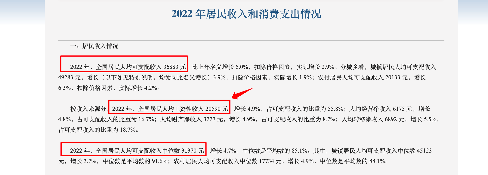
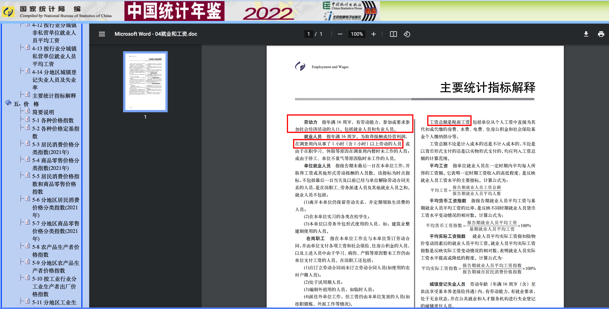
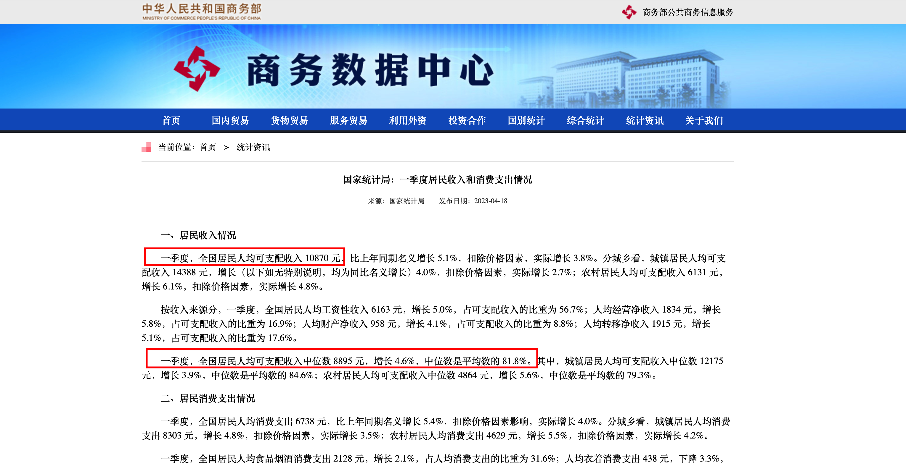
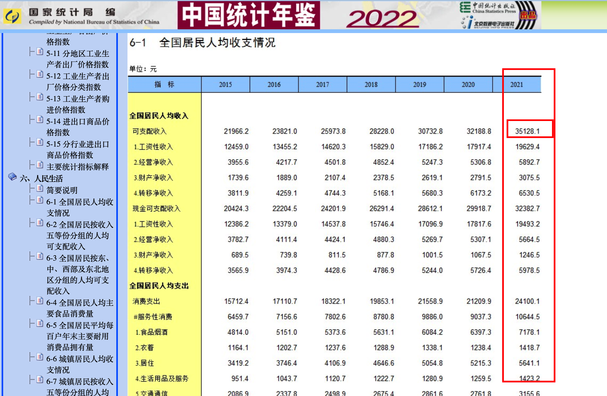
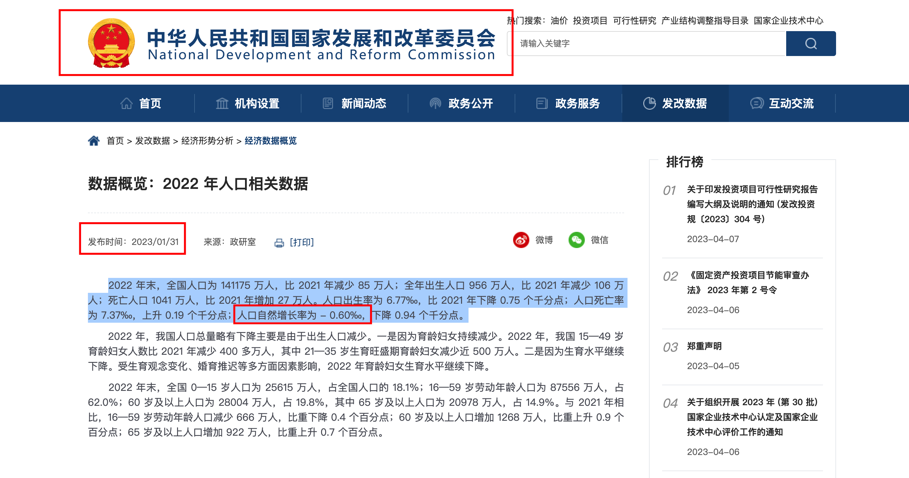
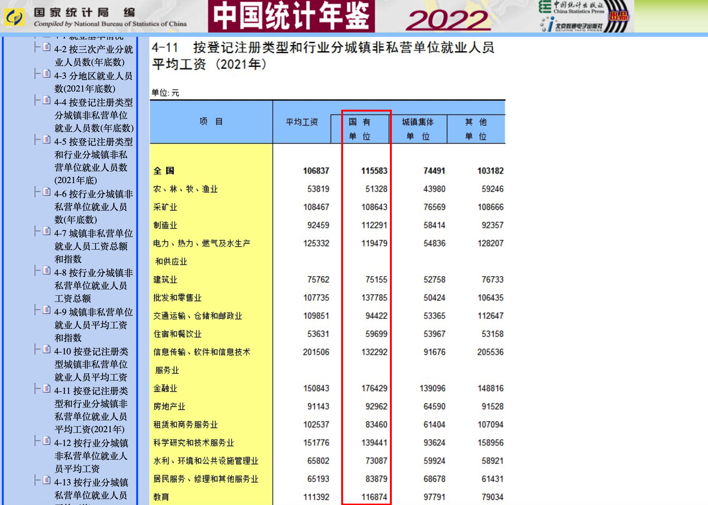
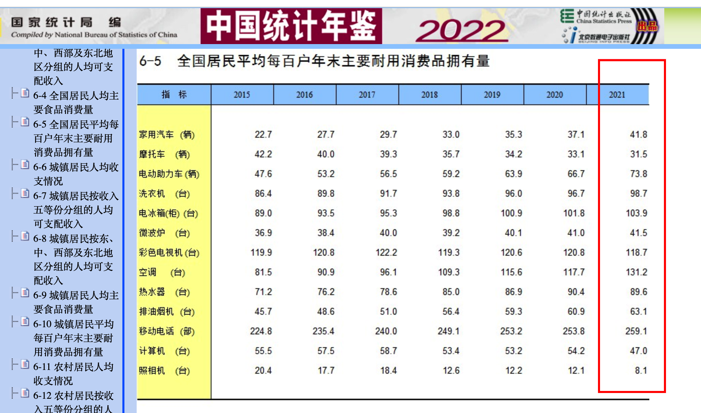

# 陶渊明的五斗米

这是五斗米系列的第一篇文章，我想说说关于五斗米的事情，就是陶渊明的五斗米。

作为中国文化史上的一位杰出人物，陶渊明的名字无疑是耳熟能详的。他是中国文学史上著名的诗人，他的作品代表了中国古典文学的最高水平之一。陶渊明 “不为五斗米折腰”，为世世代代的人所歌颂和赞美。然而，对于陶渊明这个人的实际生活情况，我觉得大家有一些误解。

实际上，从世俗的角度来看，陶渊明这一生过得非常成功。他先后娶了三个妻子，生了五个孩子，这样的生活条件在任何时代都不算是穷人的生活。事实上，还有文献来研究陶渊明。


&nbsp;
即使他没有担任官员，他的孩子们也需要吃喝，需要钱来照顾他们的生活和教育，他自己也需要钱来满足自己的基本需求，如食、衣、住、行等等。陶渊明的父母是不是还在世，需要赡养，他生病了是否需要治疗，需要花费等等，这些都是需要金钱来解决的问题。这些都是风骨解决不了的东西。

陶渊明所处的时代，虽然相对较为落后，但陶渊明受教育程度相对较高，社会发展也不是一片萧条，他也并非生活在极端贫困的环境中。据说他后来去当了教书先生，在古代受教育是很奢侈的事情，反正他的五个孩子没有一个是因为养不起而给人家送养的。虽然陶渊明不算一个穷人，但是也很难获得多好的物质条件。即使是皇帝，也无法获得现代医学的治疗，也无法享受现代交通带来的便利，有很多的局限性和掣肘。

每个人能获得的生活水平并不仅仅取决于个体本身的财富，还要考虑到社会的发展水平和科技的进展。

# 2022 年居民收入

据[国家统计局](http://www.stats.gov.cn/xxgk/sjfb/zxfb2020/202301/t20230117_1892129.html)发布的数据，2022 年，全国居民人均可支配收入中位数 31370 元；2022 年，全国居民人均可支配收入 36883 元。中位数是平均数的85.1%。

首先，有收入的人，才会有可支配收入，孩子肯定是不算在里面的。

中位数和平均数都是描述数据集中趋势的重要统计量。

中位数指的是将一组数据按照从小到大的顺序排列，取中间的一个数（若数据个数为偶数，则取中间两个数的平均值）。中位数对于极端值的影响不敏感，因此更能反映数据的典型值。在 2022 年，全国居民人均可支配收入的中位数是 31370 元，这意味着超过一半的居民收入低于这个水平。

平均数则是指数据集中所有数值的总和除以数据的个数。平均数能够反映出数据集的总体水平，但在数据存在极端值的情况下，平均数容易被极端值所影响，从而失去反映典型值的能力。在 2022 年，全国居民人均可支配收入的平均数为 36883 元。

在对比中位数和平均数时，我们可以计算它们的比值，即中位数与平均数的比值，通常表示为 M/A。在 2022 年，全国居民人均可支配收入的中位数与平均数的比值为 0.851，即中位数是平均数的 85.1%。这说明，相较于平均数，中位数更能反映出数据集的典型值。

举例来说，假设现在有五个人，他们的收入分别是 1、2、2、2、11 元。那么这五个人的平均收入是 3.6 元，中位数是 2 元。这意味着只要你的收入达到平均数水平，你就已经超过了大多数人的收入水平；而如果你的收入达到中位数水平，那么你就已经超过了一半的人。

现在来看平均数，36883 元，每个月36883 /12=3073.58元，这是实际到手的可以自由支配的钱。如果仅考虑工资作为收入来源，那么税前的工资大概在3700元的样子。

如果我们以平均数和中位数为参照，可以发现只要税前工资达到 3700 元 / 月，就已经超过了中国大多数人的收入水平。同时，我们需要意识到，中国的个人所得税起征点是 5000 元。具体有多少人需要缴纳个人所得税，我并没有查到确切数据。但从全国范围来看，大多数人的薪资都没有超过 5000 元。

# 2023一季度全国居民可支配收入

10870/3 = 3623元，税前大概在4400元左右。

# 全国居民按收入五等份分组的人均可支配收入

请注意，这里提到的人均可支配收入是指家庭为单位的收入，包括孩子的支出。

2022 年全国居民人均可支配收入为 36883 元，而 2021 年的数据约为 35128.1 元，差不多。假设您和您的爱人的收入都是税后 3.5 万元，那么您们的总收入为 7 万元。如果您们有一个在上学的孩子，那么您们的家庭人均可支配收入为 7/3=2.34 万元。如果您们家中还有年迈的父母需要赡养，并且没有其他收入来源，那么您们的家庭人均可支配收入将更低。这样的收入水平可以被认为是中等偏下，甚至是低收入组家庭。

然而，我们之前计算过，要年收入达到税后 3.5 万元，大概就是每个月税前 3700 元的样子。而且这个工资已经超过了中位数，也就是超过了全国大多数人的收入水平。这非常中国特色，即夫妻二人作为家里的劳动力，工资已经超过了中国大多数人，但是整体家庭的生活水平却很低。

# 一万五是客观的高薪

全国 20% 的高收入组家庭人均可支配收入是 8.5 万元，这个数字指的是全国收入排名前 20% 的家庭中，收入最高的那一部分家庭的平均收入。如果一个家庭有两位工作的父母和一个上学的孩子，那么这个家庭的年收入应该至少是 8.5*3=25.5 万元，这是这个家庭实际可支配的收入。将年收入平均分配到每个月，得到的结果是 2.125 万元。如果只考虑工资收入，那么这个家庭的税前月薪大约是 3 万元左右。这意味着，在中国，税前月薪达到 1.5 万元就已经可以被视为高收入了。因为这个收入已经超过了大多数人的收入水平，甚至在高收入组中也属于顶尖的。

因为数据存在极端值，马云也在高收入这个区间。假设数据是1，2，3，4，5，6，7，8，9，1001。分5等份，最后就是9和1001取平均，就是505。如果能达到高收入组的平均，那就是很客观的高收入。

# 生小孩

中国现在的人口都是负增长的。

钱的来源都是人的劳动所得，而现在中国的人口呈现负增长的趋势。为了应对这一趋势，一方面政府推迟退休年龄，让老人晚一些领取养老金；另一方面也在减少教育和培训行业的规模，让有能力的人继续接受教育，而不能继续教育的人则只能寻找工作。

如果现代的眼光来看待陶渊明，那么他绝对不能被称为一个穷人。他不仅先后娶了三个妻子，还生育了五个孩子。在古代，要养活这么多孩子并不容易，可能会被迫将一些孩子送去他人家庭抚养。但是陶渊明却是自己养大了孩子们，这表明他经济上并没有太大的困难。

# 国有单位工资高

不管怎么看，不管看哪个行业，都是国有单位工资相对来说更高一些，给国家打工还是挣得最多的。

# 耐用消费品拥有量

每一百户人家中，只有 41.8 户拥有家用汽车，这仅是平均数，实际上很多家庭并没有一辆车，而有些家庭则拥有多辆车。此外，仍有一些家庭没有洗衣机等基本家电设备。需要注意的是，这个数据是基于全国范围内的平均数计算的，因此即使考虑到大城市如北京和上海的数据，拥有家用汽车和空调的家庭数量也会增加。例如，平均每户人家拥有 1.3 台空调，但实际上有些家庭每个房间都有空调，而一套房子通常都有两个或三个房间。

# 桃花源记

以下这一段是复制粘贴的百度的《桃花源记》的翻译：

> 东晋太元年间，武陵郡有个人以打鱼为生。一天，他顺着溪水行船，忘记了路程的远近。忽然遇到一片桃花林，生长在溪水的两岸，长达几百步，中间没有别的树，花草鲜嫩美丽，落花纷纷地散在地上。渔人对此（眼前的景色）感到十分诧异，继续往前行船，想走到林子的尽头。
>
> 桃林的尽头就是溪水的发源地，于是便出现一座山，山上有个小洞口，洞里仿佛有点光亮。于是他下了船，从洞口进去了。起初洞口很狭窄，仅容一人通过。又走了几十步，突然变得开阔明亮了。（呈现在他眼前的是）一片平坦宽广的土地，一排排整齐的房舍。还有肥沃的田地、美丽的池沼，桑树竹林之类的。田间小路交错相通，鸡鸣狗叫到处可以听到。人们在田野里来来往往耕种劳作，男女的穿戴跟桃花源以外的世人完全一样。老人和小孩们个个都安适愉快，自得其乐。
>
> 村里的人看到渔人，感到非常惊讶，问他是从哪儿来的。渔人详细地做了回答。村里有人就邀请他到自己家里去（做客）。设酒杀鸡做饭来款待他。村里的人听说来了这么一个人，就都来打听消息。他们自己说他们的祖先为了躲避秦时的战乱，领着妻子儿女和乡邻来到这个与人世隔绝的地方，不再出去，因而跟外面的人断绝了来往。他们问渔人现在是什么朝代，他们竟然不知道有过汉朝，更不必说魏晋两朝了。渔人把自己知道的事一一详尽地告诉了他们，听完以后，他们都感叹惋惜。其余的人各自又把渔人请到自己家中，都拿出酒饭来款待他。渔人停留了几天，向村里人告辞离开。村里的人对他说：“我们这个地方不值得对外面的人说啊！”
>
> 渔人出来以后，找到了他的船，就顺着旧路回去，处处都做了标记。到了郡城，到太守那里拜访，报告了这番经历。太守立即派人跟着他去，寻找以前所做的标记，终于迷失了方向，再也找不到通往桃花源的路了。
>
> 南阳人刘子骥是个志向高洁的隐士，听到这件事后，高兴地计划前往。但没有实现，不久因病去世了。此后就再也没有问桃花源路的人了。

大概意思就是：

1. 吃喝不愁，每一顿都有吃的，甚至还有鸡鸭鱼肉。这就是非常好的生活了，是陶渊明对世外桃源的想象。但是现在在国内，鸡鸭鱼肉可以说是唾手可得的东西。哦对了，香菇其实是山珍海味的一种，可自行查资料。自己去菜市场买鸡鸭鱼肉，也是容易的事情。
2. 风景优美，在一座四季分明的城市生活。
3. 桃花源里这些人家，放到现在的水平，就是空调、冰箱、烘干机、微波炉等等这些实用的家用电器都有。
4. 老有所依，我感觉这个标准很难判断，因为老人涉及到陪护和医疗。大多数人还是要在家里养老的，因为政府就没有设计那么多人进养老院。政府现在就是规定65岁延迟退休，很多欧美国家也是。我觉得养老这个东西，不是一个普通人该考虑的东西，普通人只能依靠自己的孩子养老。一个护工的工资就算是5千块钱，这在全国范围内都是超过很多人的，怎么请得起呢？普通人只能靠自己的孩子养老的。这里老有所依姑且算，老人身体健康吧。每一个家庭成员都有每年的定期体检，这是非常必要的，重点在于预防。欧美国家的养老也是个难题，人力成本太高了。
5. 产假。中国现在人口出现负增长，为了促进生育，肯定会有一系列相关的政策。生不生就看那个条件有没有达到自己的标准而已。我觉得生不生孩子没什么必要的，年轻的时候经济宽裕一些，老了遭点罪也是应该的。就算生了孩子，肯定也是我什么生活水平，孩子就什么生活水平，这就是阶层。
6. 工作。中国现在大多数人的月薪都没有超过5000元，也就是说，都没有到个税的起征点。严格来说，你只要超过大多数人，你就算高薪啊。

如果排除养老和生小孩的问题，我觉得如果能做到1.吃喝不愁；2.有独立的房间和浴室，以及电冰箱、洗衣机、空调、微波炉等等这些家用耐用品；3.有一份双休且缴纳五险一金的工作；4.每年定期全面体检，这就是很美好的生活。要知道，很多大学生都还是4人寝，5人寝，这很难说有什么独立的空间所言的。如果能做到这些，就算过上了陶渊明梦想的生活，前提是不要有什么天灾人祸，抗风险能力还是有待提高。

最后讲一讲女性，我们目前生活在一个还行的时代，虽然有各种各样的问题，但是女性可以不依靠自己的家庭，不依靠自己的夫婿，经济独立。不需要牺牲自己去供养其他人。以前古代的衣服要分颜色来展示阶级地位的，现在没有这种限制，你想穿什么穿什么(法律规定不能违背公序良俗)，其实，那些丝质的刺绣精美的衣服，普通人也买不起。而现在科技的发展，这些东西都可以走入寻常百姓家。甚至，洗衣机这种解放双手的东西，基本上的家庭也有。时间倒退20年，我家里都没有24小时热水。还有就是通讯，现在要找谁可以发个信息，李商隐在写下巴山夜雨涨秋池，何当共剪西窗烛的时候，都不知道自己的妻子已经去世了。还有飞机这些交通工具的出现，都给人们的生活带来了很大的便利。

我个人认为科技的进步是促进男女平等的主要原因，农耕社会和封建社会，女性能做的事情都很少，挣不到钱，地位就低。当然，现在AI模型的出现，像chatgpt，会给人们的生活带来更大的便利，感觉不久的将来就会实现同声传译，而且还是机器来做这件事情，以前要培养一个同声传译人员需要太高的成本了，而且这些人的寿命短(寿命短属于是道听途说	😂)。

希望各位姐妹们都独立起来，不要辜负自己，不要辜负这个时代😄。不管是因为原生家庭，自己独立了爸妈也拿你没办法的，或者是因为情感问题，要坚强起来，以前的女性一生只能被渣男骗一次，试错成本极高，现在不一样了，就算跌倒了也是可以站起来的，多读书多看报，去健身去锻炼身体。因为你是最了解你自己的人，没有人比你自己更知道你需要什么。每个人都应该爱自己，这是义务，是的，这是义务。要让别人来爱你，就是折磨自己也折磨别人。

人应该爱自己，有义务让自己舒服一点，开心一点。这样才不会心理扭曲和变态，进而去伤害别人。

# 写在最后

我觉得陶渊明是很伟大的人。他确实有贫困潦倒的时候，但是他没有抱怨生活，不管他是不是装的，他装了一辈子，他就是真的。陶渊明是高级知识分子，在那个万般皆下品惟有读书高的年代，就算不做官，也是养得起五个孩子的。但是他这一生的生活质量肯定是远远不能和现代相提并论的啦。

我们的社会还有很多的问题，生活本身就是艰难的，很多事情不是努力就可以的，还关系到一个社会的政治、经济文化的进程。我们只能努力去提高自己的生活质量。况且，当今社会，就算不从政，也有太多的方式去获得一个比较好的生活质量了，甚至可以对标桃花源的生活水平。

我的意思是，如果你觉得生活困难，有可能不是你的原因。不要去责怪自己，不要去埋怨自己 ，觉得自己是不是不够努力，什么强者从来不抱怨环境，有能力的人在哪里都能混得好，但是自己就是失败了，一直苛责自己。国家有国家的命运，社会有社会的命运，家庭有家庭的命运，个体有个体的命运，一个人能做的，能努力的，也许真的就不到5%。大家都知道拆迁可以分房子，普通家庭最重要的就是房产，人在家里坐，拆迁天上来，又做了什么努力呢？

看开点，人间不值得。😂自己开心最要紧。一命二运三风水，四积阴德五读书。

