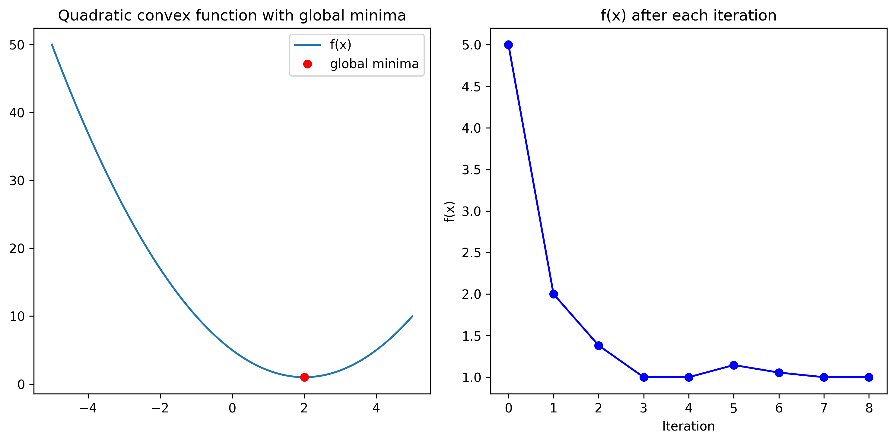
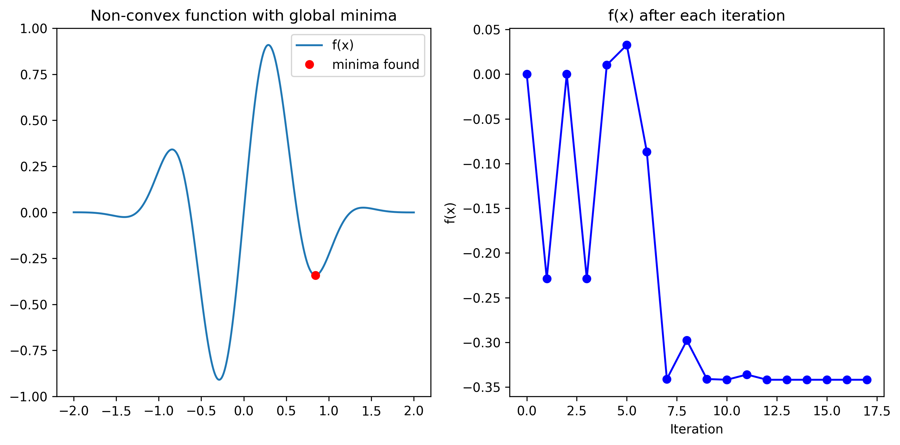
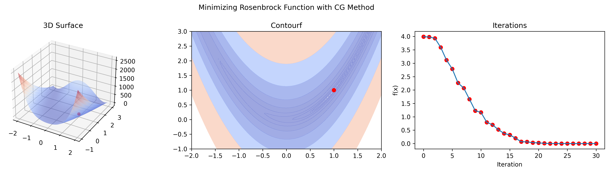

### Brent’s method on a quadratic function

```python
# Name: Mei Jiaojiao
# Profession: Artificial Intelligence
# Time and date: 4/3/23 21:49

import numpy as np
from scipy.optimize import minimize_scalar
import matplotlib.pyplot as plt

def f(x):
    return (x - 2) ** 2 + 1

def f_with_callback(x):
    f_with_callback.f_values.append(f(x))
    return f(x)

f_with_callback.f_values = []

res = minimize_scalar(f_with_callback, method='brent')

x = np.linspace(-5, 5, 100)
y = f(x)

fig, axs = plt.subplots(1, 2, figsize=(10, 5))

axs[0].plot(x, y, label='f(x)')
axs[0].plot(res.x, res.fun, 'ro', label='global minima')
axs[0].legend()
axs[0].set_title('Quadratic convex function with global minima')

axs[1].plot(f_with_callback.f_values, 'bo-')
axs[1].set_xlabel('Iteration')
axs[1].set_ylabel('f(x)')
axs[1].set_title('f(x) after each iteration')

plt.tight_layout()
plt.savefig('minimize_scalar.png', dpi=300, bbox_inches='tight', pad_inches=0.1)
plt.show()
```



### Brent’s method on a non-convex function

```python
# Name: Mei Jiaojiao
# Profession: Artificial Intelligence
# Time and date: 4/3/23 22:01

import numpy as np
from scipy.optimize import minimize_scalar
import matplotlib.pyplot as plt


def f(x):
    return np.sin(5*x) * (1 - np.tanh(x**2))


def f_with_callback(x):
    f_with_callback.f_values.append(f(x))
    return f(x)


f_with_callback.f_values = []

# Run optimization
res = minimize_scalar(f_with_callback, method='brent')

# Print optimization results
print(res)

# Plot function and optimization progress
x = np.linspace(-2, 2, 1000)
y = f(x)

fig, axs = plt.subplots(1, 2, figsize=(10, 5))

# Plot function and global minima
axs[0].plot(x, y, label='f(x)')
axs[0].plot(res.x, res.fun, 'ro', label='global minima')
axs[0].legend()
axs[0].set_title('Non-convex function with global minima')

# Plot optimization progress
axs[1].plot(f_with_callback.f_values, 'bo-')
axs[1].set_xlabel('Iteration')
axs[1].set_ylabel('f(x)')
axs[1].set_title('f(x) after each iteration')

plt.tight_layout()
plt.savefig('minimize_scalar1.png', dpi=300, bbox_inches='tight', pad_inches=0.1)
plt.show()
```



### Minimizing Rosenbrock Function with Conjugate Gradient (CG) Method

```python
# Name: Mei Jiaojiao
# Profession: Artificial Intelligence
# Time and date: 4/3/23 22:09

import numpy as np
from scipy.optimize import minimize
import matplotlib.pyplot as plt
from mpl_toolkits.mplot3d import Axes3D


def rosenbrock(x):
    return (1 - x[0]) ** 2 + 100 * (x[1] - x[0] ** 2) ** 2


# Define a callback function to track the function value at each iteration
def callback(x):
    global iterates, f_values
    iterates.append(x)
    f_values.append(rosenbrock(x))


# Define the starting point for the optimization
x0 = np.array([-1, 1])

# Minimize the Rosenbrock function using the "CG" method and the callback function
iterates = []
f_values = []
res = minimize(rosenbrock, x0, method='CG', callback=callback)

# Define a meshgrid for the surface and contour plots
x = np.linspace(-2, 2, 100)
y = np.linspace(-1, 3, 100)
X, Y = np.meshgrid(x, y)
Z = rosenbrock([X, Y])

# Plot the results
fig = plt.figure(figsize=(15, 4))
fig.suptitle('Minimizing Rosenbrock Function with CG Method')

# 3D surface plot
ax1 = fig.add_subplot(131, projection='3d')
ax1.plot_surface(X, Y, Z, cmap='coolwarm', alpha=0.5)
ax1.scatter(res.x[0], res.x[1], rosenbrock(res.x), color='r')
ax1.set_title('3D Surface')

# Contour plot
ax2 = fig.add_subplot(132)
ax2.contourf(X, Y, Z, levels=np.logspace(-1, 3, 10), cmap='coolwarm', alpha=0.5)
ax2.scatter(res.x[0], res.x[1], color='r')
ax2.set_title('Contourf')

# Iteration plot
ax3 = fig.add_subplot(133)
ax3.plot(range(len(f_values)), f_values)
ax3.scatter(range(len(f_values)), f_values, color='r')
ax3.set_xlabel('Iteration')
ax3.set_ylabel('f(x)')
ax3.set_title('Iterations')

plt.tight_layout()
plt.savefig('minimize_rosenbrock.png', dpi=300, bbox_inches='tight', pad_inches=0.1)

plt.show()
```



### Optimization of the Rosenbrock function using various methods

```python
# Name: Mei Jiaojiao
# Profession: Artificial Intelligence
# Time and date: 4/3/23 23:02
import time

import numpy as np
from scipy.optimize import minimize, differential_evolution, shgo, Bounds, dual_annealing, basinhopping
import matplotlib.pyplot as plt


# Define the Rosenbrock function
def rosenbrock(x):
    return (1 - x[0]) ** 2 + 100 * (x[1] - x[0] ** 2) ** 2


# Define the gradient and hessian of the Rosenbrock function
def rosenbrock_grad(x):
    return np.array([-2 * (1 - x[0]) - 400 * x[0] * (x[1] - x[0] ** 2),
                     200 * (x[1] - x[0] ** 2)])


def rosenbrock_hess(x):
    return np.array([[2 - 400 * (x[1] - 3 * x[0] ** 2), -400 * x[0]],
                     [-400 * x[0], 200]])


global iterates, f_values

# Define the starting point for the optimization
x0 = np.array([-1.5, 1])


# Define a callback function to track the function value at each iteration
def callback(x, convergence=None, *_):
    # starting point is included in the iterates
    iterates.append(x)
    f_values.append(rosenbrock(x))


# Run each optimization method and plot the iterations and function values
methods = ['Nelder-Mead', 'Powell', 'CG', 'BFGS', 'Newton-CG', 'L-BFGS-B',
           'TNC', 'SLSQP', 'dogleg', 'trust-ncg', 'trust-krylov', 'trust-exact',
           'trust-constr', 'differential_evolution', 'shgo', 'dual_annealing']

num_plots = len(methods)
num_cols = 3
num_rows = num_plots // num_cols + (num_plots % num_cols > 0)
fig, axs = plt.subplots(num_rows, num_cols, figsize=(15, 7 * num_rows))

final_iterates = []
final_f_values = []

# create a dictionary to store the computing time for each method
time_dict = {}

for i, method in enumerate(methods):
    print(f"Running optimization with {method}...")
    # time the optimization,ms
    start = time.time()
    # append the starting point to the iterates
    iterates = [x0]
    f_values = [rosenbrock(x0)]

    if method in ['Nelder-Mead', 'Powell']:
        res = minimize(rosenbrock, x0, method=method, callback=callback)
    elif method == 'CG':
        res = minimize(rosenbrock, x0, method=method, jac=rosenbrock_grad, callback=callback)
    elif method in ['BFGS', 'L-BFGS-B', 'TNC', 'SLSQP']:
        res = minimize(rosenbrock, x0, method=method, jac=rosenbrock_grad, callback=callback, options={'disp': False})
    elif method in ['Newton-CG', 'dogleg', 'trust-ncg', 'trust-krylov', 'trust-exact', 'trust-constr']:
        res = minimize(rosenbrock, x0, method=method, jac=rosenbrock_grad, hess=rosenbrock_hess, callback=callback)
    elif method == 'differential_evolution':
        bounds = [(i, i + 2) for i in x0]
        res = differential_evolution(rosenbrock, bounds, callback=callback)
    elif method == 'shgo':
        bounds = [(i, i + 2) for i in x0]
        res = shgo(rosenbrock, bounds, callback=callback)
    elif method == 'dual_annealing':
        res = dual_annealing(rosenbrock, bounds=[(-2, 2), (-1, 3)], callback=callback)
    elif method == 'basinhopping':
        bounds = [(i, i + 2) for i in x0]
        res = basinhopping(rosenbrock, x0, callback=callback, minimizer_kwargs={"method": "BFGS"})

    final_iterates.append(iterates)
    final_f_values.append(f_values)

    # time the optimization, ms
    end = time.time()
    time_dict[method] = end - start

# Plot the final iterates and function values for each method
fig, axs = plt.subplots(len(methods), 2, figsize=(15, 7 * len(methods)))

# Remove the empty subplot
if len(methods) % 2 != 0:
    fig.delaxes(axs[-1, -1])

for i, method in enumerate(methods):
    axs[i, 0].plot(range(len(final_f_values[i])), final_f_values[i])
    axs[i, 0].scatter(range(len(final_f_values[i])), final_f_values[i], color='b', s=25)
    axs[i, 0].set_title('Current Optimization Progress with {}'.format(method))
    axs[i, 0].set_xlabel('Iterations')
    axs[i, 0].set_ylabel('Function Value')

    delta = 0.025
    x = np.arange(-2.0, 2.0, delta)
    y = np.arange(-1.0, 3.0, delta)
    X, Y = np.meshgrid(x, y)

    Z = rosenbrock([X, Y])
    cf = axs[i, 1].contourf(X, Y, Z, levels=50, cmap='coolwarm', alpha=0.5)
    axs[i, 1].plot(*zip(*final_iterates[i]), '-o', label='Optimization Path', color='b')
    axs[i, 1].scatter(*final_iterates[i][-1], s=150, color='r', label='Final Point')
    axs[i, 1].scatter(*final_iterates[i][0], s=150, color='g', label='Starting Point')
    axs[i, 1].set_title('Rosenbrock Function with {}'.format(method))
    axs[i, 1].set_xlabel('x')
    axs[i, 1].set_ylabel('y')
    axs[i, 1].legend()
    axs[i, 1].text(0.05, 0.65, 'Time: {:.6f} s'.format(time_dict[method]), transform=axs[i, 1].transAxes, fontsize=12,
                   verticalalignment='top', bbox=dict(boxstyle='round', facecolor='wheat', alpha=0.5))
    plt.colorbar(cf, ax=axs[i, 1])

plt.tight_layout()
plt.savefig('minimize_rosenbrock_methods.png', dpi=300, bbox_inches='tight', pad_inches=0.1)
plt.show()
```


### Reference

1. *Scipy Lecture Notes — Scipy lecture notes*. (n.d.). Scipy Lecture Notes — Scipy Lecture Notes. https://scipy-lectures.org/index.html#one-document-to-learn-numerics-science-and-data-with-python


