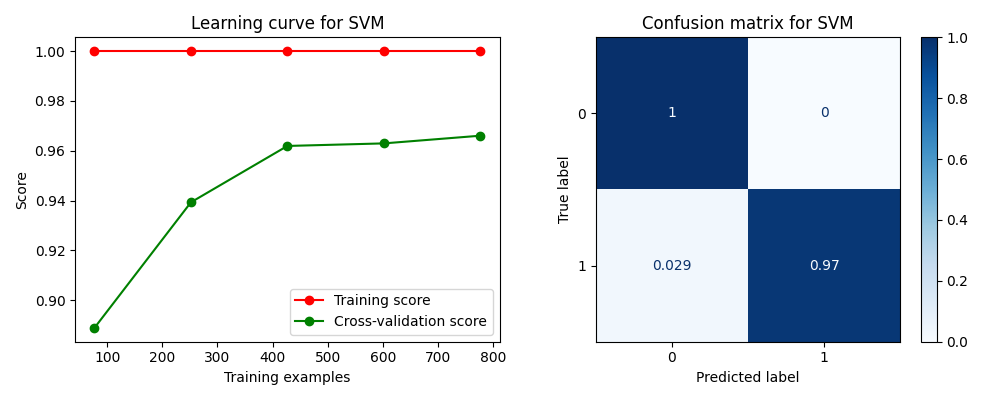
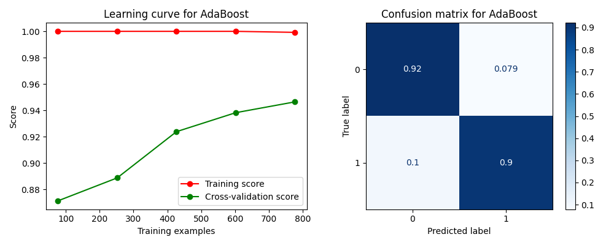

This code performs sentiment analysis on product reviews using several machine learning classifiers, including MLP classifier, Naive Bayes classifier, SVM, Random Forest, Logistic Regression, K-Nearest Neighbors, Decision Tree, AdaBoost, and Gradient Boosting.

The input data is read from an Excel file, which contains three columns: the index, the comment of the product, and the review of the product (1 means positive review, 0 means negative review). The Chinese comments are tokenized using the jieba library, and the text is vectorized using CountVectorizer.

The classifiers are trained using the training data, and their accuracy scores are calculated using the test data. The learning curve and confusion matrix are plotted for each classifier. The accuracy scores of all classifiers are printed, and the predicted and actual sentiments of a randomly selected comment are displayed for each classifier.

Finally, the code ranks the classifiers based on their accuracy scores, and saves the learning curve and confusion matrix plots for each classifier as images.

The input data for this code can be found at https://docs.google.com/spreadsheets/d/1p_Stbv7fXQnvGGz6ofNsl00VKQPt0C6L/edit?usp=sharing.

```python
# Name: Mei Jiaojiao
# Profession: Artificial Intelligence
# Time and date: 4/1/23 23:59

import numpy as np
import pandas as pd
import jieba
from sklearn.feature_extraction.text import CountVectorizer
from sklearn.model_selection import train_test_split, learning_curve
from sklearn.neighbors import KNeighborsClassifier
from sklearn.neural_network import MLPClassifier
from sklearn.naive_bayes import MultinomialNB
from sklearn.metrics import accuracy_score, ConfusionMatrixDisplay, confusion_matrix
import matplotlib.pyplot as plt
import random
from sklearn.svm import SVC
from sklearn.ensemble import RandomForestClassifier, AdaBoostClassifier, GradientBoostingClassifier
from sklearn.linear_model import LogisticRegression
from sklearn.tree import DecisionTreeClassifier

# Generating a random integer between 0 and 100 using numpy
rs = np.random.RandomState(seed=1)
rs.randint(0, 100, size=1)

# Reading input data from an excel file
data = pd.read_excel('product_review.xlsx', sheet_name='Sheet1', header=0, index_col=0)

# description of the data
# print('The information about the data is:', data.info())
# print('The first 5 rows of the data are:', data.head())
# # 0: index ;1: Comment ;2: Review
# print('The first column means the index of the data, the second column means the comment of the product, the third column means the review of the product.')
# # review 1: positive review; review 0: negative review
# print('The third column means the review of the product, 1 means positive review, 0 means negative review.')

# Using jieba library to tokenize Chinese comments
words = [' '.join(jieba.cut(row['Comment'])) for _, row in data.iterrows()]

# Vectorizing the text using CountVectorizer
vect = CountVectorizer()
X = vect.fit_transform(words)

# Extracting the target variable
y = data['Review']

# Splitting the data into train and test sets
X_train, X_test, y_train, y_test = train_test_split(X, y, test_size=0.1, random_state=1)

# Building all classifiers
mlp = MLPClassifier(hidden_layer_sizes=(64, 64, 32))
nb_clf = MultinomialNB()
svm = SVC(kernel='linear')
rf = RandomForestClassifier(n_estimators=100)
lr = LogisticRegression()
knn = KNeighborsClassifier(n_neighbors=5)
dt = DecisionTreeClassifier()
ada = AdaBoostClassifier()
gb = GradientBoostingClassifier()

# Plotting the learning curve for all classifiers
classifiers = [mlp, nb_clf, svm, rf, lr, knn, dt, ada]
titles = ['MLP classifier model', 'Naive Bayes classifier model', 'SVM', 'Random Forest', 'Logistic Regression',
          'K-Nearest Neighbors', 'Decision Tree', 'AdaBoost', 'Gradient Boosting']
scores = []

for clf, title in zip(classifiers, titles):
    fig, (ax1, ax2) = plt.subplots(1, 2, figsize=(10, 4))
    # Plotting the learning curve
    train_sizes, train_scores, test_scores = learning_curve(clf, X_train, y_train, cv=5)
    train_scores_mean, test_scores_mean = np.mean(train_scores, axis=1), np.mean(test_scores, axis=1)
    ax1.plot(train_sizes, train_scores_mean, 'o-', color='r', label='Training score')
    ax1.plot(train_sizes, test_scores_mean, 'o-', color='g', label='Cross-validation score')
    ax1.set_xlabel('Training examples')
    ax1.set_ylabel('Score')
    ax1.legend(loc='best')
    ax1.set_title(f'Learning curve for {title}')

    # Plotting the confusion matrix
    clf.fit(X_train, y_train)
    y_pred = clf.predict(X_test)
    cm = confusion_matrix(y_test, y_pred)
    disp = ConfusionMatrixDisplay.from_estimator(clf, X_test, y_test, ax=ax2, cmap=plt.cm.Blues, normalize='true')
    disp.ax_.set_title(f'Confusion matrix for {title}')

    plt.tight_layout()
    plt.savefig(f'{title}.png')
    plt.show()

    # Fitting the model to the training data and predicting the target values for the test data
    clf.fit(X_train, y_train)
    y_pred = clf.predict(X_test)

    # Calculating the accuracy score of the classifier model
    score = accuracy_score(y_pred, y_test)
    print(f'The accuracy score of the {title} is:', score)
    scores.append([title, score])

    # Selecting a random comment from the input data and performing sentiment analysis using the classifier
    rand_idx = random.randint(0, len(data) - 1)
    comment = [' '.join(jieba.cut(data.iloc[rand_idx]['Comment']))]
    print('The selected comment is:', comment[0])
    X_try = vect.transform(comment)
    y_pred = clf.predict(X_try.toarray())
    print(f'The predicted sentiment of the selected comment using {title} is:', y_pred[0])
    print('The actual sentiment of the selected comment is:', data.iloc[rand_idx]['Review'])

sorted_scores = sorted(scores, key=lambda x: x[1], reverse=True)
print('Ranking of the classifiers based on accuracy score:')
for i, (title, score) in enumerate(sorted_scores):
    print(f'{i + 1}. {title}: {score:.4f}')
```

```
.../Desktop/Sentiment Analysis on Product Reviews/Sentiment Analysis on Product Reviews.py 
Building prefix dict from the default dictionary ...
Loading model from cache /var/folders/vb/bhfltf7s0n5dmrcb5r9s80mw0000gn/T/jieba.cache
Loading model cost 0.439 seconds.
Prefix dict has been built successfully.
The accuracy score of the MLP classifier model is: 0.9814814814814815
The selected comment is: 很 好 ， 有 免息 分期 。 特意 去 旗舰店 看后 下单 的 。 红色 很 好看 。 不错 不错 。 一 第一次 用 苹果 。 再 体验 几天 来 评价 。
The predicted sentiment of the selected comment using MLP classifier model is: 1
The actual sentiment of the selected comment is: 1
The accuracy score of the Naive Bayes classifier model is: 0.8888888888888888
The selected comment is: 外形 外观 ： 手感 非常 舒服   看着 大气 上档次 。 屏幕 音效 ： 屏幕 分辨率 和 色彩 效果 非常 好 。 拍照 效果 ： 拍照 一如既往 的 真实   很 清晰 。 待机时间 ： 电池 很 抗用   续航 时间 长 。 其他 特色 ： 发货 快   态度 好 价格 美丽 。 运行 速度 ： 系统 运行 速度 超级 快
The predicted sentiment of the selected comment using Naive Bayes classifier model is: 1
The actual sentiment of the selected comment is: 1
The accuracy score of the SVM is: 0.9814814814814815
The selected comment is: 全新 国行   性价比 高   和 6s   7 比较 质 的 飞跃 ～ 不像 网上 评测 的 那么 不堪 ， 屏幕 不错 、 电池 耐用 ！ 跑 分 也 很 高 ！ 玩 吃 鸡 很 流畅 ！ 目前 的 真香机 ！
The predicted sentiment of the selected comment using SVM is: 1
The actual sentiment of the selected comment is: 1
The accuracy score of the Random Forest is: 0.9722222222222222
The selected comment is: 运行 速度 很快 ， 颜值 也 很 好 ， 网上 说 的 黑边 ， 完全 不 影响 它 的 美丽 ， 从 6 升级 上来 ， 也 没 觉得 屏幕显示 不 轻易 ， 总体 使用 下来 很 满意 ， 主要 是 爱 它 的 颜值 ， 珊瑚 色 很 美 ～
The predicted sentiment of the selected comment using Random Forest is: 1
The actual sentiment of the selected comment is: 1
The accuracy score of the Logistic Regression is: 0.9814814814814815
The selected comment is: 宝贝 用 起来 很 流畅 ， 珊瑚 色 很漂亮 ， 拿出 去 都 说 好看 ， 而且 64G 的 内存 很 够用 ， 适合 女孩 用 。 相信 京东 的 质量 ！ ！ ！
The predicted sentiment of the selected comment using Logistic Regression is: 1
The actual sentiment of the selected comment is: 1
The accuracy score of the K-Nearest Neighbors is: 0.4537037037037037
The selected comment is: 价格 保护 没有 用 ， 说 618 保价 的 没用
The predicted sentiment of the selected comment using K-Nearest Neighbors is: 0
The actual sentiment of the selected comment is: 0
The accuracy score of the Decision Tree is: 0.9259259259259259
The selected comment is: 破 手机
The predicted sentiment of the selected comment using Decision Tree is: 0
The actual sentiment of the selected comment is: 0
The accuracy score of the AdaBoost is: 0.9074074074074074
The selected comment is: 非常 好 ， 为 强大 的 系统 点赞 ， 用 了 苹果 就 真的 不想 用安卓 系统 ， 一点 都 卡 ， 不拖屏 ， 手感 一级 棒 ， 在 一个 就是 它 的 电池 ， 这次 真是 飞跃 ，
The predicted sentiment of the selected comment using AdaBoost is: 1
The actual sentiment of the selected comment is: 1
Ranking of the classifiers based on accuracy score:
1. MLP classifier model: 0.9815
2. SVM: 0.9815
3. Logistic Regression: 0.9815
4. Random Forest: 0.9722
5. Decision Tree: 0.9259
6. AdaBoost: 0.9074
7. Naive Bayes classifier model: 0.8889
8. K-Nearest Neighbors: 0.4537

Process finished with exit code 0
```

<div style="text-align:center">




</div>
A 2x2 confusion matrix is used to evaluate binary classification models that classify data into one of two possible classes. In a 2x2 confusion matrix, the actual class labels are represented by the rows, and the predicted class labels are represented by the columns. The four cells in the matrix represent:

- True Positive (TP): The model predicted the sample to be positive (1), and it actually belongs to the positive class (1).
- False Positive (FP): The model predicted the sample to be positive (1), but it actually belongs to the negative class (0).
- False Negative (FN): The model predicted the sample to be negative (0), but it actually belongs to the positive class (1).
- True Negative (TN): The model predicted the sample to be negative (0), and it actually belongs to the negative class (0).

The confusion matrix allows us to evaluate the performance of a binary classification model by comparing the predicted class labels to the actual class labels. The TP, FP, FN, and TN values can be used to calculate various metrics such as accuracy, precision, recall, and F1-score.

### Reference

1. *3.4. Validation curves: plotting scores to evaluate models*. (n.d.). Scikit-learn. https://scikit-learn/stable/modules/learning_curve.html
2. *sklearn.metrics.confusion_matrix*. (n.d.). Scikit-learn. https://scikit-learn/stable/modules/generated/sklearn.metrics.confusion_matrix.html


