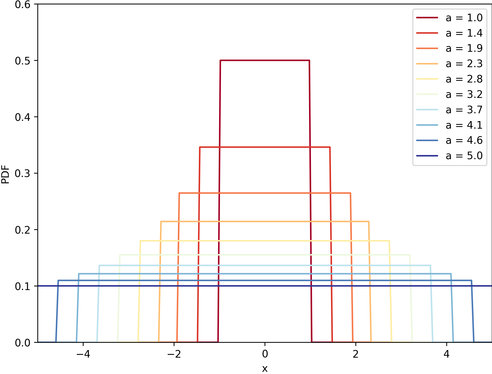
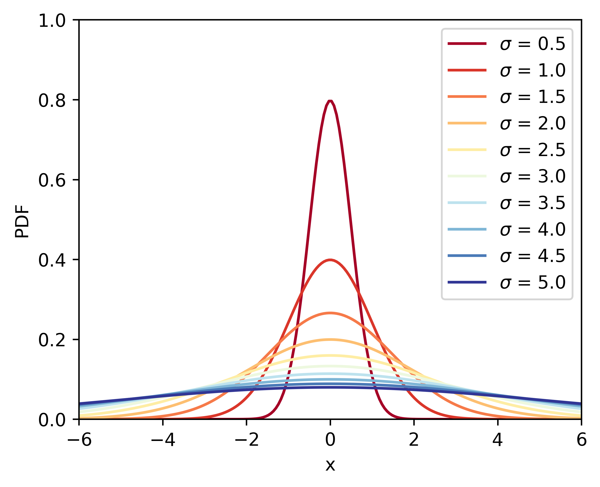

### Uniform distribution

The probability density function (pdf) of the continuous uniform distribution is:
$$
f(x)= \begin{cases}\frac{1}{b-a} & \text { for } a \leq x \leq b \\ 0 & \text { for } x<a \text { or } x>b\end{cases}
$$

```python
# Name: Mei Jiaojiao
# Profession: Artificial Intelligence
# Time and date: 3/28/23 00:10

import numpy as np
import matplotlib.pyplot as plt
from matplotlib import cm

x = np.linspace(-5, 5, 200)  # define x range and number

a_values = np.linspace(1, 5, 10)  # define a range and number

colors = cm.RdYlBu(np.linspace(0, 1, len(a_values)))  # create a color map

fig, ax = plt.subplots(figsize=(8, 6))

for idx, a in enumerate(a_values):
    pdf = np.where(np.abs(x) <= a, 1 / (2 * a), 0)  # compute the pdf
    ax.plot(x, pdf, color=colors[idx], label=f'a = {a:.1f}')

ax.legend()
ax.set_xlim(-5, 5)
ax.set_ylim(0, 0.6)
ax.set_xlabel('x')
ax.set_ylabel('PDF')

plt.savefig('uniform.png', dpi=300, bbox_inches='tight', pad_inches=0)
plt.show()
```



### Normal distribution

The probability density function (PDF) of a normal distribution with mean $\mu$ and standard deviation $\sigma$ is given by:
$$
\begin{equation}
f(x)=\frac{1}{\sqrt{2 \pi \sigma^2}} e^{-\frac{(x-\mu)^2}{2 \sigma^2}}
\end{equation}
$$
where $x$ is the random variable and $f(x)$ is the probability density function at $x$. The mean $\mu$ determines the center of the distribution, while the standard deviation $\sigma$ determines the spread of the distribution.

```python
# Name: Mei Jiaojiao
# Profession: Artificial Intelligence
# Time and date: 3/4/23 02:06

from matplotlib.collections import LineCollection
import numpy as np
import matplotlib.pyplot as plt
from matplotlib import cm  # import color map
from scipy.stats import norm

x_array = np.linspace(-6, 6, 200)
sigma_array = np.linspace(0.5, 5, 10)
# generate x and sigma arrays

num_lines = len(sigma_array)
# probability density function

colors = cm.RdYlBu(np.linspace(0, 1, num_lines))
# color map

fig, ax = plt.subplots(figsize=(5, 4))

for idx, sigma_idx in enumerate(sigma_array):
    pdf_idx = norm.pdf(x_array, scale=sigma_idx)
    legend_idx = '$\sigma$ = ' + str(sigma_idx)
    plt.plot(x_array, pdf_idx, color=colors[idx], label=legend_idx)
    # plot the pdf

plt.legend()

plt.xlim(min(x_array), max(x_array))
plt.ylim(0, 1)
plt.xlabel('x')
plt.ylabel('PDF')

fig.savefig('normal.png', dpi=600, bbox_inches='tight')
```



### Bivariate

The bivariate normal distribution is a probability distribution for two random variables that have a normal distribution.

```python
# Name: Mei Jiaojiao
# Profession: Artificial Intelligence
# Time and date: 3/4/23 16:19

import numpy as np
import matplotlib.pyplot as plt
from scipy.stats import multivariate_normal

# Set the mean and covariance of the distribution
mean = [0, 0]
cov = [[1, 0], [0, 1]]

# Create a grid of points to evaluate the distribution
x, y = np.mgrid[-3:3:.01, -3:3:.01]
pos = np.empty(x.shape + (2,))
pos[:, :, 0] = x
pos[:, :, 1] = y

# Generate the bivariate normal distribution
rv = multivariate_normal(mean, cov)

# Evaluate the distribution at each point on the grid
z = rv.pdf(pos)

# Plot the distribution, like a mountain
fig = plt.figure(figsize=(10, 5))
ax = fig.add_subplot(121, projection='3d')
ax.plot_surface(x, y, z, cmap="RdBu_r", linewidth=0.1, antialiased=True)
ax.grid(False)
# only leave the plot of the mountain
ax.set_axis_off()

ax = fig.add_subplot(122)
ax.contourf(x, y, z, cmap="RdBu_r")
ax.set_aspect("equal")
ax.set_axis_off()

# save the figure
plt.savefig("bivariate_normal.png", dpi=600, bbox_inches='tight')
plt.show()
```


### Reference

1. Wikipedia contributors. (2023, March 23). Normal distribution. In Wikipedia. Retrieved March 28, 2023, from https://en.wikipedia.org/wiki/Normal_distribution
2. Pennsylvania State University. (n.d.). 4.2 - Bivariate normal distribution. In STAT 505: Applied multivariate statistical analysis. Retrieved March 28, 2023, from https://online.stat.psu.edu/stat505/lesson/4/4.2
3. Visualize-ML. (n.d.). Book2_Beauty-of-Data-Visualization. GitHub. Retrieved March 28, 2023, from https://github.com/Visualize-ML/Book2_Beauty-of-Data-Visualization

