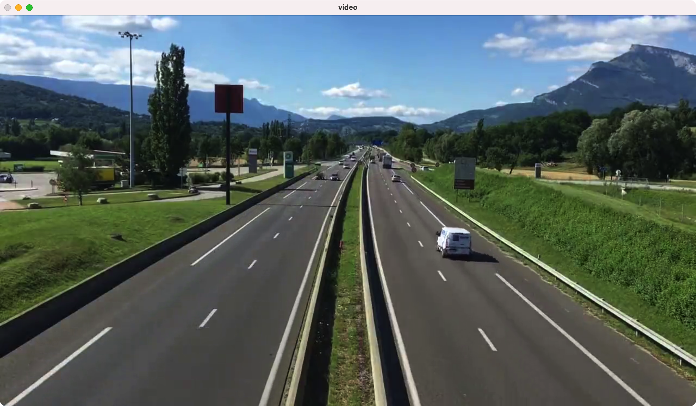
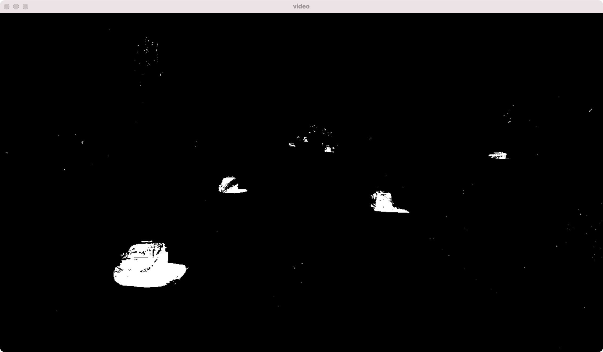
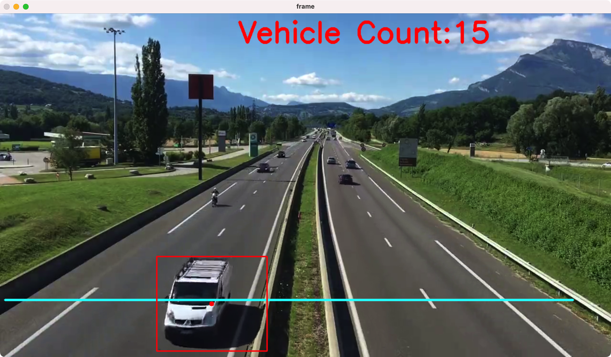
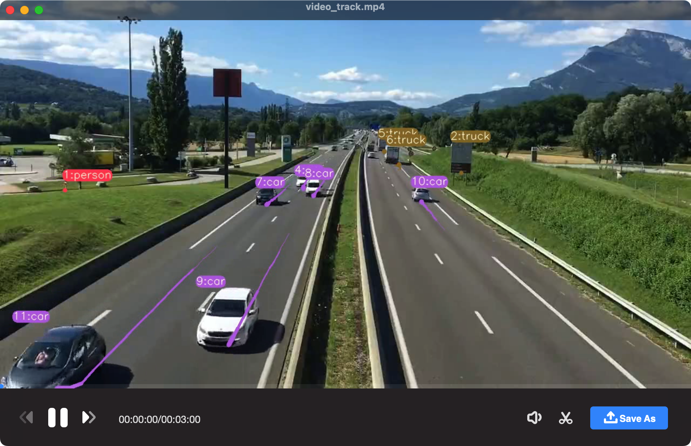

The code is a Python script that uses computer vision techniques to perform the following tasks:

1. Load a video file and display it frame by frame using OpenCV.
2. Remove the background from the video using a background subtraction algorithm.
3. Identify and track vehicles in the video using morphological operations and contour detection techniques.
4. Count the number of vehicles that pass a specified detection line in the video.

This type of technology can be used for various applications such as traffic monitoring, security surveillance, and vehicle tracking systems. It can help in detecting and preventing accidents, tracking stolen vehicles, and optimizing traffic flow.

# Load the video

```python
# Name: Mei Jiaojiao
# Profession: Artificial Intelligence
# Time and date: 4/1/22 15:39

import cv2
import numpy as np

# Create a VideoCapture object and open the video file
cap = cv2.VideoCapture('./video.mp4')

# Loop over the frames in the video
while True:
    # Read the current frame from the video
    ret, frame = cap.read()

    # If a frame was successfully read
    if ret == True:
        # Display the current frame in a window called "video"
        cv2.imshow('video', frame)

    # Wait for a key press for 1 millisecond
    key = cv2.waitKey(1)

    # If the user presses the "esc" key, break out of the loop
    if key == 27:
        break

# Release the resources and close all windows
cap.release()
cv2.destroyAllWindows()
```

<p align="center">  </p>

# Background Subtraction in OpenCV

```python
# Name: Mei Jiaojiao
# Profession: Artificial Intelligence
# Time and date: 4/1/22 15:46

import cv2
import numpy as np

# Create a VideoCapture object and open the video file
cap = cv2.VideoCapture('./video.mp4')

# Create a background subtractor object using the MOG method
mog = cv2.createBackgroundSubtractorMOG2()

while True:
    # Read a frame from the video capture object
    ret, frame = cap.read()

    # If a frame was successfully read
    if ret == True:
        # Apply background subtraction to the frame
        fgmask = mog.apply(frame)

        # Display the resulting foreground mask in a window called "video"
        cv2.imshow('video', fgmask)

    # Wait for a key press for 1 millisecond
    key = cv2.waitKey(1)

    # If the user presses the "esc" key, break out of the loop
    if key == 27:
        break

# Release the resources and close all windows
cap.release()
cv2.destroyAllWindows()
```

<p align="center">  </p>

# Detection and counting

```python
# Name: Mei Jiaojiao
# Profession: Artificial Intelligence
# Time and date: 4/1/22 15:57

import cv2
print(cv2.__version__)

import numpy as np

# Open the video file for processing
cap = cv2.VideoCapture('./video.mp4')

# Create MOG object for background subtraction
mog = cv2.createBackgroundSubtractorMOG2()
kernel = cv2.getStructuringElement(cv2.MORPH_RECT, (5, 5))

# Define minimum width and height for a detected car
min_w = 90
min_h = 90

# Define the detection line position
line_high = 600

# Define the offset from the detection line for a car to be counted
offset = 7

# Initialize an empty list to store detected car positions
cars = []

# Initialize the car count to zero
carno = 0


# Function to calculate the center point of a bounding rectangle
def center(x, y, w, h):
    x1 = int(w / 2)
    y1 = int(h / 2)
    cx = int(x) + x1
    cy = int(y) + y1
    return cx, cy


# Process each frame in the video
while True:
    ret, frame = cap.read()
    if ret == True:
        # Convert the frame to grayscale and apply Gaussian blur for noise reduction
        gray = cv2.cvtColor(frame, cv2.COLOR_BGR2GRAY)
        blur = cv2.GaussianBlur(gray, (3, 3), 5)

        # Apply MOG for background subtraction and morphological operations for noise reduction
        mask = mog.apply(blur)
        erode = cv2.erode(mask, kernel)
        dialte = cv2.dilate(erode, kernel, iterations=2)
        close = cv2.morphologyEx(dialte, cv2.MORPH_CLOSE, kernel)

        # Find contours in the processed image
        contours, h = cv2.findContours(close, cv2.RETR_TREE, cv2.CHAIN_APPROX_SIMPLE)

        # Draw the detection line on the frame
        cv2.line(frame, (10, line_high), (1200, line_high), (255, 255, 0), 3)

        # Process each detected contour
        for contour in contours:
            # Calculate the bounding rectangle of the contour
            (x, y, w, h) = cv2.boundingRect(contour)
            # Check if the bounding rectangle meets the minimum size requirement
            is_valid = (w >= min_w) and (h >= min_h)
            if not is_valid:
                continue

            # Draw a rectangle around the detected car and add its center point to the car list
            cv2.rectangle(frame, (int(x), int(y)), (int(x + w), int(y + h)), (0, 0, 255), 2)
            cpoint = center(x, y, w, h)
            cars.append(cpoint)
            cv2.circle(frame, (cpoint), 5, (0, 0, 255), -1)

            # Check if the car has crossed the detection line
            for (x, y) in cars:
                if (line_high - offset) < y < (line_high + offset):
                    # Remove the car from the list and increment the car count
                    carno += 1
                    cars.remove((x, y))
                    print(carno)

        # Draw the car count on the frame and display it
        cv2.putText(frame, 'Vehicle Count:' + str(carno), (500, 60), cv2.FONT_HERSHEY_SIMPLEX, 2, (0,
        0, 255), 5)
        cv2.imshow('frame', frame)

    # Wait for the user to press a key, and exit if the key is "esc"
    key = cv2.waitKey(1)
    if key == 27:
        break

# Release the resources and close all windows
cap.release()
cv2.destroyAllWindows()
```

<p align="center">  </p>

The original video can be accessed at https://drive.google.com/file/d/1PQYkSYX-Hgd-CJ0kBhg-BxV_IJ0gOjje/view?usp=sharing. The results can be viewed at https://drive.google.com/file/d/1xG46InzwV0b1wVy7L4SEWSyYh-pEUclN/view?usp=sharing.

# Improvements

The current issue with the program is that if multiple vehicles cross the line, the count may not be accurate. To improve the accuracy, two possible solutions are:

1. Fine-tune the program parameters to better handle the situation where multiple vehicles cross the line simultaneously.
2. Use deep learning to track the movement trajectories of vehicles and accurately count the number of vehicles crossing the line.

Both of these solutions can potentially improve the accuracy of the vehicle counting system.

# Tracking and counting

The YOLOv7-DeepSORT-Object-Tracking is a computer vision project that utilizes the YOLOv7 object detection algorithm and DeepSORT object tracking algorithm to detect and track objects in real-time video streams.The project can be found on GitHub at https://github.com/MuhammadMoinFaisal/YOLOv7-DeepSORT-Object-Tracking. 

I have tested it and the results can be viewed at https://drive.google.com/file/d/1ZtFjNEhHAxoEPQbjh0EN0TcsaVW2CTGZ/view?usp=sharing.

<div style="text-align:center">
    
</div>

# Reference

1. Joshi, P. (2020, April 20). *Build your own Vehicle Detection Model using OpenCV and Python*. Analytics Vidhya. https://www.analyticsvidhya.com/blog/2020/04/vehicle-detection-opencv-python/
1. M. (2023, January 26). *GitHub - MuhammadMoinFaisal/YOLOv7-DeepSORT-Object-Tracking: YOLOv7 Object Tracking using PyTorch, OpenCV and DeepSORT*. GitHub. https://github.com/MuhammadMoinFaisal/YOLOv7-DeepSORT-Object-Tracking


